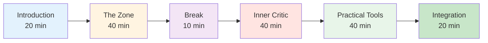

# Session Guide: Mental Game Introduction (2-3 Hours)


## Overview

This guide helps you conduct a 2-3 hour introductory session on mental game training for pétanque players. Perfect for coaches, club leaders, or experienced players who want to introduce mental training to their team.

::: tip Two Sections in This Guide
- **[For Participants](#for-participants)** - What players will learn
- **[For Facilitators](#for-facilitators)** - How to conduct the session
:::

## Quick Access

| Section | Purpose | Access |
|---------|---------|--------|
| **For Participants** | What to expect from the session | [View Section](#for-participants) |
| **For Facilitators** | Complete session plan and timing | [View Section](#for-facilitators) |
| **Session Materials** | Guides, slides, and worksheets | [View Materials](/en/guides/mental-journey/materials) |
| **Preparation Checklist** | What to prepare before the session | [View Checklist](#preparation-1-week-before) |

---

## For Participants

### What to Expect

This session introduces the mental game of pétanque through discussion, exercises, and practical techniques you can use immediately.

**You'll Learn:**
- Why mental training matters for performance
- The difference between "technical mode" and "flow mode"
- How to recognize and manage your inner critic
- Simple techniques for pressure management
- A basic pre-shot routine

**What You'll Need:**
- Open mind and willingness to share
- Notebook and pen
- Your own experiences to discuss
- 2-3 hours of focused time

### Session Structure



### Key Concepts You'll Explore

#### 1. The Zone (Flow State)
- What it feels like when everything clicks
- Why thinking about technique disrupts performance
- The "switch" from planning to execution

#### 2. The Inner Critic
- How negative self-talk affects performance
- The difference between Inner Critic and Inner Coach
- Neutral observation vs harsh judgment

#### 3. Pressure Response
- Why you play differently in competition
- Physical signs of pressure
- Quick reset techniques

#### 4. Practical Tools
- 3-breath reset
- Simple pre-shot routine
- Mistake recovery protocol

### What to Bring

**Required:**
- Yourself and your experiences
- Willingness to participate

**Optional:**
- Examples of mental challenges you face
- Questions about specific situations
- Notebook for personal notes

### After the Session

You'll receive:
- Summary handout of key concepts
- Practice exercises for the week
- Links to detailed education modules
- Goal template for mental game development


---

## For Facilitators

### Preparation Checklist

**1 Week Before:**
- [ ] Book room for 2-3 hours
- [ ] Invite 6-12 participants
- [ ] Bookmark materials pages (see [Materials](/en/guides/mental-journey/materials))
- [ ] Review this guide thoroughly
- [ ] Prepare flip chart or whiteboard

**1 Day Before:**
- [ ] Confirm attendance
- [ ] Set up room (circle seating)
- [ ] Test any technology (slides, etc.)
- [ ] Prepare materials

**1 Hour Before:**
- [ ] Arrive early
- [ ] Arrange seating in circle
- [ ] Set up materials
- [ ] Center yourself

### Your Role as Facilitator

::: warning Important
You are **not** a therapist or technical coach. You are a **facilitator** who:
- Guides discussion
- Creates safe space
- Connects concepts to experience
- Manages group dynamics
:::

**Key Skills:**
- Active listening
- Neutral presence
- Managing different personalities
- Knowing when to move on

### Detailed Session Plan

---

#### Part 1: Introduction (20 minutes)

**Objectives:**
- Create psychological safety
- Set expectations
- Build group connection

**Script:**

"Welcome everyone. This session is about the mental game of pétanque - the thoughts, feelings, and patterns that affect your performance.

**Ground Rules:**
1. What's shared here stays here
2. No judgment of others' experiences
3. Participation is voluntary
4. There are no wrong answers

**Quick Round:** Name, how long you've played, one mental challenge you face."

**Facilitator Notes:**
- Go first to model vulnerability
- Keep introductions brief (1 min each)
- Notice common themes
- Validate all responses

---

#### Part 2: The Zone / Flow State (40 minutes)

**Objectives:**
- Understand flow states
- Recognize technical vs flow mode
- Learn the "switch" concept

**Opening Question:**
"Think of a time when you played your best pétanque. What did it feel like? What was different?"

**Discussion Prompts:**
1. "How many of you have had games where everything just clicked?"
2. "What were you thinking about during those moments?"
3. "How is that different from when you struggle?"

**Key Teaching Points:**

Use whiteboard to draw:
```
PLANNING MODE          →    EXECUTION MODE
(Outside circle)            (Inside circle)
- Analyze situation         - Eyes on target
- Choose strategy           - Trust training
- Decide throw type         - Automatic movement
```

**Exercise: The Switch (10 minutes)**

"Let's practice the switch moment:
1. Stand up
2. Imagine you're outside the circle - think about a shot
3. Take a breath
4. Step forward (into imaginary circle)
5. As you step, let go of analysis
6. Focus only on an imaginary target"

**Debrief:**
- "What did you notice?"
- "Was it easy or hard to let go of thinking?"
- "How might this apply in real games?"

---

#### Part 3: Break (10 minutes)

**Facilitator Actions:**
- Encourage informal discussion
- Notice group energy
- Prepare for next section

---

#### Part 4: The Inner Critic (40 minutes)

**Objectives:**
- Recognize negative self-talk patterns
- Distinguish Inner Critic from Inner Coach
- Practice neutral observation

**Opening:**
"We all have an inner voice that comments on our performance. Sometimes it's helpful, sometimes it's harsh. Let's explore that."

**Exercise: Inner Critic Inventory (15 minutes)**

"On your paper, write down:
1. What your inner voice says after a bad throw
2. What it says when you're under pressure
3. What it says about your abilities"

*Give 5 minutes for writing*

"Now, who's willing to share one example?"

**Facilitator Notes:**
- Normalize harsh self-talk
- Don't try to "fix" anyone
- Look for common patterns

**Teaching: Inner Critic vs Inner Coach (15 minutes)**

Draw two columns on whiteboard:

| Inner Critic | Inner Coach |
|--------------|-------------|
| "How could you miss that?!" | "That went left" |
| "You always choke" | "Let's try again" |
| "You're terrible" | "What can I learn?" |

**Discussion:**
- "Notice the difference?"
- "Which voice helps performance?"
- "Can you change the voice?"

**Practice: Reframing (10 minutes)**

"Take one of your Inner Critic statements. How would an Inner Coach say it?"

Share examples.

---

#### Part 5: Practical Tools (40 minutes)

**Objectives:**
- Learn 3-breath reset
- Create simple pre-shot routine
- Understand mistake recovery

**Tool 1: 3-Breath Reset (10 minutes)**

"This is your emergency reset button. Use it when you feel pressure building."

**Demonstrate:**
1. Breathe in for 4 counts
2. Hold for 2 counts
3. Breathe out for 6 counts
4. Repeat 3 times

"Let's practice together now."

*Lead the group through 3 cycles*

**Debrief:**
- "What did you notice in your body?"
- "When might you use this?"

**Tool 2: Simple Pre-Shot Routine (15 minutes)**

"A routine helps you switch from planning to execution consistently."

**Basic Structure:**
```
Outside Circle (Planning):
- Look at situation
- Decide on throw
- See the result in your mind

Walking to Circle (Transition):
- One deep breath
- Let go of analysis

Inside Circle (Execution):
- Eyes on target only
- Trust your training
- Execute
```

**Exercise:**
"Create your own 3-step routine. Write it down."

Share examples.

**Tool 3: Mistake Recovery Protocol (15 minutes)**

"Elite players don't make fewer mistakes. They recover faster."

**3-Step Protocol:**
1. **Observe** - State the fact neutrally ("That went left")
2. **Learn** - Extract information ("Wind stronger than I thought")
3. **Reset** - Move forward (3-breath reset, eyes forward)

**Practice:**
"Think of a recent mistake. Walk through the 3 steps."

---

#### Part 6: Integration & Closing (20 minutes)

**Objectives:**
- Consolidate learning
- Create action plans
- Provide resources

**Reflection Questions:**
1. "What's one insight you're taking away?"
2. "What's one thing you'll try this week?"
3. "What questions remain?"

**Action Planning (10 minutes)**

"On your handout, write:
1. One technique you'll practice this week
2. When/where you'll practice it
3. How you'll track your progress"

**Resources:**
- Hand out summary sheet
- Share website: carreau.app
- Recommend starting module: [The Zone](/en/education/mental-game/the-zone/)

**Closing Circle:**
"One word to describe how you're feeling right now."

**Final Words:**
"Mental training is a skill like any other - it takes practice. Start small, be patient with yourself, and notice what changes. Thank you for your openness today."

---

### Facilitator Tips

#### Managing Difficult Situations

**If someone dominates:**
- "Thank you [name]. Let's hear from others."
- Use structured turn-taking

**If someone is resistant:**
- Don't argue
- "That's a valid perspective. What do others think?"
- Align with their concern

**If someone gets emotional:**
- Normalize it
- "This touches something real. Thank you for sharing."
- Don't try to fix

**If discussion stalls:**
- Use specific prompts
- Share your own example
- Move to an exercise

#### Energy Management

**High energy:** Use exercises and movement
**Low energy:** Ask provocative questions
**Scattered:** Bring back to structure
**Tense:** Use humor or break

### Post-Session

**Follow-Up:**
- Send summary email within 24 hours
- Include links to resources
- Offer to answer questions
- Schedule optional follow-up session

**Self-Reflection:**
- What worked well?
- What would you change?
- What surprised you?
- What did you learn?


---

## Materials

- [Participant Guide](/en/guides/mental-journey/materials#participant-guide)
- [Facilitator Slides](/en/guides/mental-journey/materials#facilitator-slides)
- [Summary Sheet](/en/guides/mental-journey/materials#summary-sheet)
- [Exercise Worksheets](/en/guides/mental-journey/materials#exercise-worksheets)

---

::: tip Ready to Facilitate?
1. Review this guide thoroughly
2. Download materials
3. Practice the exercises yourself
4. Schedule your session
5. Trust the process
:::

