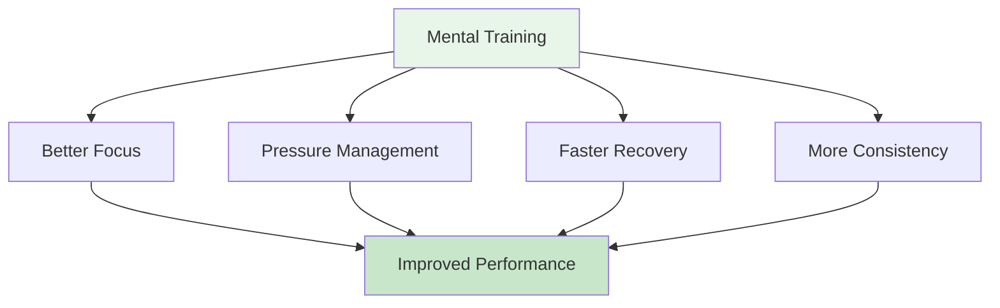

# Mental Journey for Beginners

<AdBanner />

## Welcome to Your Mental Game Journey

Whether you're a player looking to improve your mental game or a coach wanting to introduce mental training to your team, this guide will help you take the first steps into the world of sports psychology for pétanque.

::: tip Who Is This For?
- **Players** who want to understand the mental game
- **Coaches** introducing mental training to their teams
- **Clubs** organizing mental game workshops
- **Anyone** curious about the psychology of pétanque
:::

## Quick Access

| Resource | Purpose | Access |
|----------|---------|--------|
| **Getting Started** | Introduction to mental game concepts | [Read Below](#why-mental-training-matters) |
| **Session Guide** | Complete 2-3h workshop guide for facilitators | [View Guide](/en/mental-journey/session-guide) |
| **Materials** | Participant guides, slides, and worksheets | [View Materials](/en/mental-journey/materials) |
| **Related Guides** | Advanced formats | [Workshop](/en/workshop) • [Training Camp](/en/training-camp) |

## Why Mental Training Matters

At every level of pétanque, your mind affects your performance. But most players focus 90% on technique and only 10% on mental skills. This guide helps you start balancing that equation.

## What You'll Learn

### For Players

**Core Concepts:**
1. **The Zone** - Understanding flow states and how to access them
2. **The Inner Critic** - Recognizing and managing negative self-talk
3. **Pressure Response** - Why you play differently in competition
4. **The Switch** - Moving from thinking to doing

**Practical Skills:**
- Simple pre-shot routine
- 3-breath reset technique
- Mistake recovery protocol
- Focus anchors for competition

### For Coaches/Guides

**How to Facilitate:**
1. Creating psychological safety
2. Leading group discussions
3. Connecting theory to practice
4. Managing different personalities

**Session Structure:**
- 2-3 hour workshop format
- Discussion prompts and exercises
- Downloadable materials
- Follow-up activities

<AdInArticle />

## Getting Started

### Option 1: Self-Study (For Players)

**Week 1: Understanding the Basics**
1. Read [The Zone](/en/education/the-zone/) module
2. Try the 3-breath reset technique
3. Notice when you're in "technical mode" vs "flow mode"

**Week 2: Building Awareness**
1. Read [Mental Strength](/en/education/mental-strength/) module
2. Identify your inner critic patterns
3. Practice neutral observation after mistakes

**Week 3: Creating Structure**
1. Read [Mindfulness](/en/education/mindfulness/) module
2. Start 5-minute daily practice
3. Develop a simple pre-shot routine

**Week 4: Integration**
1. Use your routine in practice
2. Track mental performance in [Diary Template](/en/diary-template)
3. Set mental game goals using [Goal Template](/en/goal-template)

### Option 2: Group Workshop (For Coaches)

**Conduct a 2-3 Hour Session:**

Use our comprehensive [Session Guide](/en/mental-journey/session-guide) which includes:
- Complete session structure
- Discussion prompts
- Group exercises
- Downloadable materials

**What You'll Need:**
- 6-12 participants
- Quiet room with seating in circle
- Whiteboard or flipchart
- Screen or projector for sharing materials
- 2-3 hours of uninterrupted time

## The Three Pillars of Mental Training

### 1. Awareness
**What it is:** Noticing your thoughts, feelings, and patterns

**Why it matters:** You can't change what you don't notice

**How to develop:**
- Daily mindfulness practice (5-10 minutes)
- Post-game reflection
- Keeping a training diary

### 2. Acceptance
**What it is:** Allowing thoughts and feelings without judgment

**Why it matters:** Fighting your inner experience creates tension

**How to develop:**
- Neutral observation practice
- Inner coach vs inner critic work
- Letting go of perfectionism

### 3. Action
**What it is:** Choosing helpful responses despite difficult thoughts

**Why it matters:** Mental training is about performing well despite nerves

**How to develop:**
- Pre-shot routines
- Reset protocols
- Pressure simulation in training

## Common Questions

### "I'm not good enough to worry about mental training"
Mental training helps at every level. In fact, starting early builds better habits. You don't need to be elite to benefit from understanding your mind.

### "Isn't this just 'thinking positive'?"
No. Mental training is about performing well despite negative thoughts, not eliminating them. It's practical skills, not positive thinking.

### "How long does it take to see results?"
Some techniques (like the 3-breath reset) work immediately. Deeper changes (like consistent flow states) take 2-3 months of practice.

### "Do I need a sports psychologist?"
Not necessarily. This guide provides practical tools you can use immediately. Professional help is valuable for deeper issues, but most players can start on their own.

### "Will this help my technique?"
Mental training doesn't replace technical practice. But it helps you access your technique consistently, especially under pressure.

## Resources Available

### For Players
- [Education Modules](/en/education/) - 8 comprehensive guides
- [Goal Template](/en/goal-template) - Structure your development
- [Diary Template](/en/diary-template) - Track your progress
- [Case Studies](/en/case-studies) - Real examples

### For Coaches/Guides
- [Session Guide](/en/mental-journey/session-guide) - Complete 2-3h workshop
- [Facilitator Materials](/en/mental-journey/materials) - Digital guides & slides
- [Workshop Guide](/en/workshop) - Advanced 3-4h format
- [Training Camp Guide](/en/training-camp) - Weekend program

## Next Steps

### For Individual Players
1. **Start with awareness** - Read [The Zone](/en/education/the-zone/)
2. **Try one technique** - Use the 3-breath reset this week
3. **Track your experience** - Notice what changes
4. **Build gradually** - Add one new skill per week

### For Coaches/Groups
1. **Review the Session Guide** - Understand the structure
2. **Download materials** - Get handouts and slides
3. **Schedule a session** - Block 2-3 hours
4. **Prepare yourself** - Read facilitator notes
5. **Run the workshop** - Follow the guide

## Support

**Questions about getting started?**
- Email: [patrik.wiik@gmail.com](mailto:patrik.wiik@gmail.com)
- Review [Case Studies](/en/case-studies) for examples
- Join discussions in your club

<AdBanner />

---

::: tip Ready to Begin?
**Players:** Start with [The Zone](/en/education/the-zone/) module

**Coaches:** Go to [Session Guide](/en/mental-journey/session-guide)

**Download Materials:** Visit [Facilitator Materials](/en/mental-journey/materials)
:::

