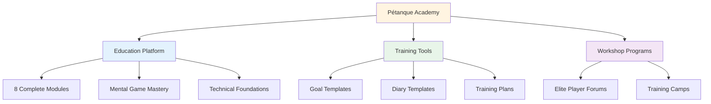
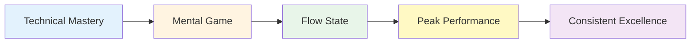

# News & Updates

<AdBanner />

## Welcome to Pétanque Academy

::: tip Platform Now Live! 🎉
**Pétanque Academy is now fully operational!**

We've launched a comprehensive platform dedicated to helping elite pétanque players reach their full potential through mental game mastery, structured training, and practical tools.
:::

<AdInArticle />

## What's Available Now

### 📚 Complete Education Platform

We've launched **8 comprehensive education modules** covering everything from flow states to nutrition:

| Module | What's Inside | Key Features |
|--------|---------------|--------------|
| **[The Zone](/en/education/the-zone/)** | Flow state mastery | 4 detailed guides on entering and maintaining flow |
| **[Mental Strength](/en/education/mental-strength/)** | Pressure handling | Pre-shot routines, inner critic management |
| **[Mindfulness](/en/education/mindfulness/)** | Present-moment awareness | Daily practices, competition techniques |
| **[Goals](/en/education/goals/)** | Strategic planning | SMART goals, hierarchy, tracking systems |
| **[Tactics](/en/education/tactics/)** | Game strategy | Decision-making, probability, positioning |
| **[Team Player](/en/education/team-player/)** | Collaboration skills | Communication, trust, team dynamics |
| **[Training](/en/education/training/)** | Practice methods | Drills, deliberate practice, progression |
| **[Nutrition](/en/education/nutrition/)** | Performance fuel | Blood sugar management, competition nutrition |

### 🛠️ Practical Tools

**Ready-to-use templates and programs:**

- **[Workshop](/en/workshop)** - Structured 3-hour sessions for mental game development
- **[Training Camp](/en/training-camp)** - Weekend intensive programs for elite players
- **[Training Session](/en/training-session)** - 2-3 hour practice frameworks
- **[Goal Template](/en/goal-template)** - Complete goal-setting and tracking system
- **[Diary Template](/en/diary-template)** - Daily practice and reflection journal

### 🎯 Technical Guidance

**[Technical Advice](/en/technical/)** section includes:
- Complete guide to all pétanque throws
- Trajectory selection strategies
- Spin control techniques
- Shot selection frameworks

### 🍽️ Nutrition for Performance

**[Food](/en/food)** - Comprehensive guide to:
- Blood sugar management for stable focus
- Pre-competition nutrition strategies
- Energy optimization for tournaments

### 📝 Articles & Insights

**NEW: 14 in-depth articles** covering mental game topics:

| Category | Articles |
|----------|----------|
| **Understanding the Inner Critic** | [Inner Critic](/en/blog/inner-critic) - Master your internal dialogue |
| **Building Pre-Shot Routines** | [Pre-Shot Routines](/en/blog/pre-shot-routines) - Create consistency |
| **Pressure Management** | [Pressure Management](/en/blog/pressure-management) - Perform under stress |
| **Performance Psychology** | [Flow States](/en/blog/flow-state-science) • [Mindfulness](/en/blog/mindfulness-competition) • [Goal Setting](/en/blog/elite-goal-setting) • [Mental Resilience](/en/blog/mental-resilience) |
| **Team Dynamics** | [Communication](/en/blog/team-communication) • [Team Chemistry](/en/blog/team-chemistry) • [Leadership](/en/blog/team-leadership) |
| **Training & Development** | [Mental Training Mistakes](/en/blog/mental-training-mistakes) • [Practice Structure](/en/blog/practice-structure) • [Competition Prep](/en/blog/competition-prep) |

➡️ **[Browse All Articles](/en/blog/)**

### 📖 Resources

**Case Studies & Testimonials:**

- **[Case Studies](/en/case-studies)** - Real examples of elite players using mental game training
- **[Testimonials](/en/testimonials)** - Feedback from players who've implemented these methods

## Our Mission

::: tip The Next Level
Elite players have already mastered technique. The next breakthrough comes from the **mental game** - learning to access flow states, handle pressure, and perform consistently at your best.

**Pétanque Academy provides the complete roadmap.**
:::

## Platform Statistics

::: info What We've Built
- ✅ **8 education modules** with 30+ detailed guides
- ✅ **5 practical tools** ready to use
- ✅ **10 languages** - accessible worldwide
- ✅ **100+ pages** of elite-level content
- ✅ **Mermaid diagrams** for visual learning
- ✅ **Copy-paste templates** for immediate use
:::

## How to Get Started

### For New Visitors

**Start with the fundamentals:**

1. **[Ambition](/en/ambition)** - Understand the philosophy behind elite development
2. **[The Zone](/en/education/the-zone/)** - Learn about flow states
3. **[Goal Template](/en/goal-template)** - Set your first structured goals

### For Experienced Players

**Dive into advanced topics:**

1. **[Mental Strength](/en/education/mental-strength/)** - Master pressure situations
2. **[Tactics](/en/education/tactics/)** - Refine strategic decision-making
3. **[Workshop](/en/workshop)** - Implement structured mental game sessions

### For Teams

**Build collective excellence:**

1. **[Team Player](/en/education/team-player/)** - Improve team dynamics
2. **[Training Camp](/en/training-camp)** - Organize weekend intensives
3. **[Training Session](/en/training-session)** - Structure team practices

## What Makes This Different

::: warning Why Pétanque Academy Stands Out
**Most training focuses on technique. We focus on what elite players actually need:**

1. **Mental game mastery** - The real differentiator at high levels
2. **Practical tools** - Not just theory, but ready-to-use templates
3. **Structured programs** - Clear frameworks for workshops and camps
4. **Evidence-based** - Built on sports psychology and flow state research
5. **Elite-focused** - Designed for players who've already mastered basics
:::

## Get Involved

**Want to contribute or provide feedback?**

Visit our **[About](/en/about)** page to:
- Learn more about the platform
- Share your feedback
- Request specific content
- Connect with us

---

::: tip Start Your Journey Today
Everything you need to take your game to the next level is already here. Pick a module, grab a template, and start implementing.

**Welcome to Pétanque Academy - where elite players become exceptional.**
:::

<AdBanner />
