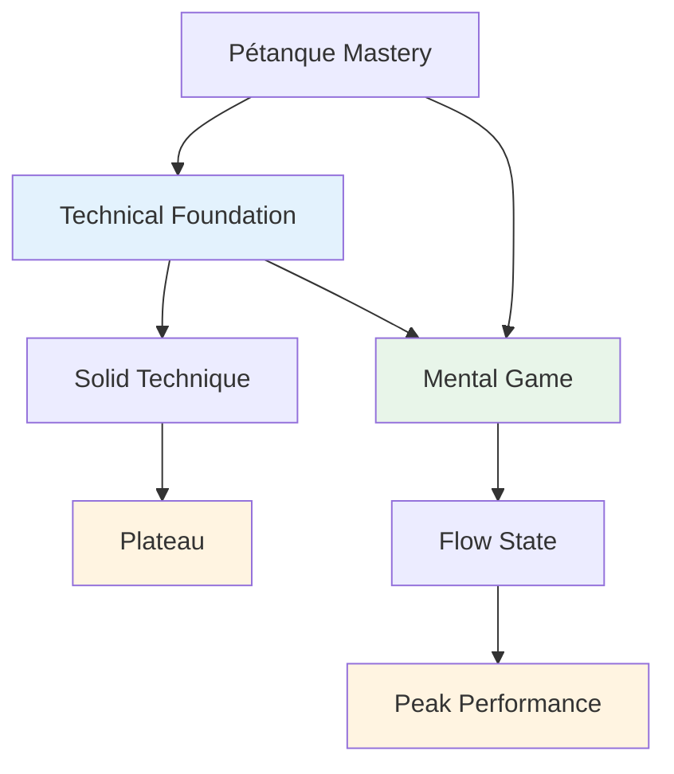

# Technical Advice

## A Note on Technique

While our primary focus is on the mental game and flow state, we recognize that technique is the foundation upon which everything else is built.

::: info Our Philosophy
**Technique is the foundation, but flow is the ceiling.** You need solid technique to reach elite level, but mental mastery is what takes you beyond.
:::

## Our Perspective

::: tip You Don't Need to Master Everything
**You don't need to master all techniques**, but understanding the full palette of possibilities helps you:

- ✅ Know what's possible
- ✅ Make informed choices about what to develop
- ✅ Appreciate the game at a deeper level
- ✅ Understand what elite players can do
:::

::: info The Goal
If you have a technical focus and want to expand your repertoire, this section outlines the end goal - the complete palette of throws available to a pétanque player.

**Remember:** The goal isn't to master everything. It's to have enough technical foundation that you can enter the zone and let your body choose the right throw naturally.
:::

## Topics

### [Palette of Throws](/en/technical/throws)
What are all the throws out there? A comprehensive overview of the technical possibilities in pétanque.

::: tip After Technique, What's Next?
Once you have solid technique, the real growth comes from:
- **[The Zone](/en/education/the-zone/)** - Accessing flow states
- **[Mental Strength](/en/education/mental-strength/)** - Handling pressure
- **[Training Methods](/en/education/training/)** - How to practice effectively
:::

