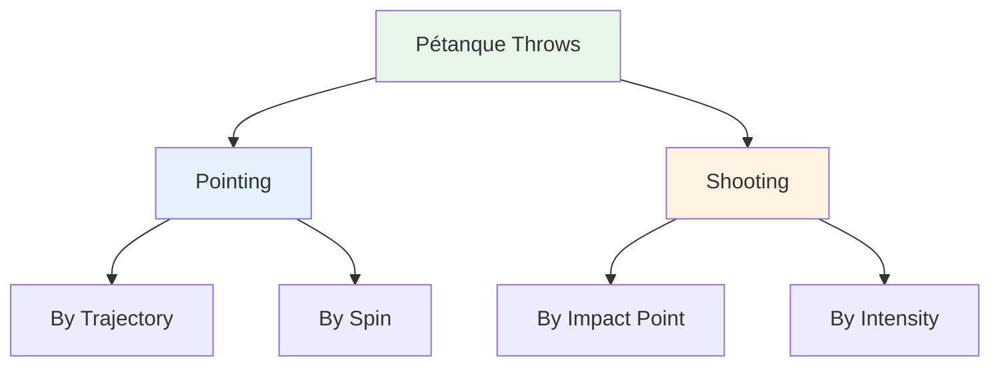
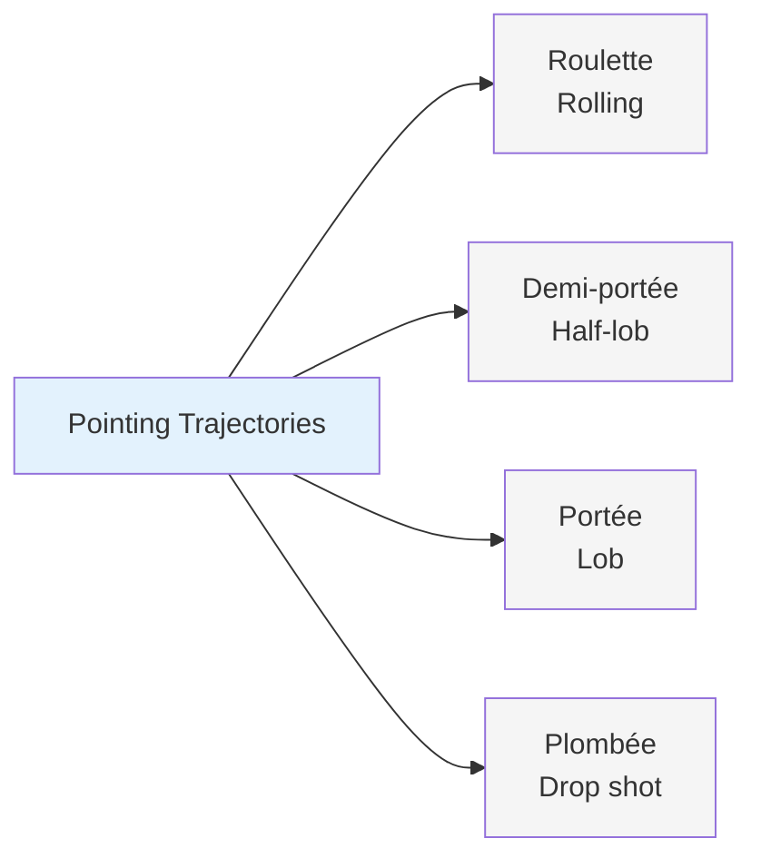
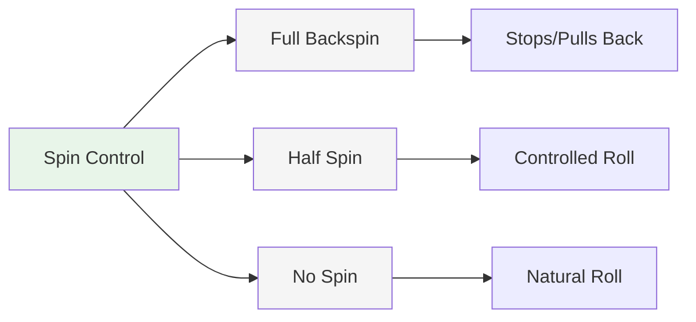
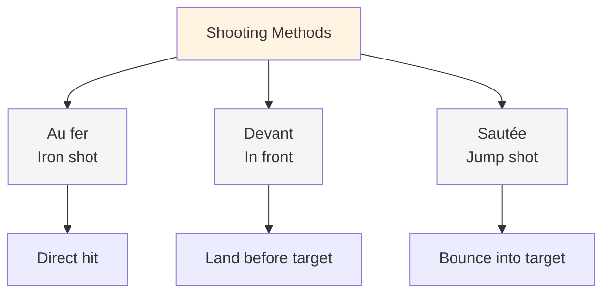
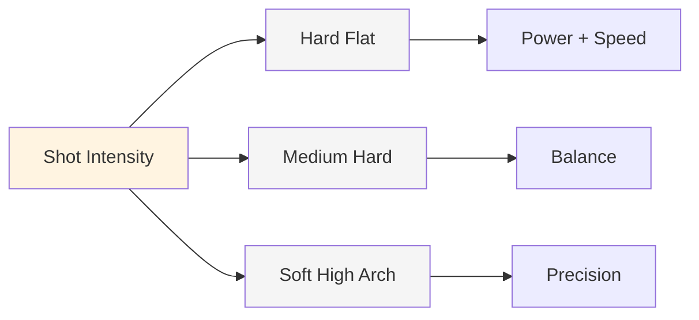
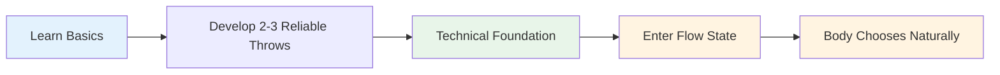

# Palette of Throws

## The Complete Technical Repertoire

This is an overview of the throws available in pétanque. You don't need to master all of them, but knowing what exists helps you understand the full scope of the game.

::: tip The Big Picture
**Understanding the full palette helps you make informed choices about what to develop.** You don't need to master everything - focus on what works for your game.
:::

## Pointing Techniques

### By Trajectory

| Throw | French Term | Trajectory | When to Use |
|-------|-------------|------------|-------------|
| **Rolling** | Roulette | Low, rolls most of the way | Smooth terrain, short distance |
| **Half-lob** | Demi-portée | Medium, lands halfway | Most common, versatile |
| **Lob** | Portée | High, lands near target | Obstacles, rough terrain |
| **Drop shot** | Plombée | Very high, drops vertically | Tight spaces, precision placement |

### By Spin

| Spin Type | Effect on Landing | When to Use |
|-----------|-------------------|-------------|
| **Full spin (backspin)** | Stops or pulls back on landing | Need to stop quickly, avoid rolling past |
| **Half spin** | Moderate backspin, controlled roll | Most versatile, predictable |
| **No spin** | Neutral, natural roll on landing | Let terrain dictate roll |

## Shooting Techniques

### By Impact Point

| Technique | French Term | Impact Point | Characteristics |
|-----------|-------------|--------------|-----------------|
| **Iron shot** | Au fer | Direct hit on the boule | Most common, clean contact |
| **In front** | Devant | Landing just before target | Safer, less precision needed |
| **Jump shot** | Sautée | Bouncing into target | Advanced, for obstacles |

### By Intensity

| Intensity | Trajectory | When to Use |
|-----------|------------|-------------|
| **Hard flat shot** | Direct, powerful, flat | Clear line, need distance on hit |
| **Medium hard** | Balanced power and control | Most versatile |
| **Soft with high arch** | Lob shot, drops from above | Obstacles, tight spaces |

## The Complete Palette

::: details Quick Reference: All Throws
**Pointing:**
- Roulette (rolling)
- Demi-portée (half-lob)
- Portée (lob)
- Plombée (drop shot)
- Full spin / Half spin / No spin

**Shooting:**
- Au fer (iron shot)
- Devant (in front)
- Sautée (jump shot)
- Hard flat / Medium / Soft high arch
:::

## Mastery Path

::: tip Remember
**The goal isn't to master everything.** It's to have enough technical foundation that you can enter the zone and let your body choose the right throw naturally.

Focus on:
1. **2-3 pointing techniques** you can rely on
2. **1-2 shooting methods** that work for you
3. **Consistent execution** under pressure
4. **Mental game** to access flow state
:::

::: info Next Steps
Once you have solid technique, the real growth comes from:
- **[The Zone](/en/education/the-zone/)** - Accessing flow states consistently
- **[Training Methods](/en/education/training/)** - How to practice effectively
- **[Mental Strength](/en/education/mental-strength/)** - Performing under pressure
:::

