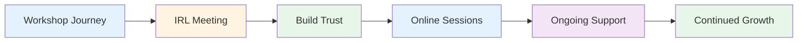
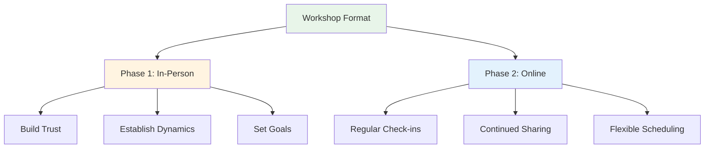
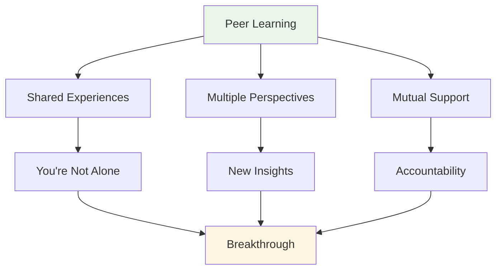

# Workshop

## Forums for Elite Players

Our workshops are intimate forums where elite players share experiences and open up their inner thoughts about the game, performance, and mental challenges.

::: tip What Makes Our Workshops Different
**Small, curated groups of elite players in a safe space for honest discussion.** This isn't a lecture - it's a peer learning experience where you share, learn, and grow together.
:::

## Format

### Small Groups
::: info Group Size
- **6-8 players** per workshop
- Carefully curated groups for optimal dynamics
- Safe space for honest discussion
- Everyone contributes, everyone learns
:::

### Hybrid Approach

| Phase | Format | Purpose | Benefits |
|-------|--------|---------|----------|
| **First Meeting** | In-person (IRL) | Build foundation | Trust, connection, group dynamics |
| **Ongoing Sessions** | Online | Maintain momentum | Regular support, flexibility, accountability |

::: details Phase 1: In-Person Meeting
**Why in-person first?**
- Build trust and connection face-to-face
- Establish group dynamics and safety
- Set intentions and goals together
- Create the foundation for honest sharing

**What happens:**
- Introductions and goal setting
- Initial exercises and discussions
- Establishing group norms
- Building rapport
:::

::: details Phase 2: Online Sessions
**Why online for ongoing?**
- Regular check-ins without travel
- Continued sharing and support
- Flexible scheduling for busy players
- Maintain momentum between in-person meetings

**What happens:**
- Progress updates and challenges
- Peer support and problem-solving
- Accountability check-ins
- Continued learning and growth
:::

## What to Expect

### Topics We Explore

| Area | Focus | Outcomes |
|------|-------|----------|
| **Mental Game** | Flow state, pressure, focus | Consistent peak performance |
| **Personal Challenges** | Fears, blocks, frustrations | Breakthroughs and solutions |
| **Peer Learning** | Shared experiences | New perspectives and insights |
| **Practical Tools** | Techniques and exercises | Immediate application |
| **Community** | Ongoing support | Long-term growth |

::: tip Workshop Experience
- 🧠 Deep discussions about mental aspects of the game
- 💬 Sharing of personal experiences and challenges
- 🤝 Peer support and accountability
- 🛠️ Practical exercises and techniques
- 👥 A community of players committed to growth
:::

## Who Should Join?

::: info Ideal Participants
- **Elite players** looking to take the next step
- Players who have **mastered technique** but want more
- Those interested in the **mental game**
- Players open to **honest self-reflection**
- Committed to **personal growth**
:::

::: warning Not a Good Fit If
- You're looking for technical coaching only
- You're not comfortable sharing in a group
- You're not willing to be vulnerable
- You want quick fixes without doing the work
:::

## The Value of Peer Learning

::: tip Why Peer Groups Work
Elite players face unique challenges that others don't understand. In a workshop, you're with people who **get it** - the pressure, the expectations, the mental battles. This creates a safe space for real growth.
:::

## Ready to Join?

::: info Next Steps
Workshops are announced in our [News](/en/news/) section. Stay tuned for upcoming dates and registration information.
:::

