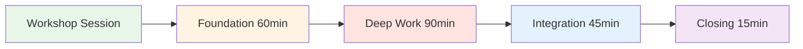
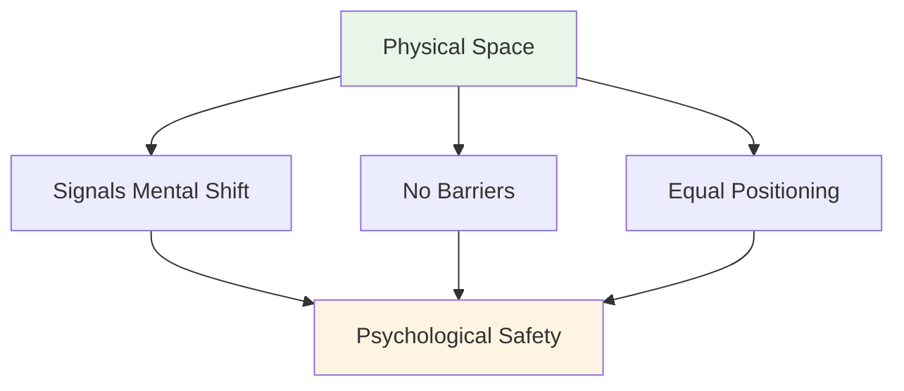
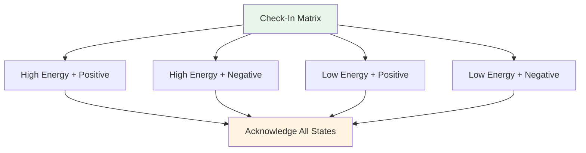
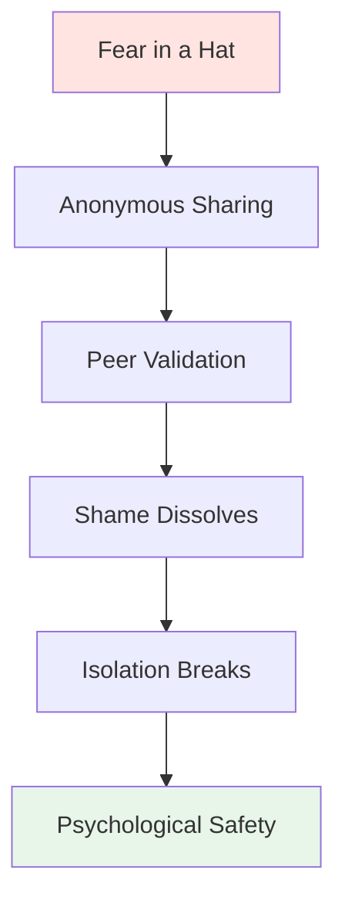

# Workshop: Theoretical Session Guide

<AdBanner />

## A Comprehensive Guide for Coordinators

This guide helps you conduct a 3-4 hour theoretical workshop with 6-8 elite players. As the **Mental Performance Coordinator (MPC)**, you'll facilitate deep discussions about the mental game, creating psychological safety that translates to performance on the piste.

::: warning Critical Concept
**You are not a technical coach or therapist.** Your role is to facilitate vulnerability-based learning that helps players understand the connection between their inner thoughts and their performance.
:::

## Pre-Workshop Preparation

### The Coordinator's Role

::: info Your Responsibilities
- **Facilitate, don't lecture** - You guide discussion, not teach technique
- **Hold the space** - Create and maintain psychological safety
- **Bridge theory to practice** - Connect website content to inner experience
- **Monitor group dynamics** - Notice who's engaged, who's resistant
- **Maintain boundaries** - Know when to refer to professional help
:::

### Essential Competencies

| Competency | What It Means | How to Develop |
|------------|---------------|----------------|
| **Emotional Intelligence** | Detect micro-expressions of discomfort | Practice active observation |
| **Neutral Authority** | Command respect without technical power | Establish credibility through presence |
| **Sport Context** | Understand pressure mechanics | Learn pétanque terminology and culture |
| **Verbal Aikido** | Align with resistance, don't fight it | Practice non-defensive communication |

::: details Key Pétanque Terms to Know
- **Carreau** - Perfect shot that displaces opponent's boule
- **Bibber** - The "yips" - involuntary tremor during release
- **Donnée** - The "given" - accepting the terrain as it is
- **Portée** - Throwing without bounce
- **Roulette** - Rolling shot
- **Cochonnet** - The target ball (jack)
:::

## Physical Setup: The Magic Circle

### Location Requirements

::: warning Critical Setup
**Choose a neutral space AWAY from the piste.** This signals a shift from physical to mental work.

Requirements:
- ✅ Soundproof or private
- ✅ Comfortable temperature
- ✅ No distractions (phones off)
- ✅ Natural light if possible
- ✅ Separate from training area
:::

### The Circle Configuration

**Seating:**
- Perfect circle of chairs
- **NO TABLES** - Tables create barriers and hide body language
- All chairs at same height (no power positions)
- Coordinator sits as part of circle (not at front)

**Center Artifacts:**
- Place boules and cochonnet in center
- Anchors the work to the sport
- Visual reminder of shared purpose

## Session Structure (3-4 Hours)

### Phase 1: Foundation (60 minutes)

#### 1. Welcome & Ground Rules (15 min)

**The Social Contract:**

::: tip The Container - Essential Ground Rules
Before any sharing begins, the group MUST agree to:

1. **Confidentiality** - What's said here, stays here
2. **The Vegas Rule** - Lessons leave the room, stories stay
3. **No Fixing** - Witness and understand, don't try to solve
4. **Right to Pass** - Vulnerability cannot be coerced
5. **Respect the Process** - Trust the discomfort
:::

**Your Script:**
> "Welcome. This space is different from the piste. Here, we explore what happens *inside* when you're standing over that shot. Everything shared here is confidential. The lessons you learn can leave, but the personal stories stay. You're not here to fix each other - just to understand. And you can always pass. Can everyone agree to this?"

#### 2. Activity: The Check-In Matrix (20 min)

**Goal:** Normalize admitting to fatigue or stress

**Materials:** Whiteboard or flip chart, sticky notes

**Procedure:**
1. Draw 2x2 matrix: High/Low Energy (vertical), Positive/Negative (horizontal)
2. Each player writes their name on sticky note
3. Place note in their current quadrant
4. Discuss: "We have three people in 'Low Energy/Negative'. How does this affect our session today?"

**Facilitation Tips:**
- Don't judge any quadrant as "bad"
- Ask: "What does your body need right now?"
- Notice patterns: "Three of you are in the same space - what's that about?"

#### 3. Activity: The Iceberg of Pétanque (25 min)

**Goal:** Visualize hidden inner thoughts

**Materials:** Large paper, markers

**Procedure:**
1. Draw iceberg on paper
2. **Above water:** Write "Technique, The Throw, The Result"
3. **Below water:** Ask: "What's happening in your mind that nobody sees?"

**Prompts:**
- "What are you afraid of when you step up to shoot?"
- "What judgment are you worried about?"
- "What does your inner voice say when you miss?"

**The Insight Question:**
> "What happens to your throwing arm when the 'underwater' stuff gets too heavy?"

This links mental load to physical tension (the bibber/yips).

::: details Common "Below Water" Responses
- Fear of letting team down
- Worry about looking stupid
- Doubt about ability
- Comparison to others
- Pressure to prove worth
- Fear of judgment from coach/teammates
- Impostor syndrome
:::

<AdInArticle />

### Phase 2: Deep Work (90 minutes)

#### 4. Activity: The User Manual (30 min)

**Goal:** Operationalize empathy - help teammates understand each other

**Materials:** Worksheets (one per player)

**The User Manual Template:**

| Section | Prompt | Example |
|---------|--------|---------|
| **My Stress Signature** | "When I am anxious, I..." | "...go completely quiet" |
| **How to Handle Me** | "When I miss a crucial shot, I need..." | "...silence, not encouragement" |
| **My Inner Thought** | "The lie I tell myself is..." | "...that I'm not good enough" |
| **My Trigger** | "I get defensive when..." | "...someone questions my shot choice" |

**Procedure:**
1. Give players 10 minutes to complete in silence
2. Go around circle - each person shares ONE section
3. Others can ask clarifying questions (not advice!)
4. Coordinator validates each share

**Facilitation Script:**
> "This is your operating manual. When your teammate knows you go quiet when anxious, they won't take it personally. When they know you need silence after a miss, they won't try to 'fix' you. This is how we build team intelligence."

#### 5. Connecting Website Content to Inner Thought (30 min)

**Goal:** Bridge technical content to psychological experience

Choose 2-3 sections from the Academy website and explore the inner game:

**Example 1: Technique - The Grip and Release**

**The Trust Question:**
> "When you're at 12-12 in a tournament, does your hand *feel* like the technique description? Is it the muscles changing or the thought 'Don't drop it' that changes your grip?"

**The Micro-Tremor:**
> "Who here feels the 'micro-tremor' of anxiety? What inner thought triggers that?"

**Example 2: Tactics - Pointing vs. Shooting**

**Risk Profile:**
> "When the guide says 'Shoot to win,' is your reaction excitement or dread? What does that tell you about your relationship with risk?"

**The Impostor:**
> "Do you ever point when you *know* you should shoot, just to avoid the embarrassment of missing? What's the cost of that safety?"

**Example 3: Nutrition - Competition Day**

**The Comfort Food Trap:**
> "Do you eat what your body needs or what your anxiety wants? How do you know the difference?"

::: tip Facilitation Technique
Don't lecture about the content. Ask questions that connect the technical information to their lived experience. The insight comes from THEM, not you.
:::

#### 6. Activity: Fear in a Hat (30 min)

**Goal:** Break the isolation loop - show that peers share deep insecurities

**Materials:** Paper, pen, hat/bag

**Procedure:**
1. Everyone writes a deep career/team fear anonymously
2. Fold papers and mix in hat
3. Each player draws a note (not their own)
4. Read it aloud
5. Validate it: "I can understand why someone would feel this way because..."

**Example Fears:**
- "I'm afraid I've peaked and will never improve"
- "I worry my teammates think I'm overrated"
- "I fear I'll choke in the big moment"
- "I'm scared of being replaced by younger players"

**The Power:**
When players hear their secret fear read aloud and validated by peers, the shame dissolves. They realize: "I'm not alone. This is normal."

**Coordinator's Role:**
- Validate EVERY fear as legitimate
- Don't minimize: "That's not true!" invalidates the feeling
- Ask: "How many of you have felt something similar?"

### Phase 3: Integration (45 minutes)

#### 7. Activity: Reframing the Inner Critic (25 min)

**Goal:** Cognitive restructuring - change the internal dialogue

**Materials:** Worksheet

**Procedure:**

**Step 1: Identify the Critic (10 min)**
> "Write down the EXACT phrase your inner critic says after a miss. Not the polite version - the brutal one."

Examples:
- "You always choke"
- "Everyone's watching you fail"
- "You're embarrassing yourself"
- "You don't belong here"

**Step 2: Reframe as Inner Coach (10 min)**
> "Now rewrite that as your Inner Coach - firm but supportive."

Examples:
- Critic: "You always choke" → Coach: "Reset and breathe. Next shot."
- Critic: "Everyone's watching you fail" → Coach: "Focus on the target, not the crowd"
- Critic: "You're embarrassing yourself" → Coach: "One shot at a time. You've done this before."

**Step 3: Partner Practice (5 min)**
> "Share your Coach phrase with a partner. They'll remind you of it when they see the Critic emerge."

#### 8. Bridging to the Piste (20 min)

**Goal:** Create actionable protocols for competition

**Discussion Questions:**
1. "What's ONE thing from today you'll use in your next competition?"
2. "How will your teammates know you need support?"
3. "What's your signal for 'I need a mental reset'?"

**Create Team Protocols:**

| Situation | Protocol | Example |
|-----------|----------|---------|
| **After a miss** | Check User Manual | "Marc needs silence, Lisa needs a fist bump" |
| **Feeling pressure** | Use Coach phrase | "Reset and breathe" |
| **Team tension** | Call timeout | "Let's take 2 minutes" |
| **Inner critic loud** | Physical reset | Touch boules, deep breath |

### Phase 4: Closing (15 minutes)

#### 9. The Check-Out (10 min)

**Procedure:**
Go around circle, each person shares:
1. **One thing you're taking:** "What insight or tool are you leaving with?"
2. **One thing you're leaving behind:** "What are you letting go of?"

**Coordinator's Role:**
- Thank each person for their contribution
- Validate the work done
- Remind of confidentiality

#### 10. Follow-Up Protocol (5 min)

::: warning Critical: Prevent Vulnerability Hangover
Deep work causes a "vulnerability hangover" - regret or shame about sharing.

**Your 24-Hour Protocol:**
- Text anyone who shared heavily within 24 hours
- Message: "Thank you for your courage yesterday. What you shared helped everyone."
- Check in: "How are you feeling about the session?"
:::

**Closing Script:**
> "What happened here today took courage. You showed up, you opened up, you trusted the process. That same courage is what you'll bring to the piste. Remember: the lessons leave this room, but the stories stay. Thank you."

<AdInArticle />

## Handling Resistance

### The "Too Cool" Athlete

**Scenario:** A player rolls their eyes at a vulnerability exercise

**Strategy:** Verbal Aikido (Align and Pivot)

**Script:**
> "I see that reaction, [Name]. Honestly, I get it. Talking about feelings feels soft. But the piste is uncomfortable. If we can't handle the discomfort of this room, we aren't training our tolerance for the discomfort of the game. Can you trust me for 20 minutes?"

### The Silent Participant

**Scenario:** Someone hasn't spoken in 45 minutes

**Strategy:** Create low-stakes entry point

**Script:**
> "[Name], I notice you're taking it all in. What's one thing that's resonating with you so far? Even just a word."

### The Over-Sharer

**Scenario:** Someone dominates with long stories

**Strategy:** Gentle redirect

**Script:**
> "Thank you for that, [Name]. I want to make sure everyone has space. Let's hear from someone who hasn't shared yet."

### The Fixer

**Scenario:** Someone tries to solve others' problems

**Strategy:** Reinforce ground rules

**Script:**
> "I appreciate you wanting to help, but remember our rule: witness and understand, don't fix. [Original speaker], what do you need right now?"

## Materials Checklist

::: details Workshop Materials
**Physical Setup:**
- [ ] Chairs (6-8, no tables)
- [ ] Boules and cochonnet for center
- [ ] Flip chart or whiteboard
- [ ] Markers

**Activities:**
- [ ] Sticky notes (Check-In Matrix)
- [ ] Large paper (Iceberg activity)
- [ ] User Manual worksheets
- [ ] Paper and pens (Fear in a Hat)
- [ ] Inner Critic/Coach worksheets

**Logistics:**
- [ ] Water for participants
- [ ] Tissues (emotional work!)
- [ ] Timer (keep on schedule)
- [ ] Participant contact list (for follow-up)
:::

## Coordinator Self-Care

::: warning You Need Support Too
Holding space for vulnerability is emotionally demanding.

**After the workshop:**
- Debrief with a peer or supervisor
- Journal about what came up for you
- Take a walk or physical break
- Don't carry their stories home
:::

## Measuring Impact

### Immediate Feedback

At the end, ask:
1. "On a scale of 1-10, how safe did you feel sharing today?"
2. "What's one thing that would make the next session better?"

### Long-Term Tracking

Follow up after 2-4 weeks:
- "Have you used any tools from the workshop?"
- "How has your relationship with your inner critic changed?"
- "What's different in your competition mindset?"

## Next Steps

::: tip Building on This Foundation
This workshop is Phase 1. Consider:
- **Follow-up sessions** (online or in-person)
- **On-piste integration** (see Training Session guide)
- **Team protocols** (implement User Manuals in competition)
- **Individual check-ins** (for players who need more support)
:::

<AdBanner />

