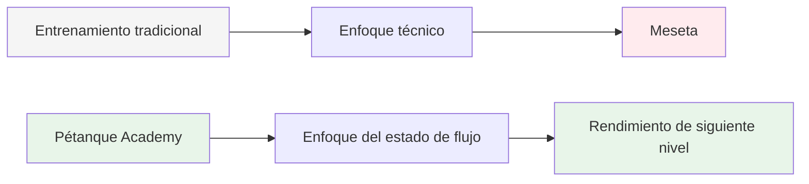
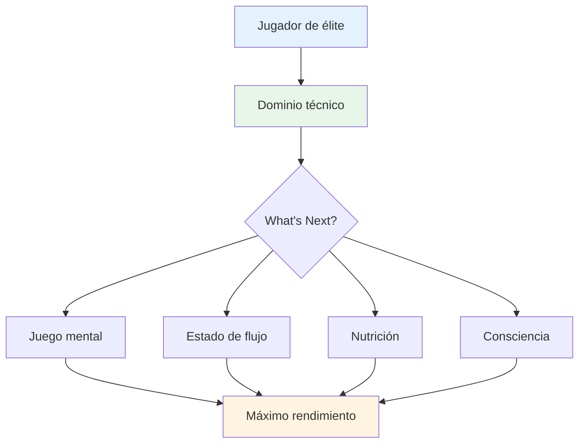

# Ambición

<AdBanner />

Nuestra misión es ayudar a los jugadores de élite a dar el siguiente paso en su desarrollo.

::: tip Nuestra visión
**Transforma a jugadores de élite de técnicamente competentes a mentalmente imparables.** Te ayudamos a acceder al estado de flujo donde las bolas perfectas se convierten en una expresión natural de tu maestría.
:::

## Más allá de la técnica

El entrenamiento tradicional se centra principalmente en los aspectos técnicos: el agarre, la postura y la liberación. Si bien estos fundamentos son importantes, los jugadores de élite ya los dominan.

::: info El avance
**El siguiente nivel no se trata de perfeccionar la técnica: se trata de entrar en el estado de flujo.**

Ayudamos a los jugadores a pasar de una perspectiva de entrenamiento técnico a una perspectiva de **flujo (en la zona)**, donde las bolas perfectas se convierten en una expresión natural de su dominio en lugar de un esfuerzo consciente.
:::

## El viaje

## Lo que ofrecemos

| Ofrenda | Descripción | Impacto |
|----------|-------------|--------|
| **Talleres** | Grupos pequeños de jugadores de élite (6-8) | Aprendizaje y apoyo profundo entre pares |
| **Educación** | Aspectos mentales del máximo rendimiento | Técnicas prácticas que puedes utilizar de inmediato |
| **Comunidad** | Jugadores con ideas afines que superan los límites | Responsabilidad y crecimiento compartido |
| **Enfoque holístico** | Nutrición, mentalidad y entrenamiento mental | Optimización completa del rendimiento |

::: tip Por qué funciona
Los jugadores de élite ya tienen la base técnica. Lo que distingue a los buenos de los excelentes es la capacidad de alcanzar su máximo rendimiento bajo presión. En eso nos centramos.
:::

## Nuestro enfoque

### 1. Entrenamiento en estado de flujo
Aprenda a entrar en “la zona” de manera consistente, no por accidente.

### 2. Fuerza mental
Desarrollar rutinas, atención plena y gestión de la presión.

### 3. Nutrición inteligente
Alimenta tu cerebro para tener una concentración estable y manos firmes.

### 4. Aprendizaje entre pares
Comparte experiencias con otros jugadores de élite en un entorno seguro y de apoyo.

::: info ¿Listo para dar el siguiente paso?
Explora nuestra sección de [Educación](/es/education/) o conoce nuestros [Talleres](/es/taller).
:::

<AdBanner />

