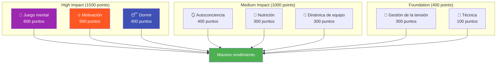

# Ambición

Nuestra misión es ayudar a los jugadores de élite a dar el siguiente paso en su desarrollo.

::: tip Nuestra visión
**Transformamos a jugadores de élite de técnicamente competentes a mentalmente imparables.** Utilizamos un enfoque basado en datos para identificar sus áreas de mejora de mayor impacto.
:::

## El modelo de rendimiento de 8 factores

La investigación y la experiencia demuestran que el rendimiento de élite en la petanca depende de **8 factores interconectados**. La mayoría de los jugadores invierten demasiado en la técnica, descuidando los factores que realmente distinguen a los buenos de los excelentes.

### ¿Por qué la técnica tiene el menor peso?

::: warning La incómoda verdad
**La técnica representa sólo 100 de los 2900 puntos totales** en nuestro modelo.

Esto no se debe a que la técnica no importe, sino a que los jugadores de élite ya han desarrollado una técnica adecuada. La mejora marginal que supone perfeccionar la liberación es mínima comparada con optimizar el sueño, controlar la tensión o fortalecer la capacidad mental.
:::

## El principio del ROI

No todas las mejoras son iguales. Utilizamos cálculos de **Retorno de la Inversión (ROI)** para identificar dónde tu tiempo de entrenamiento tendrá el mayor impacto.

| Tu nivel | Peso factorial | Potencial de retorno de la inversión (ROI) |
|------------|---------------|---------------|
| Baja habilidad en área de alto peso | Alto (por ejemplo, 600) | **Máximo** |
| Alta habilidad en área de alto peso | Alto (por ejemplo, 600) | Bajo (rendimientos decrecientes) |
| Baja habilidad en zona de bajo peso | Bajo (por ejemplo, 100) | Moderado |
| Alta habilidad en zona de bajo peso | Bajo (por ejemplo, 100) | **Mínimo** |

**Ejemplo:** Mejorar tu sueño del 30% al 60% (factor de peso alto, habilidad actual baja) probablemente tendrá más impacto que mejorar la técnica del 75% al 85% (factor de peso bajo, habilidad ya alta).

## Los 8 factores explicados

| Factor | Peso | Qué cubre |
|--------|--------|----------------|
| 🧠 **Juego mental** | 600 | Patrones de pensamiento, enfoque, confianza, acceso al estado de flujo |
| 🔥 **Motivación** | 500 | Impulso, propósito, orientación a objetivos, persistencia. |
| 😴 **Sueño y recuperación** | 400 | Descanso de calidad, protocolos precompetición, gestión energética |
| 🪞 **Autoconciencia** | 400 | Autopercepción precisa, reconocimiento de puntos ciegos, uso de retroalimentación |
| 🥗 **Nutrición** | 300 | Estabilidad del azúcar en sangre, hidratación y alimentación para la competición. |
| 🤝 **Dinámica de equipo** | 300 | Comunicación, confianza, claridad de roles, contribución del equipo |
| **Gestión de la tensión** | 300 | Relajación física, control de la respiración, excitación óptima. |
| 🎯 **Técnica** | 100 | Mecánica física, repertorio de lanzamientos, consistencia. |

## Descubre tu camino

Hemos creado una **herramienta de evaluación gratuita** que analiza sus niveles actuales en los 8 factores y calcula sus prioridades de mejora personalizadas.

::: info Realice la evaluación
**[→ Comienza tu evaluación de desarrollo de jugador](/es/evaluación/)**

En 5 minutos recibirás:
- Su gráfico de radar en los 8 factores
- Recomendaciones clasificadas según el ROI sobre qué aspectos trabajar
- Enlaces a contenido educativo específico para sus principales prioridades
- Opción para recibir retroalimentación de los compañeros de equipo
:::

## Lo que ofrecemos

| Ofrenda | Descripción | Enlace |
|----------|-------------|------|
| **Herramienta de evaluación** | Identifique sus áreas de mejora con mayor retorno de la inversión | [Realizar evaluación](/es/evaluación/) |
| **Módulos educativos** | Contenido profundo sobre los 8 factores | [Explorar Educación](/es/educacion/) |
| **Talleres** | Sesiones de 3 a 4 horas para grupos de 6 a 8 jugadores | [Guía del taller](/es/guias/taller/) |
| **Campos de entrenamiento** | Intensivos de fin de semana mezclando teoría y práctica | [Guía del campamento](/es/guias/campo-de-entrenamiento/) |

## Nuestro enfoque

### 1. Evalúe primero
Empieza con una autoevaluación honesta. Consulta la opinión de tus compañeros para identificar puntos débiles.

### 2. Priorizar por ROI
Concéntrese en factores de alto peso en los que tenga espacio para crecer, no en lo que le resulte cómodo.

### 3. Aprende la ciencia
Comprenda *por qué* algo funciona, no sólo *qué* hacer.

### 4. Practica deliberadamente
Aplica técnicas en el entrenamiento antes de la competición. Desarrolla hábitos, no solo conocimientos.

### 5. Reevaluar periódicamente
Sigue tu progreso. Tus prioridades cambiarán a medida que mejores.

::: tip ¿Listo para dar el siguiente paso?
**[→ Comienza con la evaluación](/es/evaluación/)** — Es gratis y toma 5 minutos.

O explora nuestra sección [Educación](/es/educacion/) para profundizar en cualquiera de los 8 factores.
:::

