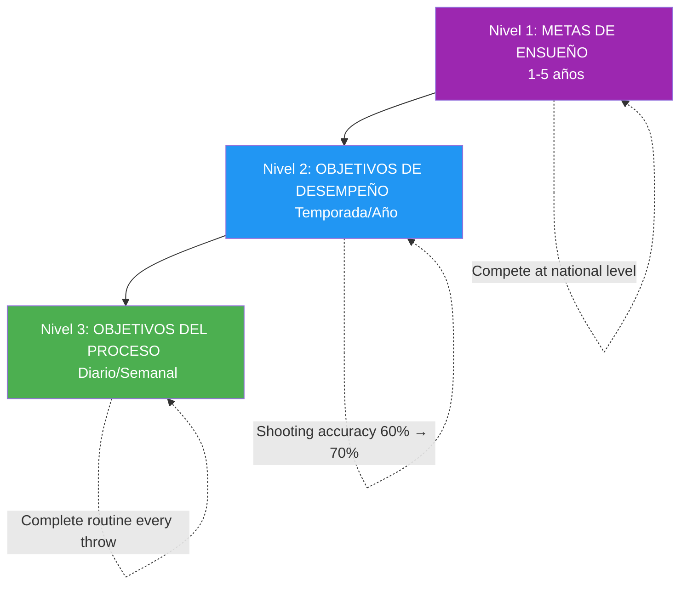

# Establecimiento de objetivos para atletas de élite

> &quot;Los objetivos correctos aceleran el desarrollo; los equivocados crean frustración y estancamiento&quot;.

Establecer metas parece sencillo: decide qué quieres y trabaja para conseguirlo. Pero establecer metas de élite es más complejo.

::: warning Error común
**La mayoría de los jugadores solo se fijan objetivos de resultados** (&quot;Ganar el campeonato&quot;). No se pueden controlar los resultados, solo el proceso que conduce a ellos.
:::

---

## Más allá de los objetivos básicos

| Problemas de objetivos de resultados | Por qué es un problema |
|----------------------|-------------------|
| No se pueden controlar completamente los resultados | Crea impotencia |
| Crea presión sin dirección | Ansiedad sin acción |
| El éxito o el fracaso son binarios | No hay victorias parciales |
| No guía la práctica diaria | ¿Qué es lo que realmente haces? |

El establecimiento de objetivos de élite es algo más profundo.

---

## La jerarquía de objetivos

### Nivel 1: Metas de ensueño (1-5 años)
Tus aspiraciones más grandes:
- &quot;Compite a nivel nacional&quot;
- &quot;Ser reconocido como un tirador de élite&quot;
- &quot;Ganar un campeonato importante&quot;

::: info Dirección, no acción
Estos proporcionan dirección y motivación, pero no se pueden poner en práctica a diario.
:::

### Nivel 2: Metas de rendimiento (temporada/año)
Mejoras mensurables en tu juego:
- Aumenta la precisión de disparo del 60% al 70%
- &quot;Reducir los errores no forzados en un 25%&quot;
- &quot;Desarrollar una plombée fiable&quot;

Estos están bajo su control y son mensurables.

### Nivel 3: Metas del proceso (diarias/semanales)
Las acciones que impulsan la mejora:
- &quot;Rutina completa previa al lanzamiento en cada lanzamiento&quot;
- Practica la visualización durante 10 minutos diarios.
- &quot;Entrena tu técnica de tiro 3 veces por semana&quot;

::: tip Control total
**Los objetivos del proceso son 100% controlables.** Concéntrese aquí para lograr el máximo impacto.
:::

## El marco SMART+

Vaya más allá de los objetivos SMART básicos:

### Específico
No &quot;mejorar mi puntería&quot;, sino &quot;desarrollar una media punta consistente que aterrice a 30 cm del objetivo desde 8 metros&quot;.

### Mensurable
Define cómo harás el seguimiento del progreso:
- Porcentajes de tasa de éxito
- Métricas de consistencia
- Marcadores de análisis de vídeo

### Alcanzable pero exigente
El objetivo debe exigir crecimiento, pero debe ser realista. Un tirador del 60% que aspira al 65% es alcanzable; aspirar al 90% es una fantasía.

### Importante
Los objetivos deben conectarse con tus aspiraciones más amplias y abordar las debilidades reales, no sólo lo que es fácil de mejorar.

### Limitado en el tiempo
Establezca plazos claros:
- &quot;Al final de la temporada&quot;
- &quot;Dentro de 3 meses&quot;
- &quot;Por el campeonato nacional&quot;

### + Personalmente significativo
El objetivo debe ser importante para TI, no solo para tu entrenador o tus compañeros. La motivación interna sustenta el esfuerzo cuando el progreso es lento.

## Enfoque en el proceso vs. en los resultados

### El problema con los objetivos de resultados

&quot;Ganar el partido&quot; crea problemas:
- Ansiedad por cosas que no puedes controlar
- Distracción de la ejecución
- Pensamiento de todo o nada
- Presión sin guía

### El poder de los objetivos de proceso

&quot;Ejecutar mi rutina pre-disparo a la perfección&quot; ofrece:
- Control total
- Enfoque claro
- Retroalimentación inmediata
- Construye hacia resultados de forma natural

### El equilibrio

Utilice objetivos de resultados para motivar y orientar. Utilice objetivos de proceso para enfocarse y ejecutar el día a día.

## Establecimiento de objetivos para las diferentes fases

### Fuera de temporada
Centrarse en los objetivos de desarrollo:
- Mejoras técnicas
- Acondicionamiento físico
- Desarrollo de habilidades mentales
- Ampliando tu paleta de lanzamientos

### Pretemporada
Transición a la integración:
- Combinando habilidades en condiciones similares a las de un partido
- Probando mejoras en la competencia amistosa
- Estrategias de refinamiento

### Temporada de competición
Cambio hacia el rendimiento y el proceso:
- Ejecutar lo que has desarrollado
- Objetivos del proceso para cada partido
- Cambios técnicos mínimos

### Post-competición
Reflexión y planificación:
- Analizar lo que funcionó
- Identificar áreas de crecimiento
- Establecer metas para el próximo ciclo

## Errores comunes al establecer objetivos

### Demasiados objetivos
El enfoque es poder. 2 o 3 objetivos clave superan a 10 dispersos.

### Solo objetivos de resultados
Sin objetivos de proceso, no tienes una hoja de ruta.

### Sin flexibilidad
Los objetivos deben adaptarse a la nueva información. Aferrarse rígidamente a objetivos obsoletos desperdicia esfuerzo.

### Objetivos basados en la comparación
&quot;Ser mejor que [jugador]&quot; pone tu éxito en manos de otra persona.

### Descuidar los objetivos mentales
Los objetivos técnicos y físicos dominan, pero las habilidades mentales a menudo determinan quién gana.

## Estrategias de implementación

### Escríbelos
Los objetivos escritos tienen muchas más probabilidades de lograrse.

### Revisar periódicamente
La revisión semanal mantiene los objetivos presentes y permite realizar ajustes.

### Compartir selectivamente
Comparta con aquellos que lo apoyarán, no con aquellos que lo debilitarán.

### Visualizar el logro
Imagina periódicamente que logras tus objetivos: la sensación, el momento.

### Seguimiento del progreso
Lo que se mide se gestiona. Mantenga registros.

## Cuando los objetivos no se cumplen

Los objetivos no alcanzados no son fracasos: son datos:

1. **Analizar**: ¿Por qué no se logró?
2. **Aprende**: ¿Qué te enseña esto?
3. **Ajustar**: Modificar el objetivo o el enfoque
4. **Continuar**: La persistencia vence a la perfección

## El juego mental de los goles

Los objetivos afectan la psicología:
- **Demasiado fácil**: Aburrimiento, complacencia.
- **Demasiado difícil**: Ansiedad, desánimo.
- **Perfecto**: Compromiso, fluidez, crecimiento

Encuentra el punto ideal donde los objetivos sean un desafío sin abrumar.

---

| *Relacionado: [Introducción al establecimiento de metas](/es/educacion/motivacion/) | [Objetivos SMART](/es/educacion/motivacion/objetivos-inteligentes) | [Planificando tu desarrollo](/es/educacion/motivacion/planificacion)* |

