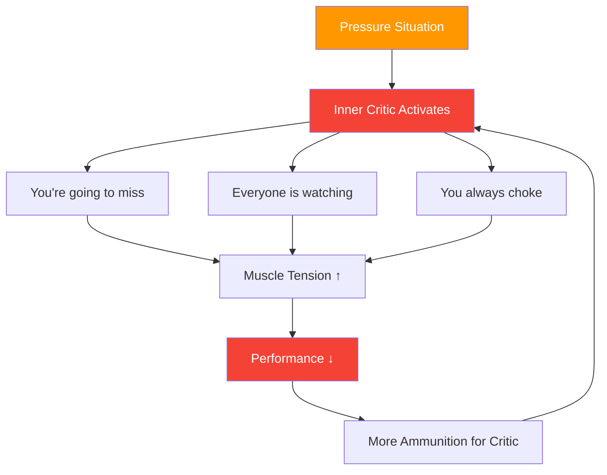

# Understanding the Inner Critic

> "Every pétanque player knows that voice — the one that whispers 'you're going to miss' just as you're about to throw."

This is your inner critic — and learning to manage it is essential for elite performance.

::: warning The Paradox
**Your inner critic isn't trying to hurt you** — it's a misguided attempt at protection. But this "protection" becomes self-sabotage.
:::

---

## What Is the Inner Critic?

The inner critic is that internal voice that judges, criticizes, and undermines your confidence:

### When It Appears

| Moment | Inner Critic Says |
|--------|-------------------|
| **Before crucial shot** | "Everyone is watching. Don't mess this up." |
| **After a miss** | "You always choke under pressure." |
| **During losing streak** | "You're not good enough for this level." |

## Recognizing Your Patterns

The first step is awareness. Start noticing when your inner critic appears:

### Common Triggers
- High-pressure situations (match point, important tournaments)
- After making a mistake
- When opponents are performing well
- When teammates seem frustrated
- Physical fatigue or discomfort

### Common Messages
- "You can't handle pressure"
- "You're not as good as them"
- "Everyone is judging you"
- "You always fail when it matters"

## The Impact on Performance

When the inner critic takes over, your body responds:

1. **Muscle tension increases** — Your throw becomes rigid
2. **Breathing becomes shallow** — Less oxygen, less focus
3. **Vision narrows** — You lose awareness of the terrain
4. **Decision-making suffers** — You second-guess yourself

This creates a vicious cycle: the inner critic causes poor performance, which gives the critic more ammunition.

## Strategies for Managing the Inner Critic

### 1. Name It to Tame It

Give your inner critic a name — something slightly ridiculous. "Oh, there goes Negative Nils again." This creates distance between you and the voice, making it easier to dismiss.

### 2. Challenge the Evidence

When the critic says "you always miss under pressure," ask yourself: Is that actually true? Can you think of times you performed well under pressure? The critic deals in absolutes that rarely reflect reality.

### 3. Reframe the Message

Transform criticism into coaching:
- "You're going to miss" → "Focus on your routine"
- "Everyone is watching" → "This is your moment to shine"
- "You always choke" → "You've handled pressure before"

### 4. Use Your Pre-Shot Routine

A solid [pre-shot routine](/es/education/mental-game/mental-strength/pre-shot-routine) gives your mind something constructive to focus on, leaving less room for the critic.

### 5. Practice Self-Compassion

Treat yourself as you would a teammate. Would you tell a struggling teammate "you're terrible"? Of course not. Extend the same kindness to yourself.

## Building a Supportive Inner Voice

The goal isn't to silence the inner critic completely — that's nearly impossible. Instead, develop a stronger supportive voice:

### The Supportive Voice Says:
- "One throw at a time"
- "Trust your training"
- "You've done this before"
- "Stay in the present"
- "Breathe and reset"

### Daily Practice

Spend 5 minutes each day:
1. Recall a moment when you performed well
2. Remember how it felt in your body
3. Hear what your supportive voice was saying
4. Anchor this feeling with a physical gesture (touching your boule, adjusting your stance)

## In Competition

When the inner critic appears during a match:

1. **Acknowledge it**: "I notice I'm being self-critical"
2. **Take a breath**: Slow, deep breath to reset
3. **Use your anchor**: The physical gesture from your practice
4. **Return to routine**: Focus on your pre-shot process

## The Long-Term Journey

Managing the inner critic is not a one-time fix. It's an ongoing practice that becomes easier with time. Elite players don't eliminate self-doubt — they learn to perform despite it.

The inner critic will always be part of you. But with practice, its voice becomes quieter, and your supportive voice becomes stronger. That's the mental edge that separates good players from great ones.

---

*Related: [Handling Pressure](/es/education/mental-game/mental-strength/handling-pressure) | [Pre-Shot Routine](/es/education/mental-game/mental-strength/pre-shot-routine) | [Mindfulness Techniques](/es/education/mental-game/mindfulness/techniques)*

