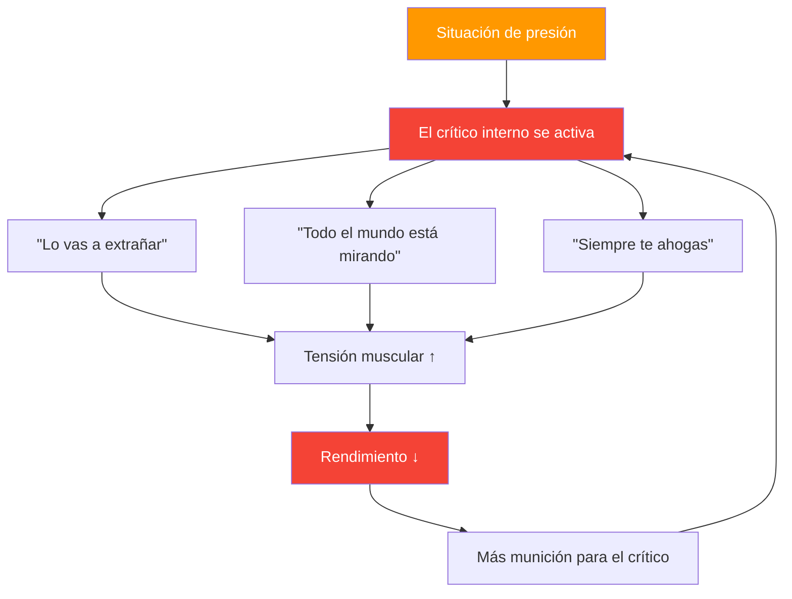

# Entendiendo al crítico interno

> &quot;Todo jugador de petanca conoce esa voz, la que susurra &#39;vas a fallar&#39; justo cuando estás a punto de lanzar&quot;.

Éste es su crítico interno, y aprender a gestionarlo es esencial para un rendimiento de élite.

::: warning La paradoja
**Tu crítico interno no intenta hacerte daño**; es un intento erróneo de protegerte. Pero esta &quot;protección&quot; se convierte en autosabotaje.
:::

---

## ¿Qué es el crítico interno?

El crítico interno es esa voz interna que juzga, critica y socava tu confianza:

### Cuando aparece

| Momento | El crítico interno dice |
|--------|-------------------|
| **Antes del disparo crucial** | &quot;Todo el mundo está mirando. No arruines esto.&quot; |
| **Después de un fallo** | &quot;Siempre te ahogas bajo presión.&quot; |
| **Durante la racha perdedora** | &quot;No eres lo suficientemente bueno para este nivel.&quot; |

## Reconociendo tus patrones

El primer paso es la consciencia. Empieza a notar cuándo aparece tu crítico interior:

### Desencadenantes comunes
- Situaciones de alta presión (punto de partido, torneos importantes)
- Después de cometer un error
- Cuando los oponentes tienen un buen desempeño
- Cuando los compañeros de equipo parecen frustrados
- Fatiga física o malestar

### Mensajes comunes
- &quot;No puedes soportar la presión&quot;
- &quot;No eres tan bueno como ellos&quot;
- &quot;Todo el mundo te está juzgando&quot;
- &quot;Siempre fallas cuando importa&quot;

## El impacto en el rendimiento

Cuando el crítico interno toma el control, tu cuerpo responde:

1. **La tensión muscular aumenta** — Tu lanzamiento se vuelve rígido
2. **La respiración se vuelve superficial** — Menos oxígeno, menos concentración
3. **La visión se estrecha** — Pierdes la conciencia del terreno
4. **La toma de decisiones se ve afectada** — Dudas de ti mismo

Esto crea un círculo vicioso: el crítico interno provoca un mal desempeño, lo que le da más munición.

## Estrategias para gestionar al crítico interno

### 1. Ponle un nombre para domarlo

Ponle un nombre a tu crítico interno, algo un poco ridículo. &quot;¡Ah, ahí va otra vez Negativo Nils!&quot;. Esto crea distancia entre tú y la voz, facilitando su desestimación.

### 2. Cuestionar la evidencia

Cuando el crítico dice &quot;siempre fallas bajo presión&quot;, pregúntate: ¿Es cierto? ¿Recuerdas momentos en los que te fue bien bajo presión? El crítico usa absolutos que rara vez reflejan la realidad.

### 3. Reformular el mensaje

Transformar la crítica en coaching:
- &quot;Lo vas a extrañar&quot; → &quot;Concéntrate en tu rutina&quot;
- &quot;Todos están mirando&quot; → &quot;Este es tu momento para brillar&quot;
- &quot;Siempre te ahogas&quot; → &quot;Ya has manejado la presión antes&quot;

### 4. Utilice su rutina previa al disparo

Una [rutina previa al tiro](/es/educacion/juego-mental/fuerza-mental/rutina-pre-tiro) sólida le da a tu mente algo constructivo en lo que concentrarse, dejando menos espacio para la crítica.

### 5. Practica la autocompasión

Trátate como a un compañero de equipo. ¿Le dirías a un compañero con dificultades &quot;eres terrible&quot;? Claro que no. Sé amable contigo mismo.

## Construyendo una voz interior de apoyo

El objetivo no es silenciar por completo a la crítica interna; eso es casi imposible. En cambio, desarrolla una voz de apoyo más fuerte:

### La voz de apoyo dice:
- &quot;Un lanzamiento a la vez&quot;
- &quot;Confía en tu entrenamiento&quot;
- &quot;Ya has hecho esto antes&quot;
- &quot;Quédate en el presente&quot;
- &quot;Respira y reinicia&quot;

### Práctica diaria

Dedica 5 minutos cada día a:
1. Recuerda un momento en el que te desempeñaste bien
2. Recuerda cómo te sentiste en el cuerpo
3. Escuche lo que decía su voz de apoyo
4. Ancla este sentimiento con un gesto físico (tocar tu bola, ajustar tu postura)

## En competición

Cuando el crítico interior aparece durante un partido:

1. **Reconócelo**: &quot;Me doy cuenta de que estoy siendo autocrítico&quot;
2. **Toma una respiración**: Respira lenta y profundamente para reiniciar.
3. **Usa tu ancla**: El gesto físico de tu práctica
4. **Vuelve a la rutina**: Concéntrate en tu proceso previo a la inyección

## El viaje a largo plazo

Gestionar la crítica interna no es una solución única. Es una práctica continua que se vuelve más fácil con el tiempo. Los jugadores de élite no eliminan las dudas, sino que aprenden a rendir a pesar de ellas.

El crítico interior siempre será parte de ti. Pero con la práctica, su voz se aquieta y tu voz de apoyo se fortalece. Esa es la ventaja mental que distingue a los buenos jugadores de los grandes.

---

| *Relacionado: [Manejo de la presión](/es/educacion/juego-mental/fuerza-mental/manejo-de-la-presion) | [Rutina pre-tiro](/es/educacion/juego-mental/fuerza-mental/rutina-pre-tiro) | [Técnicas de atención plena](/es/educacion/juego-mental/atención-plena/tecnicas)* |

