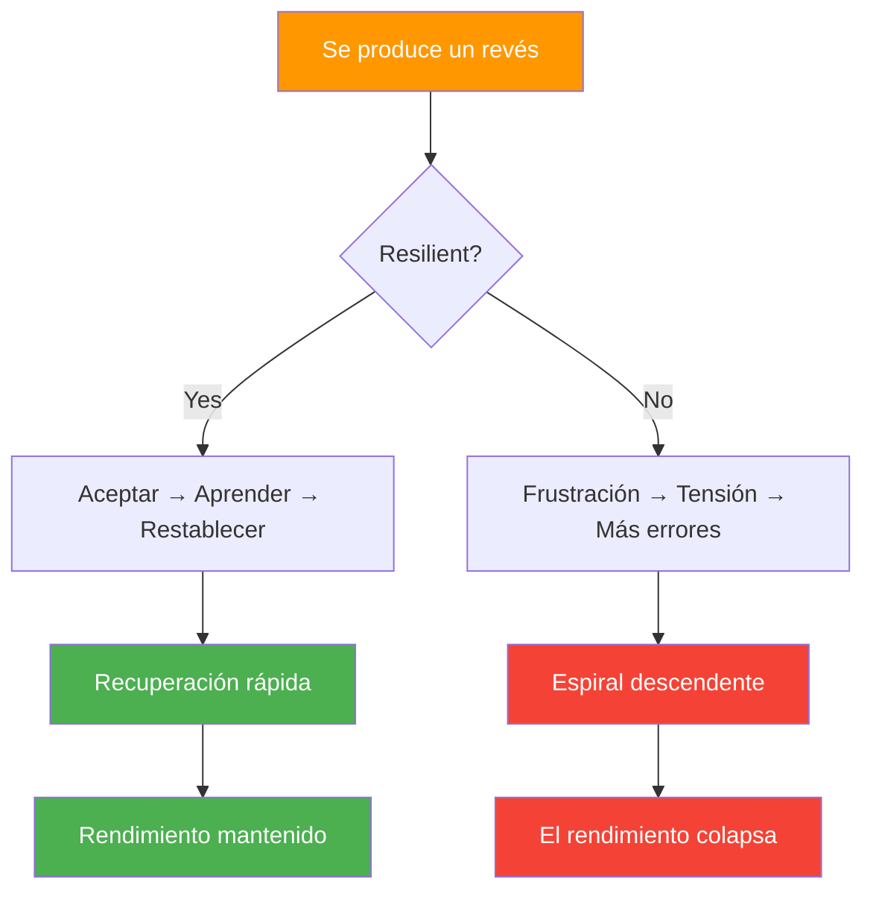

# Resiliencia mental en la petanca

> &quot;La resiliencia no consiste en no caer nunca, sino en la rapidez con la que uno se levanta&quot;.

En la petanca, donde el impulso cambia rápidamente y un solo lanzamiento puede cambiarlo todo, la resiliencia mental a menudo determina quién gana.

::: tip La verdad de la resiliencia
**Todo jugador de élite tiene momentos malos.** Lo que los diferencia es la velocidad de recuperación: minutos, no partidos.
:::

---

## ¿Qué es la resiliencia mental?

La resiliencia mental es la capacidad de:
- Recuperarse rápidamente de los reveses
- Mantener el esfuerzo a pesar de las dificultades
- Adaptarse a las circunstancias cambiantes
- Manténgase seguro ante la adversidad
- Aprende de los fracasos sin dejarte definir por ellos

---

## Por qué la resiliencia es importante en la petanca

La petanca pone a prueba la resiliencia constantemente:

| Desafío | Respuesta resiliente | Respuesta no resiliente |
|-----------|-------------------|------------------------|
| El punto perfecto recibe un disparo | &quot;Siguiente lanzamiento&quot; | &quot;¡Injusto!&quot; |
| Fallar un tiro &quot;fácil&quot; | &quot;Reiniciar, seguir adelante&quot; | &quot;Siempre me ahogo&quot; |
| Los oponentes regresan | &quot;Manténte enfocado&quot; | &quot;Vamos a perder&quot; |
| Luchas entre compañeros de equipo | &quot;Apoyarlos&quot; | &quot;Lo están arruinando&quot; |

---

## La mentalidad de resiliencia

### Mentalidad fija vs. mentalidad de crecimiento

| Mentalidad fija | Mentalidad de crecimiento |
|---------------|----------------|
| &quot;Fallé porque no soy lo suficientemente bueno&quot; | &quot;Me perdí... ¿qué puedo aprender?&quot; |
| &quot;No puedo soportar la presión&quot; | &quot;Estoy aprendiendo a manejar la presión&quot; |
| &quot;El fracaso significa que soy un fracaso&quot; | &quot;El fracaso significa que estoy creciendo&quot; |

::: info Visión clave
**Los jugadores resilientes ven los reveses como información, no como identidad.**
:::

### Enfoque controlable

Los jugadores resilientes se centran en lo que pueden controlar:
- Su preparación
- Su esfuerzo
- Su actitud
- Su respuesta a los acontecimientos

Liberan lo que no pueden controlar:
- Rendimiento de los oponentes
- Condiciones climáticas
- Rebotes afortunados o desafortunados
- Opiniones de otros

### Perspectiva a largo plazo

Un lanzamiento, un partido, un torneo: nada define tu carrera. Los jugadores resilientes mantienen la perspectiva:
- &quot;Este es un momento de un largo viaje&quot;
- &quot;He superado reveses antes&quot;
- &quot;Esto me hará más fuerte&quot;

## Construyendo resiliencia

### 1. Desarrollar una base sólida

La resiliencia es más fácil cuando tienes:
- **Técnica sólida**: Confianza en tus habilidades
- **Aptitud física**: Energía para sostener el esfuerzo
- **Habilidades mentales**: Herramientas para gestionar la adversidad
- **Red de apoyo**: Personas que creen en ti

### 2. Practica la adversidad

No se puede desarrollar resiliencia sin afrontar desafíos:
- Entrenar en condiciones difíciles
- Practica cuando estés cansado
- Compite contra mejores jugadores
- Ponte en situaciones de presión

### 3. Desarrollar rutinas de recuperación

Crea rituales para recuperarte:

**Reinicio físico:**
- Respiración profunda
- Sacudir la tensión
- Cambiar la postura

**Reinicio mental:**
- Reconocer el revés
- Extraer cualquier lección
- Reenfocarse en el presente

### 4. Construir un banco de resiliencia

Mantén un registro mental de las veces que has superado la adversidad:
- Regresos que has hecho
- Desafíos que has enfrentado
- Crecimiento que has logrado

Apóyese en estos recuerdos cuando los desafíos actuales parezcan abrumadores.

## Resiliencia en acción

### Después de un tiro fallado

1. **Aceptar**: &quot;Eso pasó&quot;
2. **Respira**: Una respiración profunda
3. **Aprender**: Evaluación rápida (si resulta útil)
4. **Liberación**: Déjalo ir
5. **Reenfoque**: Próxima oportunidad

### Durante una racha perdedora

1. **Perspectiva**: &quot;Las rachas terminan&quot;
2. **Proceso**: Enfóquese en la ejecución, no en los resultados
3. **Paciencia**: Confía en que el rendimiento volverá
4. **Persistencia**: Sigue apareciendo

### Cuando los oponentes dominan

1. **Respeto**: Reconoce su buen juego
2. **Enfoque**: Controla lo que puedas
3. **Competir**: Haz que ganen todos los puntos
4. **Aprende**: ¿Qué puedes sacar de esto?

### Después de una dura pérdida

1. **Sentir**: Permitir la decepción (brevemente)
2. **Analizar**: ¿Qué salió bien? ¿Qué no?
3. **Extracto**: Lecciones para la próxima vez
4. **Sigue adelante**: No lo lleves adelante

## Los asesinos de la resiliencia

### Perfeccionismo
Esperar la perfección garantiza la decepción. La excelencia, no la perfección, es el objetivo.

### Catastrofismo
&quot;Fallé ese tiro, se acabó el partido, soy fatal&quot;. Un solo acontecimiento no lo determina todo.

### Comparación
Medirte con los demás pone tu confianza en sus manos.

### Rumia
Repetir los fracasos no los cambia: sólo extiende su impacto.

## Resiliencia del equipo

La resiliencia es contagiosa en ambos sentidos:

**Desarrollar la resiliencia del equipo:**
- Apoyar a los compañeros de equipo con dificultades
- Celebre el esfuerzo, no sólo los resultados
- Modelar respuestas resilientes
- Mantener un lenguaje corporal positivo

**Protección contra la negatividad:**
- No te unas a las sesiones de quejas
- Redirigir las conversaciones negativas
- Centrarse en las soluciones, no en los problemas

## Desarrollo de resiliencia a largo plazo

### Prácticas diarias
- Diario de gratitud (crea una perspectiva positiva)
- Meditación de atención plena (desarrolla la regulación emocional)
- Ejercicio físico (desarrolla tolerancia al estrés)

### Reflexión semanal
- ¿A qué desafíos me enfrenté?
- ¿Cómo respondí?
- ¿Qué haría diferente?
- ¿De qué estoy orgulloso?

### Revisión de temporada
- Principales contratiempos y cómo los manejé
- Crecimiento de la capacidad de resiliencia
- Áreas de desarrollo continuo

## El competidor resiliente

Los competidores más resilientes comparten rasgos:
- Esperan desafíos y se preparan para ellos.
- Consideran los reveses como temporales y específicos
- Mantienen el esfuerzo cuando los resultados se quedan atrás
- Aprenden de cada experiencia
- Mantienen la perspectiva de lo que importa

La resiliencia no es un rasgo que tienes o no tienes: es una habilidad que se desarrolla a través de la práctica y la intención.

---

| *Relacionado: [Fuerza mental](/es/educacion/juego-mental/fuerza-mental/) | [Manejo de la presión](/es/educacion/juego-mental/fuerza-mental/manejo-de-la-presion) | [La Zona](/es/educacion/juego-mental/la-zona/)* |

