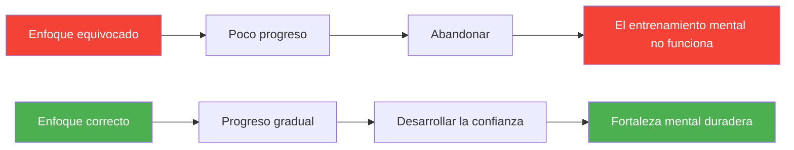

# 5 errores de entrenamiento mental

> Muchos jugadores invierten tiempo en sus habilidades mentales y solo ven poca mejora. He aquí por qué.

El entrenamiento mental puede transformar tu rendimiento en la petanca, pero solo si se realiza correctamente.

::: danger Patrón común
**La mayoría de los entrenamientos mentales fracasan no porque las técnicas no funcionen**, sino por cómo se aplican.
:::

---

## Error n.° 1: Tratar las habilidades mentales como algo opcional

::: warning El problema
Muchos jugadores consideran que el entrenamiento mental es algo deseable, algo en lo que trabajar &quot;cuando haya tiempo&quot;.
:::

### Por qué falla

Las habilidades mentales son habilidades: requieren la misma práctica constante que la técnica de lanzamiento. La atención ocasional produce resultados ocasionales.

### La solución

| Acción | Implementación |
|--------|---------------|
| Prográmalo | Me gusta el entrenamiento físico |
| Empieza poco a poco | Sólo 10 minutos diarios |
| Hazlo no negociable | No hay excusas |
| Rastrearlo | Junto con la práctica física |

**Recuerda:** En los niveles de élite, las habilidades mentales a menudo determinan quién gana.

## Error n.° 2: Entrenar solo cuando las cosas van mal

### El problema

Los jugadores suelen recurrir al entrenamiento mental solo después de un mal rendimiento o durante una mala racha. Lo ven como una terapia más que como un desarrollo.

### Por qué falla

Las habilidades mentales que se desarrollan en tiempos de crisis son frágiles. No se pueden desarrollar capacidades profundas cuando ya se está luchando. Es como intentar aprender a nadar mientras uno se ahoga.

### La solución

- Desarrolla habilidades mentales durante los buenos momentos
- Practica cuando tengas un buen desempeño
- Crea una base antes de necesitarla
- Mantener la práctica de manera constante, independientemente de los resultados.

**Recuerda:** El mejor momento para desarrollar fuerza mental es cuando no la necesitas desesperadamente.

## Error n.° 3: Esperar resultados inmediatos

### El problema

Los jugadores prueban la visualización durante una semana, no ven una mejora inmediata y concluyen &quot;no funciona para mí&quot;.

### Por qué falla

Las habilidades mentales se desarrollan lentamente, a menudo de forma invisible al principio. Las vías neuronales que sustentan la fortaleza mental tardan en desarrollarse. Esperar resultados rápidos lleva al abandono antes de que se manifiesten los beneficios.

### La solución

- Comprométete a practicar de forma constante durante al menos 8 a 12 semanas.
- Busque mejoras sutiles, no cambios dramáticos
- Confía en el proceso incluso cuando el progreso no sea visible
- Mantenga un diario para realizar un seguimiento de los cambios graduales

**Recuerda:** No esperarías dominar un nuevo lanzamiento en una semana. La habilidad mental requiere la misma paciencia.

## Error n.° 4: Práctica genérica sin personalización

### El problema

Los jugadores siguen programas genéricos de entrenamiento mental sin adaptarlos a sus necesidades específicas, personalidad y estilo de juego.

### Por qué falla

El entrenamiento mental no es universal. Lo que funciona para un jugador puede no funcionar para otro. Una técnica de visualización que ayuda a un pensador visual puede frustrar a alguien que piensa con sentimientos.

### La solución

- Identifique SUS desafíos mentales específicos
- Experimente con diferentes técnicas
- Adapte los métodos a su estilo de aprendizaje
- Concéntrese en lo que realmente le ayuda

**Preguntas para hacer:**
- ¿A qué desafíos mentales me enfrento con más frecuencia?
- ¿Cómo proceso la información de forma natural?
- ¿Qué me ha funcionado en el pasado?
- ¿Qué me parece auténtico?

## Error n.° 5: separar el entrenamiento mental del físico

### El problema

Los jugadores realizan entrenamiento mental de forma aislada (meditación en casa, visualización antes de acostarse), pero no lo integran con la práctica física.

### Por qué falla

Las habilidades mentales deben estar conectadas con el rendimiento físico. Practicar la atención plena sobre una almohadilla es diferente a practicarla mientras se lanza. La transferencia no es automática.

### La solución

- Utilice habilidades mentales durante cada sesión de práctica.
- Practica tu rutina previa al disparo con total compromiso mental.
- Aplicar técnicas de gestión de la presión en el entrenamiento.
- Crear situaciones de práctica que requieran habilidades mentales.

**Ejemplos de integración:**
- Visualiza cada lanzamiento antes de ejecutarlo
- Utilice técnicas de respiración entre lanzamientos.
- Practica tu rutina de concentración en el entrenamiento
- Simular situaciones de presión periódicamente

## Errores de bonificación

### Error n.° 6: Solo teoría, nada de práctica

Leer sobre habilidades mentales no es lo mismo que practicarlas. El conocimiento sin aplicación no cambia nada.

### Error n.° 7: ignorar lo básico

Las técnicas avanzadas construidas sobre bases débiles se desmoronan. Domina la respiración básica, la concentración y la rutina antes que los métodos complejos.

### Error n.° 8: hacerlo solo

El entrenamiento mental se beneficia de la orientación. Considere trabajar con un psicólogo deportivo o un mentor con experiencia.

## El enfoque correcto

Entrenamiento mental efectivo:

1. **Es consistente**: práctica regular, no atención ocasional
2. **Es proactivo** — Construido antes de que se necesite, no en crisis
3. **Es paciente** — Permite tiempo para el desarrollo
4. **Es personalizado** — Adaptado a tus necesidades
5. **Está integrado** — Conectado a la práctica física

## Empezando bien

Si estás comenzando un entrenamiento mental:

1. **Evalúa** honestamente tu juego mental actual
2. **Identificar** 1 o 2 áreas específicas para mejorar
3. **Elige** técnicas que se adapten a tu estilo
4. **Programar** tiempo de práctica regular
5. **Integrar** con el entrenamiento físico
6. **Seguimiento** del progreso a lo largo del tiempo
7. **Ajustar** según lo que funcione

## La recompensa

Los jugadores que evitan estos errores y entrenan sus mentes de manera constante informan:
- Mayor consistencia bajo presión
- Recuperación más rápida de los errores
- Más diversión en la competición
- Mejor enfoque y concentración
- Mayor confianza

El juego mental se puede entrenar. Entrénalo bien.

---

| *Relacionado: [Fuerza mental](/es/educacion/juego-mental/fuerza-mental/) | [Métodos de entrenamiento](/es/educación/técnica/entrenamiento/) | [Mindfulness](/es/educacion/juego-mental/mindfulness/)* |

