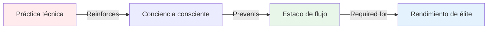

# Por qué los jugadores de élite necesitan entrenamiento mental más que entrenamiento técnico

> &quot;Si llevas años jugando a la petanca y tienes una técnica sólida, es posible que la práctica más técnica te esté frenando&quot;.

::: tip La incómoda verdad
**En el nivel de élite, tu técnica no es el cuello de botella: lo es tu mente.**
:::

---

## La paradoja del desarrollo de las élites

Aquí hay algo que sorprende a la mayoría de los jugadores:

::: warning El principio de inversión
A medida que aumenta su habilidad técnica, la relación entre entrenamiento técnico y mental debería **invertirse**.

- **Principiantes:** 90% técnico, 10% mental
- **Intermedio:** 70% técnico, 30% mental
- **Avanzado:** 50% técnico, 50% mental
- **Élite:** 20% técnico, 80% mental
:::

Esto no es intuitivo. La mayoría de los jugadores asumen que, para mejorar, necesitan practicar más su técnica. Pero en el nivel de élite, este enfoque causa problemas.

## Por qué el entrenamiento técnico puede perjudicar el rendimiento de élite

### El problema de pensar demasiado

Al practicar la técnica con frecuencia, se refuerza la **conciencia** de los movimientos. Esto es perfecto para principiantes que están desarrollando sus conexiones neuronales. Pero para los jugadores de élite, crea un hábito peligroso: pensar en la técnica durante la ejecución.

**Ejemplo del terreno:**

*Principiante:* Necesita pensar &quot;doblar las rodillas, soltar suavemente y continuar&quot; para ejecutar correctamente.

*Jugador de élite:* Ya tiene más de 10,000 horas de práctica. El movimiento es automático. Pensar en &quot;doblar las rodillas&quot; interrumpe el patrón entrenado.

### La barrera del estado de flujo

Los estados de flujo (estar &quot;en la zona&quot;) requieren **hipofrontalidad transitoria**, una reducción temporal de la actividad en la corteza prefrontal (la parte analítica del cerebro).

Cuanto más practiques la técnica conscientemente, más difícil será &quot;desconectarse&quot; durante la competición.

## Lo que realmente necesitan los jugadores de élite

### 1. La capacidad de cambiar de modo

El rendimiento de élite requiere dominar la transición entre dos modos cerebrales:

**Modo de planificación (fuera del círculo)**
- Pensamiento analítico
- Evaluación de la estrategia
- Toma de decisiones
- Evaluación de riesgos

**Modo de ejecución (dentro del círculo)**
- Movimiento automático
- Enfoque solo en el objetivo
- Confianza en la formación
- Acceso al estado de flujo

La mayoría de los jugadores de élite se quedan estancados en el modo de planificación durante la ejecución. Necesitan entrenar el **cambio**, no la técnica.

### 2. Gestión de la presión

La práctica técnica en condiciones cómodas no te prepara para la presión psicológica de la competición.

**Qué sucede bajo presión:**
- La frecuencia cardíaca aumenta
- La respiración se vuelve superficial
- Músculos tensos
- La atención se estrecha
- El crítico interno se activa

Puedes tener una técnica perfecta en la práctica y perderla por completo bajo presión. No se trata de un problema técnico, sino mental.

### 3. Recuperación de errores

Los jugadores de élite no cometen menos errores que los buenos. Se recuperan **más rápido**.

**Buen jugador después de un mal lanzamiento:**
- Se detiene en el error
- Analiza lo que salió mal
- Preocupaciones por el próximo lanzamiento
- El rendimiento se deteriora

**Jugador de élite después de un mal lanzamiento:**
- Observación neutral
- Aprendizaje rápido
- Reinicio inmediato
- Rendimiento mantenido

Esta es una habilidad entrenada, no un rasgo de personalidad.

## La ciencia: Por qué funciona el entrenamiento mental

### Neurociencia de la experiencia

Las investigaciones sobre el rendimiento de los expertos muestran que los atletas de élite tienen:

1. **Patrones motores automatizados**: los movimientos ocurren sin control consciente.
2. **Reconocimiento de patrones superior**: vea las situaciones más rápido
3. **Mejor regulación emocional** - Gestionar la presión de forma eficaz
4. **Recuperación más rápida** - Restablecerse rápidamente después de errores

Aviso: Solo el punto 1 es técnico. Los otros tres son mentales.

### El umbral de las 10.000 horas

Una vez que hayas invertido aproximadamente 10 000 horas en práctica deliberada (unos 8-10 años de juego serio), tus patrones técnicos estarán prácticamente consolidados. Una mayor mejora técnica muestra resultados decrecientes.

¿Pero el desarrollo del juego mental? Ahí es donde aún se pueden lograr grandes avances.

## Cómo reestructurar tu entrenamiento

### Para jugadores de élite (más de 8 años de experiencia)

**División típica actual:**
- 80% práctica técnica
- 20% juego/competición

**División recomendada:**
- 20% de mantenimiento técnico
- 40% de entrenamiento de juego mental
- 40% situaciones de competencia/presión

### ¿Cómo es el entrenamiento del juego mental?

**Esto no:**
- &quot;Simplemente relájate&quot;
- &quot;No pienses en ello&quot;
- &quot;Ten confianza&quot;

**Pero esto:**
- Práctica estructurada de atención plena (10 minutos diarios)
- Desarrollo y práctica de rutinas previas al disparo
- Simulación de presión en el entrenamiento
- Protocolos de recuperación de errores
- Identificación del disparador del estado de flujo
- Trabajo de entrenador interno vs. crítico interno

Consulte nuestra sección [Educación](/es/education/) para conocer técnicas específicas.

## La incómoda verdad

Si eres un jugador de élite que aún dedica el 80 % de su tiempo de entrenamiento a ejercicios técnicos, estás entrenando como un principiante. Tu técnica ya es bastante buena. La limitación no es tu brazo, sino tu mente.

::: tip La verdadera pregunta
No es &quot;¿Cómo puedo mejorar mi técnica de señalización?&quot;

La pregunta es &quot;¿Cómo puedo acceder a mi mejor técnica de manera consistente bajo presión?&quot;
:::

## Próximos pasos prácticos

### 1. Evalúe su ratio actual

Realiza un seguimiento de tu entrenamiento durante una semana:
- Horas de práctica técnica
- Horas de trabajo de juego mental
- Horas en situaciones de competición/presión

### 2. Empieza poco a poco

No cambies la proporción de la noche a la mañana. Añade:
- 10 minutos diarios de atención plena
- Un enfoque de juego mental por sesión de entrenamiento
- Práctica de rutina previa al disparo

### 3. Medir el rendimiento mental

Pista:
- Tiempo de recuperación después de los errores
- Consistencia bajo presión
- Frecuencia del estado de flujo
- Cumplimiento de la rutina previa a la inyección

### 4. Utilice los módulos educativos

Empezar con:
1. [La Zona](/es/educacion/juego-mental/la-zona/) - Comprender los estados de flujo
2. [Fuerza mental](/es/educacion/juego-mental/fuerza-mental/) - Desarrolla habilidades de presión
3. [Mindfulness](/es/educacion/juego-mental/mindfulness/) - Desarrollar la concentración en el momento presente

## Conclusión

El camino al rendimiento de élite no es practicar más técnicamente, sino entrenar la mente de forma más inteligente. Tu técnica ya es lo suficientemente buena. La pregunta es: ¿puedes acceder a ella cuando importa?

Los jugadores que hacen este cambio —que adoptan el entrenamiento mental como su principal enfoque de desarrollo— son los que superan las mesetas de rendimiento y alcanzan una excelencia constante.

**La elección es tuya:** Sigue entrenando como un principiante o comienza a entrenar como un jugador de élite.

---

## Recursos relacionados

- [La Zona: Entendiendo el Estado de Flujo](/es/educacion/juego-mental/la-zona/)
- [Estudios de caso: Jugadores de élite en acción](/es/articulos/estudios-de-caso)
- [Plantilla de objetivo](/es/guides/templates/goal-template) - Planifica el desarrollo de tu juego mental

**¿Preguntas o comentarios?** Correo electrónico: [patrik.wiik@gmail.com](mailto:patrik.wiik@gmail.com)

