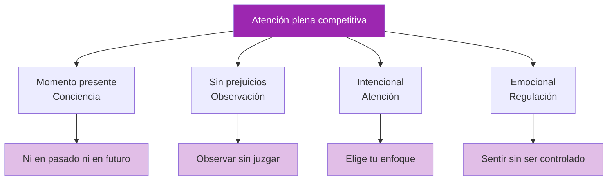

# Atención plena en la competición

> &quot;La atención plena no es solo para cojines de meditación: es una ventaja competitiva&quot;.

La capacidad de permanecer presente, consciente y no reactivo durante los partidos separa a los jugadores de élite de aquellos que se derrumban bajo presión.

::: tip La ventaja del momento presente
**Solo puedes lanzar una bola a la vez.** La atención plena te mantiene en el único momento que importa: este.
:::

---

## Qué significa la atención plena en la competición

---

## El problema de la mente errante

::: danger El problema del 47%
**Las investigaciones muestran que la mente promedio divaga el 47% del tiempo.** En la competencia, esta divagación es costosa.
:::

| A dónde va la mente | Lo que te pierdes |
|-----------------|---------------|
| Último tiro fallado | Lectura actual del terreno |
| Preocuparse por la puntuación | Selección óptima del tiro |
| Lo que piensan los demás | Sensación de la bola |
| Planificación de celebraciones | Ejecución en el momento presente |

Cada momento invertido en un viaje mental en el tiempo es un momento que no se pasa lanzando algo delante de uno.

## Habilidades de atención plena para la competición

### 1. Anclaje al presente

Utilice anclajes sensoriales para regresar al ahora:

**Anclajes físicos:**
- Siente el peso de la bola
- Nota tus pies en el suelo
- Siente la textura del agarre

**Anclajes ambientales:**
- Observar detalles específicos del terreno.
- Escuchar sonidos ambientales
- Siente la temperatura y el viento

### 2. Observar sin reaccionar

Cuando surjan emociones (frustración, ansiedad, excitación), practique:

1. **Aviso**: &quot;Me siento frustrado&quot;
2. **Nombre**: &quot;Esto es frustración&quot;
3. **Permitir**: Déjalo estar ahí sin luchar.
4. **Regresar**: Volver la atención a la tarea actual

La emoción no desaparece, pero pierde su poder de controlarte.

### 3. Enfoque en un solo punto

Entrena tu atención para permanecer en una sola cosa:

**Antes del lanzamiento:**
- Concéntrese únicamente en leer el terreno
- Luego solo visualizando el resultado
- Entonces solo en la posición de tu cuerpo

**Durante el lanzamiento:**
- Concéntrese sólo en el objetivo
- Deje que el cuerpo se ejecute sin interferencias

### 4. Mente de principiante

Aborda cada lanzamiento como si fuera el primero:
- No hay suposiciones basadas en el desempeño pasado
- Una mirada fresca al terreno
- Curiosidad en lugar de expectativa

## Aplicaciones prácticas

### Entre lanzamientos

El tiempo entre lanzamientos es cuando la mente divaga más. Aprovecha este tiempo conscientemente:

- **Observar activamente**: Observar a compañeros de equipo y oponentes con total atención.
- **Mantente encarnado**: Observa tu respiración, tu postura y tu estado físico.
- **Prepárese mentalmente**: visualice escenarios potenciales
- **Descansa la atención**: Dale a tu concentración breves descansos

### Durante los momentos de presión

Cuando hay más en juego:

1. **Disminuya la velocidad**: tome una respiración más profunda
2. **Conéctate a tierra**: Siente tus pies, la bola
3. **Enfoque estrecho**: Este lanzamiento solamente
4. **Confianza**: Deja ir el apego al resultado

### Después de los errores

Los errores provocan la rumia. Rompe el ciclo:

1. **Reconocer**: &quot;Eso no salió como estaba planeado&quot;
2. **Extracto**: &quot;¿Qué puedo aprender?&quot;
3. **Comunicado**: &quot;Está hecho, sigamos adelante&quot;
4. **Reenfoque**: &quot;¿Qué sigue?&quot;

## La rutina consciente previa al disparo

Integra la atención plena en tu rutina:

1. **Llegar**: Entrar al círculo con plena presencia.
2. **Respira**: Una respiración consciente para centrarse
3. **Ver**: Observa atentamente el terreno
4. **Visualizar**: Ver el resultado con claridad
5. **Siente**: Nota la bola, tu cuerpo
6. **Liberación**: Suelta y confía.

## Desafíos comunes

### &quot;No puedo dejar de pensar&quot;

No necesitas detener los pensamientos, simplemente no los sigas. Observa el pensamiento, déjalo pasar y regresa a tu punto de apoyo.

### &quot;La atención plena me relaja demasiado&quot;

La atención plena competitiva no se trata de estar tranquilo, sino de estar presente. Puedes estar alerta, con energía y consciente al mismo tiempo.

### &quot;Me olvido de ser consciente&quot;

Utilice activadores:
- Recoger la bola = señal de atención plena
- Entrar en el círculo = recordatorio de presencia
- Tomar tu postura = ancla de atención

## Desarrollando la habilidad

### Práctica diaria

De 5 a 10 minutos de práctica formal de atención plena fortalecen las vías neuronales:
- Meditación de conciencia de la respiración
- Práctica de escaneo corporal
- Ejercicios de observación consciente

### Integración de la formación

Practica la atención plena durante cada sesión de entrenamiento:
- Presencia completa en cada lanzamiento
- Observa cuando la atención se desvía
- Practica volver a concentrarte

### Preparación para la competición

Antes de los partidos:
- Práctica breve de atención plena
- Establecer la intención de centrarse en el presente
- Recuerda tus anclas

## La ventaja competitiva

Los competidores conscientes tienen ventajas:
- **Recuperación más rápida** de los errores
- **Mejor toma de decisiones** bajo presión
- **Rendimiento más consistente**
- **Mayor disfrute** de la competición
- **Reducción del agotamiento** y la ansiedad

El jugador que está completamente presente en cada lanzamiento, mientras los demás están perdidos en sus pensamientos, tiene una ventaja significativa.

---

| *Relacionado: [Introducción a la atención plena](/es/educacion/juego-mental/atención-plena/) | [Técnicas de atención plena](/es/educacion/juego-mental/atención-plena/tecnicas) | [Práctica diaria](/es/educacion/juego-mental/mindfulness/practica-diaria)* |

