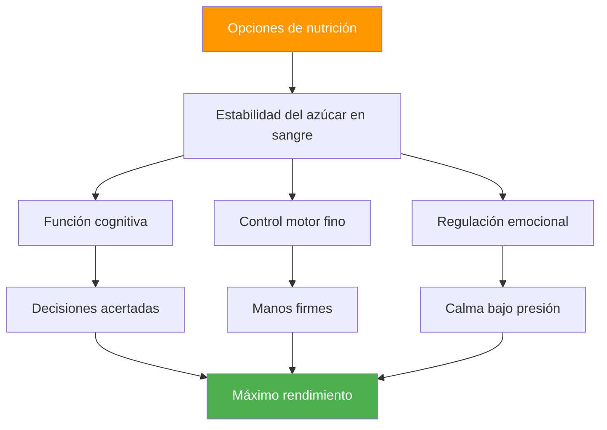

# Nutrición para la competición: Impulsando el rendimiento de precisión

> Tu cerebro es tu herramienta más importante en la petanca. Aliméntalo con combustible estable, no con energía de montaña rusa.

Las competiciones de petanca pueden durar entre 6 y 10 horas. Lo que consumes afecta directamente tu función cognitiva, tu control motor fino y tu capacidad para mantener la concentración durante varias partidas.

::: tip La regla de oro
**Nivel de azúcar en sangre estable = manos firmes.** Cada elección nutricional debe contribuir a un nivel de energía constante, no a picos y caídas.
:::

---

## Por qué es importante la nutrición en la petanca

A diferencia de los deportes de alta intensidad, la petanca exige:

Las elecciones nutricionales equivocadas crean problemas de rendimiento que los jugadores atribuyen a &quot;debilidad mental&quot; o &quot;mala suerte&quot;.

---

## La conexión con el azúcar en la sangre

Tu cerebro funciona con glucosa. Las fluctuaciones del azúcar en sangre afectan directamente:

| Estado de azúcar en la sangre | Efecto mental | Efecto físico |
|-------------------|---------------|-----------------|
| **Estable** | Pensamiento claro, buenas decisiones | Manos firmes, consistentes |
| **Pico (demasiado alto)** | Energía inicial, luego choque | Nervioso, hiperactivo |
| **Accidente (demasiado bajo)** | Falta de concentración, irritabilidad. | Temblor, agarre débil |
| **Montaña rusa** | Estado de ánimo/enfoque impredecible | Rendimiento inconsistente |

**Objetivo:** Mantener el nivel de azúcar en sangre estable durante toda la competición.

## Nutrición el día de la competición

### Pre-competición (3-4 horas antes)

**Come una comida sustancial:**
- Carbohidratos complejos (avena, pan integral, arroz)
- Proteínas (huevos, yogur, carne magra)
- Grasas saludables (aguacate, frutos secos, aceite de oliva)
- Evitar: Azúcares simples, alimentos pesados/grasosos.

**Ejemplos de comidas:**
- Avena con nueces y plátano
- Huevos sobre tostada integral con aguacate
- Arroz con pollo y verduras

### Pre-partido (1-2 horas antes)

**Un refrigerio ligero y familiar:**
- Banana
- Un pequeño puñado de nueces
- Medio sándwich
- Evitar: Cualquier cosa nueva o experimental.

### Durante la competición

**Entre partidos:**
- Pequeños refrigerios frecuentes cada 60-90 minutos
- Frutos secos, semillas, frutos secos
- Galletas integrales
- Fruta fresca (plátano, manzana)

**Durante los partidos:**
- El agua se filtra entre los extremos
- Carbohidratos rápidos si es necesario (frutos secos)
- Evite comer durante el juego activo

### Recuperación (después de la competición)

**En un plazo de 30 a 60 minutos:**
- Proteína para la recuperación muscular
- Carbohidratos para reponer
- Líquidos para rehidratar

## Protocolo de hidratación

### Lo básico
- Comience hidratado (verifique el color de la orina de la mañana)
- Bebe de forma constante durante todo el proceso, no esperes a tener sed.
- Objetivo 150-250 ml por hora de competición.
- Ajustar al calor y la humedad

### Señales de advertencia de deshidratación
- Sed (ya estás deshidratado)
- orina oscura
- Dolor de cabeza
- Disminución de la concentración
- Fatiga

### La trampa de la sobrehidratación
Demasiada agua, especialmente sin electrolitos:
- Ir al baño con frecuencia (altera el ritmo)
- Electrolitos diluidos (pueden causar temblores)
- Incomodidad y distracción

**Equilibrio:** Ingesta constante, incluir electrolitos en condiciones de calor.

## Alimentos que se deben evitar

### El día de la competición
- **Comidas pesadas** — Desvían la sangre hacia la digestión
- **Alto nivel de azúcar** — Provoca bajones de energía
- **Alcohol (la noche anterior)** — Interrumpe el sueño, deshidrata
- **Exceso de cafeína**: puede causar nerviosismo.
- **Nuevos alimentos** — Riesgo de problemas digestivos
- **Alimentos grasosos/fritos** — Digestión lenta, letargo

### Alimentos que causan problemas
- **Bebidas carbonatadas** — Hinchazón, malestar
- **Alimentos ricos en fibra**: pueden causar malestar
- **Lácteos (para algunos)** — Sensibilidad digestiva
- **Edulcorantes artificiales**: pueden causar problemas estomacales.

## Estrategia de cafeína

La cafeína puede mejorar la concentración y el tiempo de reacción, pero requiere un manejo cuidadoso:

### Uso eficaz
- Conozca su tolerancia
- Tiempo consistente (no cambiar por la competencia)
- Dosis moderada (100-200 mg)
- Lo suficientemente temprano para evitar interferencias con los partidos de la tarde.
- Combinar con alimentos para reducir el nerviosismo.

### Uso ineficaz
- Más de lo habitual (provoca ansiedad, temblores)
- Tarde en el día (interrumpe el sueño)
- En ayunas (nerviosismo, bajón)
- Confiar en la cafeína para compensar la falta de sueño

## Desarrolla tu plan de nutrición para la competición

### Paso 1: Prueba en la práctica
Prueba tu plan de nutrición de competición en el entrenamiento:
- Mismo tiempo
- Los mismos alimentos
- Misma hidratación
- Observa cómo te sientes y actúas

### Paso 2: Preparar la logística
- Sepa qué comida está disponible en el lugar
- Traiga sus propios bocadillos probados
- Tener opciones de respaldo
- Empaca más de lo que crees que necesitas

### Paso 3: Crear un cronograma
Anota tu cronograma de nutrición:
- Comida pre-competición (hora, comida)
- Merienda previa al partido (tiempo, comida)
- Durante la competición (horario, comidas)
- Intervalos de recordatorio de hidratación

### Paso 4: Seguimiento y ajuste
Después de las competiciones, tenga en cuenta:
- Qué comiste y cuándo
- Cómo te sentiste físicamente
- Calidad del rendimiento
- ¿Algún problema (hambre, bajón, estómago)?

## Consideraciones sobre el calor y la humedad

Requisitos para cambios por clima cálido:

- **Aumentar los líquidos** — Puede necesitar entre un 50 % y un 100 % más
- **Añade electrolitos** — La sudoración hace perder minerales
- **Comidas más ligeras**: los alimentos pesados son más difíciles de procesar
- **Roturas de sombra** — No subestime el estrés por calor
- **Preenfriamiento** — Llegar al lugar fresco e hidratado.

## Errores comunes

::: warning Evite estos
- **Saltarse el desayuno** — Agota el glucógeno matutino
- **Bebidas energéticas** — Demasiada cafeína y azúcar
- **Esperar hasta tener hambre** — Ya afecta el rendimiento
- **Noche de alcohol antes** — Deshidratación y falta de sueño
- **Probar nuevos alimentos** — Riesgo de problemas digestivos
:::

## Pasos de acción

1. **Planifica tu nutrición para la competición** con antelación
2. **Pon a prueba tu plan** en condiciones de práctica
3. **Prepara tus snacks** la noche anterior
4. **Sigue tu horario** sin importar la presión del partido
5. **Revisar y perfeccionar** después de cada competencia

---

## Contenido relacionado

- [Módulo de Nutrición](/es/educacion/nutricion/) — Educación nutricional completa
- [Nutrición en competición](/es/educacion/nutricion/competición) — Protocolos detallados
- [Dormir para mejorar el rendimiento](/es/articles/sleep-performance) — Optimización de la recuperación

