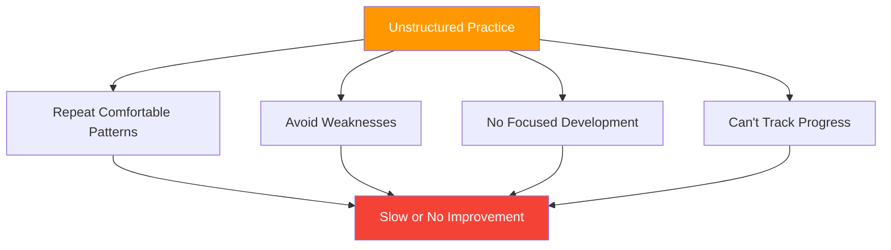

# Structuring Your Practice

> "Two players can spend the same hours on the terrain and see vastly different improvement."

The difference is often in how practice is structured.

::: tip The 10,000 Hour Myth
**It's not about hours — it's about how you use them.** Deliberate practice beats mindless repetition every time.
:::

---

## The Problem with Unstructured Practice

Most recreational practice looks like this:
- Show up, throw some boules
- Play a few casual games
- Chat with friends
- Go home

This is enjoyable but inefficient for improvement.

---

## Principles of Effective Practice

| Principle | Question to Ask |
|-----------|----------------|
| **Purposeful** | What am I working on today? |
| **Deliberate** | Is this challenging me? |
| **Feedback-rich** | How do I know if I'm improving? |
| **Focused** | Am I fully present? |

### 1. Purposeful Practice

Every session should have a clear purpose:
- What am I working on today?
- What does success look like?
- How will I know if I've improved?

### 2. Deliberate Difficulty

::: info The Edge of Ability
**Practice should challenge you.** If it's comfortable, you're not growing.
:::

- Work at the edge of your ability
- Include elements that are hard
- Avoid pure comfort zone repetition

### 3. Immediate Feedback

You need to know how you're doing:
- Track results of drills
- Use video when possible
- Get input from training partners

### 4. Focused Attention

Quality over quantity:
- Full concentration during practice
- Shorter, focused sessions beat long, distracted ones
- Mental engagement is essential

## Session Structure

### Warm-Up (10-15 minutes)

**Physical:**
- Light movement
- Arm and shoulder preparation
- Gradual intensity increase

**Mental:**
- Transition from daily life
- Set intention for session
- Begin focusing attention

### Technical Work (20-30 minutes)

Focus on specific skills:
- Isolated technique practice
- Drills targeting weaknesses
- Repetition with attention

**Example focus areas:**
- Pointing accuracy at specific distances
- Shooting from different angles
- Specific throw types (plombée, portée, etc.)

### Applied Practice (20-30 minutes)

Use skills in realistic contexts:
- Simulated game situations
- Pressure drills
- Decision-making practice

### Cool-Down (10 minutes)

**Physical:**
- Light throwing
- Stretching

**Mental:**
- Review what you learned
- Note areas for future work
- Transition out of practice mode

## Types of Practice Sessions

### Skill Development Session

Focus: Building or refining specific techniques

- 70% technical drills
- 20% applied practice
- 10% warm-up/cool-down

### Competition Simulation

Focus: Preparing for match conditions

- 20% warm-up with purpose
- 60% match-like play with pressure
- 20% debrief and adjustment

### Maintenance Session

Focus: Keeping skills sharp

- Balanced work across all areas
- No intense focus on any one thing
- Enjoyable but purposeful

### Recovery Session

Focus: Light practice after competition

- Low intensity
- Enjoyable throwing
- Mental reset

## Designing Drills

Effective drills have:

### Clear Objectives
What specifically are you practicing?

### Measurable Outcomes
How do you track success?

### Appropriate Challenge
Hard enough to stretch, not so hard you can't succeed

### Relevance
Connected to actual game situations

### Progression
Ways to increase difficulty as you improve

## Sample Drills

### Pointing Accuracy

**Setup:** Target at 8 meters
**Goal:** Land within 30cm of target
**Track:** Success rate over 20 throws
**Progress:** Decrease target size, increase distance

### Shooting Consistency

**Setup:** Stationary target boule
**Goal:** Hit the target
**Track:** Hits per 10 attempts
**Progress:** Vary angles, add movement

### Pressure Simulation

**Setup:** Must make 3 in a row to "win"
**Goal:** Complete the sequence
**Track:** Attempts needed
**Progress:** Increase required sequence

## Weekly Planning

### Balanced Week Example

**Monday:** Skill development (pointing focus)
**Wednesday:** Competition simulation
**Friday:** Skill development (shooting focus)
**Weekend:** Match play

### Periodization

Vary intensity across the season:

**Off-season:** Heavy skill development
**Pre-season:** Integration and simulation
**Competition season:** Maintenance and sharpening
**Post-season:** Recovery and reflection

## Common Mistakes

### Too Much Game Play

Playing games is fun but doesn't target weaknesses efficiently.

### No Tracking

Without measurement, you can't know if you're improving.

### Avoiding Weaknesses

We naturally practice what we're good at. Force yourself to work on weaknesses.

### Inconsistent Schedule

Sporadic practice produces sporadic results.

### No Mental Practice

Physical repetition without mental engagement limits improvement.

## Making Practice Stick

### Before Practice
- Set clear intentions
- Prepare mentally
- Review previous session notes

### During Practice
- Stay focused
- Track results
- Adjust as needed

### After Practice
- Note what you learned
- Identify next steps
- Celebrate progress

## The 10,000 Hour Myth

It's not just about hours — it's about quality. 1,000 hours of deliberate practice beats 10,000 hours of mindless repetition.

Structure your practice with purpose, and every hour counts more.

---

*Related: [Training Methods](/es/education/technique/training/) | [Training Drills](/es/education/technique/training/drills) | [Goal Setting](/es/education/motivation/)*

