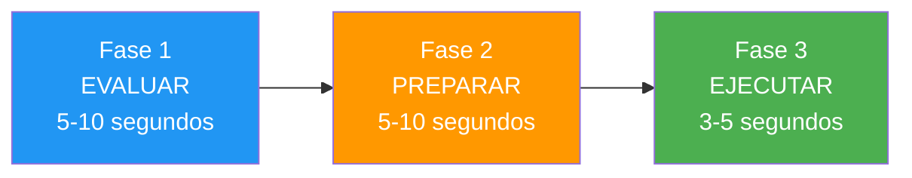

# Desarrollar rutinas previas al disparo

> &quot;La diferencia entre un buen lanzamiento y un gran lanzamiento a menudo ocurre antes de que la bola salga de tu mano&quot;.

Una rutina previa al entrenamiento bien diseñada es tu ancla en la tormenta de la competencia: una secuencia confiable que prepara tu mente y tu cuerpo para un rendimiento óptimo.

::: tip Su ventaja competitiva
**Una rutina consistente crea resultados consistentes.** Es lo único que puedes controlar completamente, independientemente de la presión o las circunstancias.
:::

---

## Por qué son importantes las rutinas previas al disparo

Los atletas de élite de todos los deportes utilizan rutinas previas al lanzamiento. En la petanca, donde cada lanzamiento es discreto y la presión puede aumentar entre cada disparo, las rutinas cumplen múltiples funciones:

| Objetivo | Cómo ayuda |
|---------|--------------|
| **Consistencia** | Misma preparación → ejecución más consistente |
| **Enfocar** | Tarea constructiva en lugar de preocupación |
| **Transición** | Pasar del pensamiento a la acción |
| **Gestión de la presión** | Las acciones familiares calman el sistema nervioso |
| **Reiniciar** | Borra la toma anterior de la mente |

---

## Anatomía de una rutina efectiva

### Fase 1: Evaluación (5-10 segundos)
- Leer el terreno
- Visualizar el resultado previsto
- Elige tu tipo de lanzamiento
- Comprometerse con la decisión

### Fase 2: Preparación (5-10 segundos)
- Toma tu posición
- Encuentra tu agarre
- Calma tu respiración
- Siente el peso de la bola

### Fase 3: Ejecución (3-5 segundos)
- Enfoque final en el objetivo
- Confía en tu cuerpo
- Liberación sin pensar
- Seguir adelante con naturalidad

## Construyendo tu rutina personal

### Paso 1: Observa tus patrones actuales

Antes de crear una nueva rutina, observa lo que ya haces:
- ¿Qué haces antes de realizar un lanzamiento exitoso?
- ¿Qué cambia cuando estás bajo presión?
- ¿Qué te parece natural?

### Paso 2: Diseña tu secuencia

Crea una rutina que incluya:

**Elementos físicos:**
- Cómo abordar el círculo
- Cómo coger y sujetar la bola
- Tu postura y posicionamiento
- Un patrón de respiración específico

**Elementos mentales:**
- Una visualización del resultado
- Una palabra o frase de enfoque
- Un punto de compromiso (el momento en el que decides &quot;este es el lanzamiento&quot;)

### Paso 3: Mantenlo simple

Tu rutina debe ser:
- **Lo suficientemente corto** para mantener la presión (15-25 segundos en total)
- **Bastante simple** para recordar cuando estás estresado
- **Suficientemente flexible** para adaptarse a diferentes situaciones

## Rutinas de ejemplo

### La rutina del pointer
1. Colóquese detrás del círculo y evalúe el terreno.
2. Visualiza la trayectoria de la bola y el lugar de aterrizaje.
3. Entra en el círculo y encuentra tu postura.
4. Tres respiraciones lentas mientras sientes la bola
5. Ojos en el objetivo, suelta

### La rutina del tirador
1. Identifica la bola objetivo, elige el ángulo
2. Visualice el impacto y el resultado
3. Entra al círculo con propósito
4. Una respiración profunda, siente el peso.
5. Fijar la mirada en el objetivo y ejecutar

## Errores comunes que se deben evitar

### Demasiado largo
Si tu rutina te toma más de 30 segundos, estás pensando demasiado. Las rutinas largas dan más tiempo a la ansiedad para acumularse.

### Demasiado rígido
Si alguna interrupción destruye tu rutina, es demasiado frágil. Incorpora flexibilidad: si algo te distrae, ten un mecanismo de reinicio.

### Saltar bajo presión
La rutina es más importante cuando la presión es máxima. Si la abandonas cuando estás estresado, pierdes sus beneficios protectores.

### Centrándose en la mecánica
Tu rutina debe terminar concentrándote en el resultado, no en la técnica. &quot;Da en el blanco&quot;, no &quot;mantén el codo recto&quot;.

## Practicando tu rutina

### En formación
- Usa tu rutina completa para cada lanzamiento, incluso los casuales.
- Cronometra tu tiempo para garantizar la consistencia
- Practica con distracciones para desarrollar resiliencia

### Automaticidad de edificios
El objetivo es que tu rutina se vuelva automática, algo que hagas sin pensar. Esto requiere repetición:
- Más de 100 lanzamientos con la misma rutina
- Uso consistente en diferentes situaciones
- Exposición gradual a la presión manteniendo la rutina.

## Adaptación a la competencia

En los partidos, tu rutina puede necesitar ligeros ajustes:

- **Presión de tiempo**: Tenga lista una versión abreviada
- **Condiciones climáticas**: Ajuste los elementos físicos según sea necesario
- **Momentos de alta presión**: Disminuya ligeramente la velocidad, no acelere.

## La rutina de reinicio

Igualmente importante es lo que haces después de un lanzamiento:

1. **Acepta el resultado**: bueno o malo, está hecho.
2. **Reinicio físico**: da un paso atrás y libera la tensión
3. **Reinicio mental**: limpia el tiro de tu mente
4. **Prepárese para lo que viene**: centre su atención en lo que viene

---

| *Relacionado: [Guía de rutina previa al tiro](/es/educacion/juego-mental/fuerza-mental/rutina-previa-al-tiro) | [Manejo de la presión](/es/educacion/juego-mental/fuerza-mental/manejo-de-la-presion) | [Técnicas de atención plena](/es/educacion/juego-mental/atención-plena/tecnicas)* |

