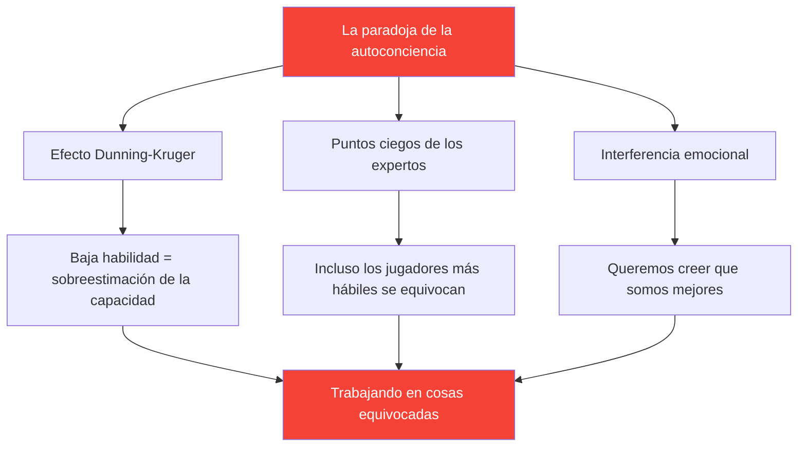

# Desarrollar la autoconciencia: la base de la mejora

> &quot;No puedes mejorar lo que no percibes con precisión&quot;.

La autoconciencia (conocer sus verdaderas fortalezas y debilidades) es la base de un desarrollo eficaz.

::: danger La incómoda verdad
**La mayoría de los jugadores están trabajando en las cosas equivocadas** porque no se ven a sí mismos con claridad.
:::

---

## La paradoja de la autoconciencia

---

## ¿Por qué los jugadores de petanca tienen dificultades?

La petanca dificulta especialmente la autoevaluación:

| Desafío | Por qué es difícil |
|-----------|--------------|
| **Varianza del resultado** | Las buenas decisiones pueden producir malos resultados (y viceversa) |
| **Sesgo de comparación** | Recordamos las mejores actuaciones y explicamos las peores |
| **Protección de identidad** | Admitir la debilidad se siente amenazante |

::: warning La memoria no son datos
**Construimos narrativas que protegen nuestra autoimagen.** El seguimiento objetivo es esencial.
:::

---

## Los componentes de la autoconciencia

La verdadera autoconciencia requiere comprensión de múltiples dominios:

| Dominio | Preguntas clave |
|--------|---------------|
| **Técnico** | ¿Qué lanzamientos son realmente fiables? ¿Cuáles son inconsistentes? |
| **Mental** | ¿Cómo respondo a la presión? ¿Qué desencadena mi crítica interna? |
| **Físico** | ¿Cuándo tengo más energía? ¿Cómo me afecta la fatiga? |
| **Táctico** | ¿Ataco demasiado? ¿Ataco demasiado poco? ¿Cómo interpreto las situaciones? |
| **Emocional** | ¿Qué me frustra? ¿Cuándo juego con cuidado? |
| **Interpersonal** | ¿Cómo perciben mis compañeros de equipo mi comunicación? |

## Retroalimentación externa: el espejo que necesitas

No puedes ver tus propios puntos ciegos. Necesitas perspectivas externas.

### Métodos de retroalimentación estructurada

**Análisis de vídeo**
- Graba partidos y practica
- Mirar con áreas de enfoque específicas
- Observa los patrones que te pierdes en el momento

**Evaluación por pares**
- Pide comentarios honestos a tus compañeros de confianza
- Utilice la [Herramienta de evaluación](/es/assessment/) para la validación por pares
- Compara tu autoevaluación con la de ellos

**Observación del entrenador**
- Los ojos nuevos ven lo que los ojos familiares pasan por alto
- Solicita comentarios específicos, no impresiones generales
- Seguimiento de los temas de retroalimentación a lo largo del tiempo

### La brecha de retroalimentación

Cuando su autoevaluación difiera significativamente de la retroalimentación externa, preste atención a:

| Tipo de espacio | Significado | Acción |
|----------|---------|--------|
| Tu calificación es más alta | Posible punto ciego | Investigar con vídeo/datos |
| Tu calificación es más baja | Posible problema de confianza | Centrarse en la evidencia de competencia |
| Brecha consistente | Error sistemático de percepción | Recalibra tu modelo mental |

## Desarrollar hábitos de autoconciencia

### Reflexión diaria (5 minutos)

Después de cada sesión, pregúntese:

1. **¿Qué salió bien?** (Sea específico)
2. **¿Qué no salió bien?** (Se honesto)
3. **¿Qué haría diferente?** (Sea constructivo)
4. **¿Qué me sorprendió?** (Sé curioso)

### Revisión semanal (15 minutos)

Busque patrones:

- ¿Qué situaciones me desafían constantemente?
- ¿En qué estoy mejorando?
- ¿Qué comentarios he recibido?
- ¿Qué estoy evitando mirar?

### Evaluación mensual

Utilice la herramienta [Evaluación del jugador](/es/evaluación/):

- Evalúese en los 8 factores
- Solicitar validación de pares
- Comparar con el mes anterior
- Identificar las brechas más grandes

## La ventaja de los datos

La percepción subjetiva no es fiable. Los datos aportan objetividad:

### Qué seguir

**Datos de rendimiento**
- Tasas de éxito por tipo de lanzamiento
- Rendimiento bajo presión vs. sin presión
- Primer set vs. sets posteriores
- Con diferentes socios

**Datos de proceso**
- Calidad del sueño antes de los partidos
- Cumplimiento de la rutina previa al partido
- Estado mental en momentos clave
- Tiempo de recuperación después de los errores

### Cómo utilizar los datos

1. **Identificar patrones**: ¿Qué se correlaciona con un desempeño bueno o malo?
2. **Cuestione sus suposiciones**: ¿Los datos coinciden con sus creencias?
3. **Capacitación de guías**: concéntrese en las debilidades reales, no en las percibidas
4. **Seguimiento del progreso**: la mejora suele ser invisible sin medición

## Bloqueos comunes de la autoconciencia

::: warning Esté atento a estos
- **Defensividad** al recibir retroalimentación
- **Explicando** los malos resultados
- **Buscando confirmación** en lugar de la verdad
- **Evitar la medición** de áreas débiles
- **Culpar a factores externos** constantemente
:::

## La conexión con la mentalidad de crecimiento

La autoconciencia requiere aceptar que:

- La capacidad actual no es fija
- La debilidad es información, no identidad
- La retroalimentación es un regalo, no un ataque.
- La mejora requiere una evaluación honesta

## Pasos de acción

1. **Hoy:** Completa la [Autoevaluación](/es/autoevaluación/)
2. **Esta semana:** Solicitar comentarios de dos compañeros de equipo de confianza.
3. **En curso:** Establecer el hábito de reflexión diaria
4. **Mensualmente:** Realice un seguimiento del progreso con evaluaciones repetidas

---

## Contenido relacionado

- [Módulo de Autoconciencia](/es/educacion/autoconciencia/) — Educación completa
- [Evaluación del jugador](/es/evaluación/) — Evalúa tus 8 factores
- [El crítico interno](/es/articulos/critico-interno) — Cómo gestionar el autojuicio

