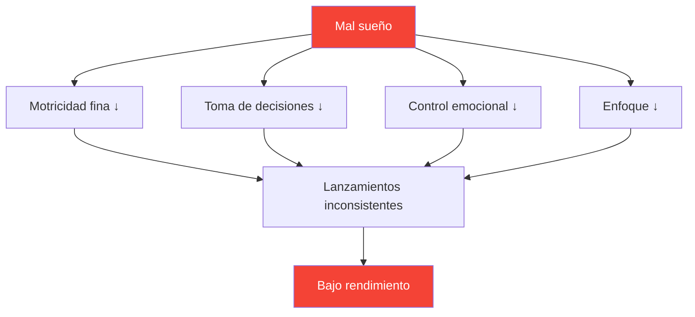

# El sueño: el factor de rendimiento más subestimado

> &quot;El jugador que duerme mejor suele ganar.&quot;

La mayoría de los jugadores se centran en la técnica y el entrenamiento mental. Pocos optimizan su sueño. Esto es un error: el sueño puede ser la mejora con mayor retorno de la inversión disponible para la mayoría de los jugadores competitivos.

::: tip Mejora de alto retorno de la inversión
**La optimización del sueño no requiere ningún talento y ofrece enormes beneficios.** Es lo más parecido a un potenciador del rendimiento legal.
:::

---

## La investigación

La ciencia del sueño revela efectos sorprendentes en el rendimiento en deportes de precisión:

### Tiempo de reacción
- **24 horas sin dormir** = tiempo de reacción equivalente a 0,1% de alcohol en sangre
- **6 horas/noche durante 2 semanas** = equivalente a permanecer despierto 48 horas
- Los atletas de élite promedian **8,5+ horas** frente a las 7 horas de la población general

### Toma de decisiones
- La falta de sueño afecta primero la corteza prefrontal
- Las decisiones tácticas se deterioran antes de que aparezca una fatiga evidente
- No notas tu deterioro (la metacognición también falla)

### Control de motores
- Las habilidades motoras finas (agarrar, soltar) requieren una memoria consolidada
- La consolidación de la memoria ocurre durante el sueño profundo.
- Aprender habilidades sin dormir lo suficiente = práctica desperdiciada

## La conexión de precisión

La petanca requiere exactamente lo que la falta de sueño destruye:

| Habilidad requerida | Efecto de la privación del sueño |
|----------------|--------------------------|
| Control motor fino | La presión de agarre se vuelve inconsistente |
| Procesamiento visual | El juicio de distancia está deteriorado |
| Toma de decisiones | Los errores tácticos aumentan |
| Regulación emocional | La frustración tras los errores aumenta |
| Atención sostenida | El enfoque se desvía en los partidos más largos |

## Señales de que no duermes lo suficiente

Te has adaptado a la privación crónica del sueño si:

- Necesitas una alarma para despertarte
- Tienes sueño a primera hora de la tarde.
- Te quedas dormido a los 5 minutos de acostarte
- Te &quot;pones al día&quot; los fines de semana
- El café es esencial, no opcional

**Verificación de la realidad:** Si necesitas cafeína para funcionar normalmente, estás privado de sueño.

## Protocolo de la Semana de la Competencia

### 7 días antes
- Empieza a dormir 30 minutos más por noche
- Estabilizar la hora de despertarse (la misma hora todos los días)

### 3 días antes
- Sin alcohol (altera la arquitectura del sueño)
- No comer pesado después de las 7pm
- Reducir el tiempo frente a la pantalla después del atardecer

### La noche anterior
- Hora normal de acostarse (no te vayas a la cama temprano, simplemente te quedarás despierto)
- Entorno familiar si es posible
- Rutina de relajación

### Mañana de competición
- Despierta a la hora normal
- Exposición a la luz inmediatamente
- Rutina normal de desayuno

## Optimización de la calidad del sueño

No es sólo la duración: la calidad importa más.

### Entorno del sueño
- **Temperatura:** 18-20 °C (65-68 °F) es óptima
- **Oscuridad:** Oscuridad total o máscara para dormir
- **Sonido:** Consistente (ruido blanco) o silencioso
- **Ropa de cama:** Cómoda, no demasiado cálida.

### Rutina antes de dormir
- Más de 60 minutos sin pantallas antes de acostarse
- Luces tenues por la noche
- Actividades de liquidación constantes
- Una ducha fría puede provocar el sueño.

### Momento
- Hora de despertarse constante (más importante que la hora de acostarse)
- Evite dormir más de 30 minutos los fines de semana
- Siestas: antes de las 3pm, menos de 20 minutos

## La estrategia de la siesta

Siesta estratégica para los días de competición:

### La siesta energética (10-20 min)
- Reduce la fatiga sin causar aturdimiento.
- Ideal para sesiones entre la mañana y la tarde.
- Configura la alarma: no te quedes dormido

### El ciclo completo (90 min)
- Ciclo completo del sueño
- Sólo si tienes 2+ horas antes de la competición
- Riesgo de aturdimiento si se interrumpe

### Nunca tome una siesta si:
- Tienes insomnio al inicio del sueño
- La competición dura 90 minutos.
- Son más de las 3 de la tarde y necesitas dormir esa noche.

## Consideraciones de viaje

Para competiciones fuera de casa:

### Antes de viajar
- Traiga artículos familiares para dormir (almohada, antifaz para dormir)
- Investigar habitación de hotel (solicitar habitación tranquila)
- Ajustar el horario si se cruzan zonas horarias

### En destino
- Si es posible, mantén el horario de sueño en casa.
- La exposición a la luz controla el ritmo circadiano
- Evite las comidas pesadas cerca de la hora de acostarse.

### Cruce de zona horaria
- 1 día por hora para adaptarse completamente
- La exposición a la luz matutina acelera el ajuste hacia el este
- La exposición a la luz del atardecer acelera el ajuste hacia el oeste

## Seguimiento de su sueño

Lo que se mide se gestiona:

### Seguimiento simple
- Hora de despertarse y hora de acostarse
- Calidad subjetiva (1-10)
- Notas de correlación de rendimiento

### Seguimiento avanzado
- Rastreador de sueño o dispositivo portátil
- Tendencias de la VFC (variabilidad de la frecuencia cardíaca)
- Datos de las etapas del sueño

### Qué buscar
- Correlación entre el sueño y el rendimiento
- Patrones (puesta al día el fin de semana, insomnio previo a la competición)
- Tendencias a lo largo del tiempo

## Errores comunes

::: warning Evite estos
- **El alcohol como ayuda para dormir** — Ayuda a la aparición del sueño, destruye la calidad del mismo.
- **Ponerse al día los fines de semana** — No puedo &quot;pagar&quot; la deuda de sueño
- **Pantallas en la cama** — Entrena el cerebro para que la cama ≠ duerma
- **Horario inconsistente**: el ritmo circadiano necesita consistencia
- **Ignorar el sueño por el entrenamiento** — Cambiar calidad por cantidad
:::

## Pasos de acción

1. **Esta semana:** Realiza un seguimiento de tu sueño real (duración + calidad)
2. **La próxima semana:** Establecer un horario de despertar constante
3. **Semanas siguientes:** Optimizar el entorno y la rutina
4. **Pre-competición:** Implementar el protocolo de la semana de competencia

---

## Contenido relacionado

- [Módulo de sueño y recuperación](/es/educación/sueño/) — Educación completa sobre el sueño
- [Hábitos de sueño](/es/educacion/sueño/habitos) — Creando rutinas sostenibles
- [Sueño de competición](/es/educacion/sueño/competición) — Protocolos específicos para cada evento

