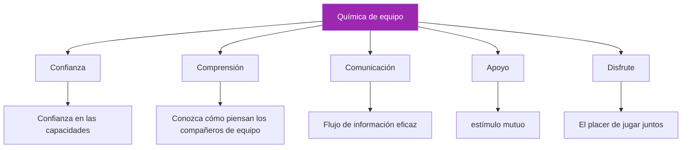

# Construyendo química en equipo

> “Lo has visto: equipos donde el todo supera la suma de las partes”.

Jugadores que se anticipan, se apoyan y rinden mejor juntos que solos. Esto es química de equipo, y no es casualidad.

::: tip La química se construye, no se encuentra
**Los grandes equipos no se forman, se desarrollan.** La química requiere un esfuerzo intencional a lo largo del tiempo.
:::

---

## ¿Qué es la química del equipo?

---

## Por qué es importante la química

| Con Química ✅ | Sin química ❌ |
|-------------------|----------------------|
| Tomar mejores decisiones colectivas | Culparse unos a otros por los fracasos |
| Recuperarse más rápido de los reveses | Comunicarse mal bajo estrés |
| Actuar consistentemente bajo presión | Rendimiento inferior al talento |
| Disfruta más de la competición | Experimentar conflicto y frustración |
| Permanecer juntos más tiempo | El equipo se disuelve |

## Los bloques de construcción

### 1. Objetivos compartidos

La química comienza con la alineación:
- ¿Qué estamos tratando de lograr?
- ¿Cómo se ve el éxito?
- ¿Qué estamos dispuestos a sacrificar?

Los equipos con objetivos conflictivos (uno quiere divertirse, otro quiere ganar a toda costa) tienen dificultades para desarrollar química.

### 2. Claridad de roles

Cada jugador necesita saber:
- ¿Qué se espera de ellos?
- Cómo contribuyen al éxito del equipo
- Cuándo liderar y cuándo seguir

Los roles poco claros crean fricción y resentimiento.

### 3. Respeto mutuo

Respeto significa:
- Valorar la contribución de cada compañero de equipo
- Aceptar diferentes estilos y enfoques
- Tratarnos unos a otros con dignidad, especialmente bajo presión

### 4. Seguridad psicológica

Los jugadores necesitan sentirse seguros para:
- Cometer errores sin juzgar con dureza
- Expresar opiniones y preocupaciones
- Ser ellos mismos sin pretensiones

## Química de la construcción: pasos prácticos

### Tiempo juntos

La química requiere inversión:
- Practiquen juntos regularmente
- Pasar tiempo juntos fuera del terreno.
- Compartir experiencias más allá de la petanca

### Formación de equipos estructurada

Las actividades intencionales ayudan a:
- Sesiones de establecimiento de objetivos en equipo
- Informes posteriores al partido (constructivos)
- Discusiones sobre estilos de juego y preferencias.

### Resolución de conflictos

Abordar los problemas antes de que se agraven:
- Crear espacio para una conversación honesta
- Centrarse en los comportamientos, no en las personalidades
- Busca soluciones, no culpas

### Celebrar juntos

La alegría compartida crea vínculos:
- Reconocer las buenas actuaciones
- Celebrar los logros del equipo
- Marcar hitos juntos

## Asesinos de la química

### Cultura de la culpa

Cuando los errores conducen a críticas en lugar de apoyo, la confianza se erosiona rápidamente.

### Compromiso desigual

Si algunos jugadores invierten más que otros, surge el resentimiento.

### Mala comunicación

Los malentendidos y las suposiciones crean distancia.

### Conflictos del ego

Cuando el reconocimiento individual importa más que el éxito del equipo, la química sufre.

### Conflicto no resuelto

Los problemas que no se abordan no desaparecen: crecen.

## Química en competición

### Antes de los partidos

- Llegar juntos, calentar juntos
- Breve discusión en equipo sobre el enfoque
- Energía positiva y estímulo mutuo

### Durante los partidos

- Apoyo visible entre nosotros
- Sólo comunicación constructiva
- Celebración compartida de buenas jugadas
- Respuesta colectiva a los reveses

### Después de los partidos

- Ganemos o perdamos, permanezcamos unidos
- Breve informe (qué funcionó, qué mejorar)
- Mantener relaciones positivas independientemente del resultado

## Diferentes personalidades

Los equipos fuertes a menudo incluyen diferentes tipos de personalidad:

- **El Constante**: Tranquilo bajo presión, consistente
- **El Energizante**: Aporta entusiasmo y motivación.
- **El estratega**: piensa con anticipación y ve patrones
- **El Competidor**: Impulsa la voluntad de ganar

La química no consiste en que todos sean iguales: se trata de que las diferencias trabajen juntas.

## Cuando falta la química

### Señales de mala química

- Frustración visible con los compañeros de equipo
- Culpar después de los errores
- Falta de comunicación
- Jugando como individuos, no como equipo
- Temer los partidos en lugar de disfrutarlos

### Reconstruyendo la química

1. **Reconoce el problema**: nómbralo abiertamente
2. **Identificar las causas**: ¿Qué está creando la fricción?
3. **Comprometerse con el cambio**: Todas las partes deben invertir
4. **Toma acción**: Pasos específicos para mejorar
5. **Ten paciencia**: la química necesita tiempo para reconstruirse.

### Cuándo seguir adelante

A veces la química no se puede arreglar:
- Diferencias de valores fundamentales
- Confianza rota repetidamente
- Falta de voluntad para cambiar

Está bien reconocer cuando un equipo no está funcionando.

## El papel del capitán

Si eres el líder del equipo:
- Modela el comportamiento que quieres ver
- Abordar los problemas de forma temprana y directa
- Crear oportunidades de conexión
- Proteger la cultura del equipo
- Equilibrar las necesidades individuales con las necesidades del equipo

## Química a largo plazo

La química no es estática: requiere mantenimiento:

### Registros regulares

- ¿Cómo estamos funcionando como equipo?
- ¿Qué funciona? ¿Qué no?
- ¿Hay algún problema que abordar?

### Inversión continua

- Sigamos pasando tiempo juntos
- Sigue comunicándote abiertamente
- Sigamos apoyándonos unos a otros

### Adaptación

- A medida que los jugadores crecen y cambian, también debe hacerlo el equipo.
- Estar dispuesto a evolucionar roles y dinámicas.
- Manténganse curiosos el uno con el otro

---

| *Relacionado: [Dinámica de equipo](/es/educacion/dinamica-de-equipo/) | [Comunicación](/es/educacion/dinamica-de-equipo/comunicacion) | Liderazgo en la petanca |

