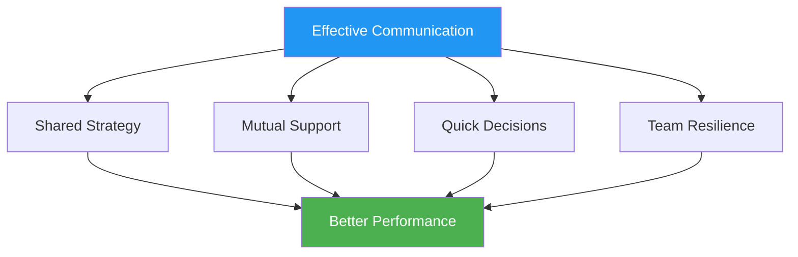

# Communication Under Pressure

> "The right words at the right moment build confidence. The wrong words can unravel even skilled teams."

::: tip The Communication Truth
**Under pressure, less is more.** Clear, concise communication beats lengthy discussions every time.
:::

---

## Why Communication Matters

Pétanque teams face unique challenges:
- Decisions must be made quickly
- Pressure affects how we speak and listen
- Non-verbal cues are visible to opponents
- Individual performance affects team dynamics

---

## The Communication Principles

### 1. Clarity Over Quantity

| ❌ Don't Say | ✅ Say Instead |
|-------------|---------------|
| "I think maybe we should try to point here, but I'm not sure..." | "I'll point to the left side. The ground is better there." |

### 2. Positive Framing

| ❌ Negative | ✅ Positive |
|------------|------------|
| "Don't miss this one" | "You've got this — trust your throw" |
| "That was terrible" | "Shake it off, next one" |

### 3. Present Focus

::: warning Past vs Present
**Instead of:** "Why did you throw it there?"
**Say:** "Okay, what's our best option now?"
:::

### 4. Ownership Language

Use "I" statements for your own actions, "we" for team situations:

- "I'll take this shot"
- "We need to protect the point"
- "I think we should..."

## What to Communicate

### Before Each End

- **Strategy discussion**: Brief alignment on approach
- **Role clarity**: Who's doing what
- **Terrain observations**: Relevant conditions

### During Play

- **Decisions**: Clear statement of intended action
- **Support**: Encouragement before throws
- **Information**: Relevant observations about terrain or opponents

### After Throws

- **Acknowledgment**: Brief recognition (good or bad)
- **Adjustment**: Any strategic changes needed
- **Reset**: Help teammate refocus

## What NOT to Communicate

### Avoid During Pressure Moments

- Technical instructions ("Keep your elbow in")
- Criticism of past throws
- Expressions of frustration
- Doubt about teammate's ability
- Excessive analysis

### Avoid in General

- Blame language
- Sarcasm or passive aggression
- Comparisons to other players
- Predictions of failure

## Non-Verbal Communication

Your body language speaks loudly:

### Positive Signals
- Eye contact with teammates
- Open, relaxed posture
- Nodding and acknowledgment
- Calm, steady movements

### Negative Signals (Avoid)
- Eye rolling or sighing
- Turning away from teammates
- Crossed arms or closed posture
- Visible frustration

### Reading Teammates

Learn to recognize when teammates need:
- **Space**: They're processing, don't interrupt
- **Support**: They're struggling, offer encouragement
- **Information**: They're uncertain, provide clarity
- **Energy**: They're flat, bring enthusiasm

## Communication Roles

### The Pointer
- Communicate your read of the terrain
- State your intended placement clearly
- Ask for input when uncertain

### The Shooter
- Confirm target selection
- Communicate confidence level
- Request information about angles

### The Milieu/Captain
- Facilitate team discussions
- Make final decisions when needed
- Manage team energy and focus

## Pressure Situations

### When Behind

- Stay solution-focused
- Maintain positive energy
- Avoid blame or frustration
- Celebrate small wins

### When Ahead

- Stay focused, avoid complacency
- Keep communication consistent
- Don't change what's working

### Match Point (Theirs)

- Acknowledge the pressure briefly
- Focus on the process
- Support each other visibly

### Match Point (Ours)

- Stay calm and focused
- Avoid premature celebration
- Execute as normal

## Building Communication Skills

### In Practice

- Practice communicating during training
- Give and receive feedback on communication
- Experiment with different approaches

### Team Agreements

Establish team norms:
- How we handle disagreements
- What support looks like
- When to speak and when to stay quiet

### Post-Match Review

Discuss communication:
- What worked well?
- What could improve?
- Any misunderstandings to address?

## When Communication Breaks Down

### In the Moment

1. Take a breath
2. Reset with a simple statement: "Let's focus on this throw"
3. Return to basics: clear, positive, present

### After the Match

- Address issues calmly
- Focus on behaviors, not personalities
- Agree on improvements
- Move forward together

## The Silent Support

Sometimes the best communication is presence:
- Standing with a struggling teammate
- A hand on the shoulder
- A nod of confidence
- Simply being there

Words aren't always necessary. Connection is.

---

*Related: [Team Dynamics](/es/education/team-dynamics/) | [Communication](/es/education/team-dynamics/communication) | [Handling Pressure](/es/education/mental-game/mental-strength/handling-pressure)*

