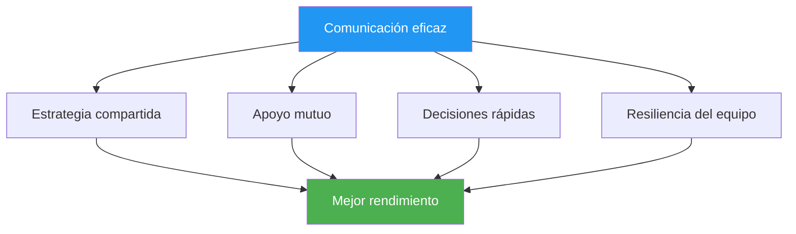

# Comunicación bajo presión

> Las palabras adecuadas en el momento oportuno generan confianza. Las palabras equivocadas pueden desbaratar incluso a equipos hábiles.

::: tip La verdad de la comunicación
**Bajo presión, menos es más.** Una comunicación clara y concisa siempre supera a las largas discusiones.
:::

---

## Por qué es importante la comunicación

Los equipos de petanca se enfrentan a desafíos únicos:
- Las decisiones deben tomarse rápidamente
- La presión afecta cómo hablamos y escuchamos
- Las señales no verbales son visibles para los oponentes.
- El rendimiento individual afecta la dinámica del equipo

---

## Los principios de la comunicación

### 1. Claridad antes que cantidad

| ❌ No digas | ✅ Di en cambio |
|-------------|---------------|
| &quot;Creo que tal vez deberíamos intentar señalar aquí, pero no estoy seguro...&quot; | —Señalaré el lado izquierdo. El terreno está mejor allí. |

### 2. Encuadre positivo

| ❌ Negativo | ✅ Positivo |
|------------|------------|
| &quot;No te lo pierdas&quot; | &quot;Lo tienes todo bajo control, confía en tu tiro&quot; |
| &quot;Eso fue terrible&quot; | &quot;Sacúdetelo, siguiente&quot; |

### 3. Enfoque actual

::: warning Pasado vs. Presente
**En lugar de:** &quot;¿Por qué lo tiraste ahí?&quot;
**Di:** &quot;Bien, ¿cuál es nuestra mejor opción ahora?&quot;
:::

### 4. Lenguaje de propiedad

Utilice declaraciones en &quot;yo&quot; para sus propias acciones, y en &quot;nosotros&quot; para situaciones de equipo:

- &quot;Tomaré esta foto&quot;
- &quot;Necesitamos proteger el punto&quot;
- &quot;Creo que deberíamos...&quot;

## Qué comunicar

### Antes de cada fin

- **Discusión de estrategia**: Breve alineación sobre el enfoque
- **Claridad de roles**: Quién hace qué
- **Observaciones del terreno**: Condiciones relevantes

### Durante el juego

- **Decisiones**: Declaración clara de la acción prevista
- **Apoyo**: Ánimo antes de los lanzamientos
- **Información**: Observaciones relevantes sobre el terreno o los oponentes.

### Después de los lanzamientos

- **Agradecimiento**: Breve reconocimiento (bueno o malo)
- **Ajuste**: Cualquier cambio estratégico necesario
- **Restablecer**: Ayuda a tu compañero de equipo a reenfocarse

## Qué NO comunicar

### Evitar durante momentos de presión

- Instrucciones técnicas (&quot;Mantenga el codo hacia adentro&quot;)
- Crítica de los lanzamientos pasados
- Expresiones de frustración
- Duda sobre la capacidad del compañero de equipo
- Análisis excesivo

### Evitar en general

- Lenguaje de culpa
- Sarcasmo o agresión pasiva
- Comparaciones con otros jugadores
- Predicciones de fracaso

## Comunicación no verbal

Tu lenguaje corporal habla fuerte:

### Señales positivas
- Contacto visual con compañeros de equipo
- Postura abierta y relajada
- Asentir y reconocer
- Movimientos tranquilos y constantes

### Señales negativas (Evitar)
- Poner los ojos en blanco o suspirar
- Alejándose de sus compañeros de equipo
- Brazos cruzados o postura cerrada
- Frustración visible

### Compañeros de equipo de lectura

Aprenda a reconocer cuándo los compañeros de equipo necesitan:
- **Espacio**: Están procesando, no interrumpas
- **Apoyo**: Están luchando, ofréceles ánimo.
- **Información**: Son inciertas, aportan claridad
- **Energía**: Son planos, aportan entusiasmo.

## Roles de comunicación

### El puntero
- Comunica tu lectura del terreno
- Indique claramente su ubicación prevista
- Pida sugerencias cuando no esté seguro

### El tirador
- Confirmar selección de objetivo
- Comunicar el nivel de confianza
- Solicitar información sobre ángulos

### El Medio/Capitán
- Facilitar las discusiones en equipo
- Tomar decisiones finales cuando sea necesario
- Gestionar la energía y el enfoque del equipo

## Situaciones de presión

### Cuando detrás

- Manténgase centrado en la solución
- Mantener la energía positiva
- Evite la culpa o la frustración
- Celebra los pequeños triunfos

### Cuando adelante

- Manténgase concentrado, evite la complacencia
- Mantenga la comunicación consistente
- No cambies lo que funciona

### Punto de partido (de ellos)

- Reconozca la presión brevemente
- Centrarse en el proceso
- Apoyarnos mutuamente de forma visible

### Punto de partido (el nuestro)

- Mantén la calma y la concentración
- Evite las celebraciones prematuras
- Ejecutar normalmente

## Desarrollar habilidades de comunicación

### En la práctica

- Practique la comunicación durante el entrenamiento
- Dar y recibir retroalimentación sobre la comunicación.
- Experimente con diferentes enfoques

### Acuerdos de equipo

Establecer normas de equipo:
- Cómo manejamos los desacuerdos
- ¿Cómo se ve el soporte?
- Cuándo hablar y cuándo callar

### Análisis posterior al partido

Discutir la comunicación:
- ¿Qué funcionó bien?
- ¿Qué podría mejorar?
- ¿Hay algún malentendido que deba abordarse?

## Cuando la comunicación falla

### En el momento

1. Toma un respiro
2. Reinicia con una simple declaración: &quot;Concentrémonos en este lanzamiento&quot;.
3. Regreso a lo básico: claro, positivo, presente

### Después del partido

- Abordar los problemas con calma
- Centrarse en los comportamientos, no en las personalidades
- Acordar mejoras
- Avanzar juntos

## El apoyo silencioso

A veces la mejor comunicación es la presencia:
- De pie junto a un compañero de equipo con dificultades
- Una mano en el hombro
- Un gesto de confianza
- Simplemente estar ahí

Las palabras no siempre son necesarias. La conexión sí.

---

| *Relacionado: [Dinámica de equipo](/es/educacion/dinamica-de-equipo/) | [Comunicación](/es/educacion/dinamica-de-equipo/comunicacion) | [Manejo de la presión](/es/educacion/juego-mental/fuerza-mental/manejo-de-la-presion)* |

