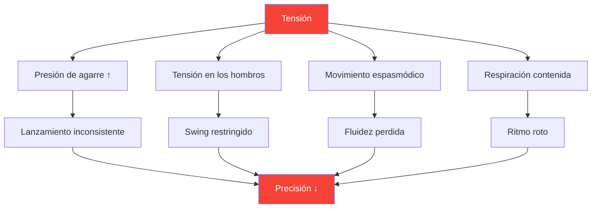
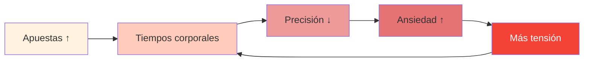

# Tensión y precisión: la conexión oculta

> &quot;No se puede estar tenso y preciso a la vez. Es físicamente imposible.&quot;

Lo has sentido: ese lanzamiento crucial donde tu cuerpo se tensa, tu agarre aumenta y la pelota va justo donde no querías. La tensión es el asesino silencioso de la precisión.

::: danger El enemigo oculto
**La mayor parte de la tensión es invisible para el jugador que la experimenta.** No sabes que estás tenso hasta que es demasiado tarde.
:::

---

## La biomecánica de la tensión

---

## Donde se esconde la tensión

La mayoría de los jugadores son conscientes de la tensión intensa (hombros tensos antes de un lanzamiento fuerte). Pocos perciben la tensión sutil que degrada constantemente el rendimiento.

| Ubicación | Efecto al lanzar | Cómo notarlo |
|----------|-----------------|---------------|
| **Agarre** | Tiempo de lanzamiento inconsistente | Marcas de pelota en la palma |
| **Antebrazo** | Fluidez reducida de la muñeca | Sensación de ardor |
| **Hombro** | Arco de oscilación restringido | El lanzamiento se siente &quot;corto&quot; |
| **Cuello** | Posición alterada de la cabeza | Rigidez después de los partidos |
| **Mandíbula** | Cascada de tensión en todo el cuerpo | Dientes apretados |
| **Aliento** | Ritmo alterado | Conteniendo la respiración |

---

## La espiral de presión-tensión

Bajo presión, comienza un ciclo destructivo:

::: tip Romper el ciclo
**Interrumpir en el Paso 2** — antes de que la tensión afecte el rendimiento. Por eso son esenciales las rutinas previas al disparo con comprobaciones de tensión.
:::

## Detectando sus patrones de tensión

### El método de escaneo corporal

Antes de practicar, cierra los ojos y escanea:

1. Comience por los pies: ¿Siente agarrotamiento en los dedos?
2. Subir las piernas: ¿Alguna rodilla bloqueada?
3. Observe las caderas y el centro del cuerpo: ¿Hay algún refuerzo?
4. Revisar los hombros: ¿hay alguna elevación?
5. Escanear brazos y manos: ¿Hay algún agarre prematuro?
6. Observe el cuello y la cara: ¿Hay tensión?

Califica la tensión de 0 a 10 en cada ubicación. **Tu valor de referencia debe ser 2 o menos.**

### El método del vídeo

Grábate lanzando:
- Práctica de bajo riesgo
- Práctica de apuestas moderadas
- Competición de alto riesgo

Compara tu lenguaje corporal. ¿Dónde te tensas a medida que aumenta la presión?

### El método del socio

Pídale a un compañero de equipo que observe:
- Tu cara antes de lanzamientos importantes
- Tu postura cambia bajo presión
- Tus patrones de respiración
- Tu comportamiento de agarre

Los observadores externos ven lo que nosotros no podemos sentir.

## Técnicas de liberación

### Liberaciones rápidas (uso durante la competición)

**La sacudida**
- Un breve y vigoroso apretón de manos y brazos.
- Libera patrones de retención
- Toma de 2 a 3 segundos

**La gota de exhalación**
- Respiración profunda
- Al exhalar, baje los hombros conscientemente.
- Libere la tensión de la mandíbula simultáneamente

**El reinicio del agarre**
- Mano abierta completamente
- Abre bien los dedos
- Vuelva a agarrar con la mínima fuerza necesaria

### Liberaciones profundas (uso en la práctica/precompetición)

**Relajación muscular progresiva**
- Tense deliberadamente cada grupo muscular (5 segundos)
- Suelte completamente (15 segundos)
- Observa la diferencia
- Trabaja todo el cuerpo

**Conexión respiración-cuerpo**
- Respiración lenta (4 tiempos inhalando, 6 tiempos exhalando)
- En cada exhalación, libera una zona del cuerpo.
- Continúe hasta lograr la relajación de todo el cuerpo.

## La integración previa al disparo

Incorpore la conciencia de la tensión en su rutina previa al disparo:

### Antes de entrar al círculo
- Escaneo corporal rápido (2 segundos)
- Una exhalación liberadora
- Confirmar agarre relajado

### En el círculo
- Último aliento para asentarse
- Enfoque suave en el objetivo
- Iniciar el lanzamiento desde el estado relajado

### Después del lanzamiento
- Observe dónde se acumuló la tensión
- Agitar si es necesario
- Reiniciar para el siguiente lanzamiento

## Entrenamiento de la conciencia de la tensión

### Ejercicio 1: El agarre mínimo

Encuentre la presión de agarre mínima que mantiene el control:
- Comience con un agarre firme y lance 5 pelotas
- Reducir el agarre un 20% — lanzar 5 pelotas
- Continúe reduciendo hasta perder el control
- Retroceda un nivel: este es su agarre óptimo

La mayoría de los jugadores agarran entre un 40 y un 60 % más fuerte de lo necesario.

### Ejercicio 2: Simulación de presión

Practica bajo presión artificial mientras controlas la tensión:
- Crear consecuencias para los lanzamientos de práctica
- Observa dónde aparece la tensión
- Practica la liberación mientras mantienes el enfoque
- Aumente gradualmente la tolerancia a la presión

### Ejercicio 3: El puntero relajado

Evalúese en dos dimensiones:
- Resultado técnico (¿donde cayó la pelota?)
- Nivel de tensión (¿qué tan relajado estabas?)

**Objetivo:** Maximizar ambos simultáneamente. Muchos jugadores deben aceptar resultados ligeramente peores al principio mientras aprenden a lanzar con relajación.

## Protocolo del día de la competición

### Pre-partido
- Relajación progresiva de 10 minutos
- Escaneo corporal para identificar patrones de retención
- Rutina de sacudidas

### Entre extremos
- Breve sacudida
- Una respiración liberadora
- Comprobación de tensión antes de lanzamientos críticos

### Durante el lanzamiento
- Confía en tu rutina previa a la inyección
- La técnica de liberación está preprogramada
- No controle conscientemente durante la ejecución

## Errores comunes

::: warning Evite estos
- **Exceso de relajación**: es necesaria cierta activación
- **Control consciente durante el lanzamiento** — Interrumpe el flujo
- **Solo relajarse para grandes lanzamientos** — Debe ser constante
- **Ignorar la respiración** — La respiración y la tensión están relacionadas
- **Apresurarse en la rutina** — Liberar la tensión lleva tiempo
:::

## El beneficio a largo plazo

Jugadores que dominan la gestión de la tensión:
- Tener un rendimiento más consistente bajo presión
- Experimente menos fatiga física
- Recuperarse más rápido de los errores
- Disfruta más de la competición

---

## Contenido relacionado

- [Módulo de Gestión de la Tensión](/es/educación/tension/) — Educación completa
- [Preparación física](/es/educación/tensión/física) — Preparación corporal
- [Gestión de la presión](/es/articles/gestion-de-la-presion) — Aspectos mentales

