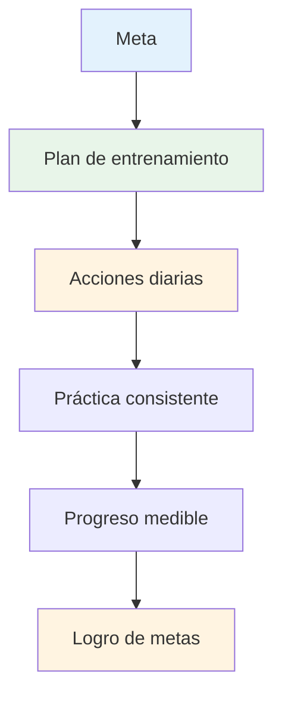

# Creando tu plan de entrenamiento

Las metas sin un plan son solo deseos. Esta guía te ayuda a convertir tus metas en un plan de entrenamiento estructurado que realmente funciona.

::: tip La gran idea
**Los objetivos sin un plan son sólo deseos.** Un plan de entrenamiento estructurado transforma tus objetivos en acciones diarias que se traducen en un progreso real.
:::

## Las 8 fases del desarrollo autodirigido

### Fase 1: Establece tu brújula (objetivos)
Ya aprendiste sobre los objetivos SMART. Ahora, ordénalos:

1. **Objetivo a largo plazo** (1-2 años): Tu sueño
2. **Objetivo anual**: El objetivo de este año
3. **Objetivos trimestrales**: hitos de 3 meses
4. **Objetivos mensuales**: Áreas de enfoque específicas
5. **Objetivos semanales**: Objetivos de entrenamiento

### Fase 2: Evalúe sus recursos

Antes de planificar, evalúa honestamente lo que tienes:

| Recurso | Preguntas para hacer |
|----------|-----------------|
| **Tiempo** | ¿Cuántas horas por semana puedes entrenar de manera realista? |
| **Ubicación** | ¿Tienes acceso a una pista adecuada? ¿Cuál es la calidad de la superficie? |
| **Equipo** | ¿Tienes las bolas adecuadas? ¿Herramientas de medición? ¿Capacidad para grabar vídeos? |
| **Conocimiento** | ¿Cuáles son sus fortalezas y debilidades técnicas? |
| **Condición física** | ¿Alguna limitación? ¿Áreas que requieren trabajo? |

Sé honesto. Un plan realista supera una fantasía ambiciosa.

### Fase 3: Elige tus ejercicios

Seleccione ejercicios que apoyen directamente sus objetivos:

**Para mejorar la puntería:**
- Apuntado de precisión a zonas marcadas
- Ejercicios de variación de distancia
- Práctica de superficies diferentes

**Para mejorar la toma de fotografías:**
- Escalera de tiro (distancias progresivas)
- Tiro con obstáculos (arco alto forzado)
- Práctica de tiro al blanco en movimiento

**Para el desarrollo mental:**
- Práctica de rutina previa al disparo
- Sesiones de visualización
- Simulación de presión

**Equilibra tu programa:**
- Trabajo técnico (apuntar, disparar)
- Entrenamiento mental (mindfulness, visualización)
- Acondicionamiento físico (equilibrio, flexibilidad)
- Juego de partidos (aplicación de habilidades)

### Fase 4: Crea tu horario

Construye un horario semanal realista:

| Día | Mañana | Tarde | Noche | Enfocar |
|-----|---------|-----------|---------|-------|
| Lun | - | Técnico: Apuntando | Movilidad ligera | Precisión |
| Mar | - | Técnico: Tiro | - | Potencia/precisión |
| Casarse | - | Entrenamiento mental | - | Consciencia |
| Jue | - | Mixto: Escenarios de juego | Movilidad ligera | Solicitud |
| Vie | - | Técnico: Debilidad | - | Mejora |
| Se sentó | Juego por partidos o competición | - | - | Actuación |
| Sol | Descansar | Revisión semanal | Planificación | Recuperación |

**Principios clave:**
- Priorizar el entrenamiento mental (a menudo se descuida)
- Incluir días de descanso
- Equilibrar diferentes habilidades
- Deje la flexibilidad para toda la vida

### Fase 5: Prepárese para los obstáculos

Las cosas saldrán mal. Planifica para ello.

| Riesgo | Probabilidad | Impacto | Plan de respaldo |
|------|------------|--------|-------------|
| escasez de tiempo | Alto | Medio | Tenga preparada una &quot;sesión mínima&quot; (20 min) |
| Mal tiempo | Medio | Medio | Visualización en interiores, estudio de vídeo |
| Baja motivación | Alto | Medio | Regresa al &quot;por qué&quot;, objetivos más pequeños, tómate un descanso |
| Lesión menor | Medio | Alto | Centrarse en el entrenamiento mental, habilidades no afectadas |
| Sin compañero de práctica | Medio | Bajo | Ejercicios en solitario, autoanálisis en vídeo |

### Fase 6: Seguimiento de su progreso

Lo que se mide se gestiona.

**Mantenga un diario de entrenamiento:**
- Fecha y duración
- Ejercicios completados
- Puntuaciones/resultados
- Cómo te sentiste (energía, concentración, fluidez)
- Notas técnicas
- Clima/condiciones

**Preguntas de repaso semanal:**
- ¿Completé mis sesiones planificadas?
- ¿Qué puntuaciones obtuve?
- ¿Qué te hizo sentir bien? ¿Qué te resultó difícil?
- ¿Alguna experiencia de flujo?
- ¿Qué debo ajustar?

### Fase 7: Mantente motivado

La motivación fluctúa. Crea sistemas para mantenerla:

**Motivación interna:**
- Conéctate con tu “por qué”
- Celebra los pequeños triunfos
- Observe la mejora con el tiempo
- Encuentra alegría en el proceso

**Soporte externo:**
- Compañeros de entrenamiento (incluso ocasionalmente)
- Compartir objetivos con alguien
- Únase a comunidades en línea
- Rachas de seguimiento y consistencia

**Cuando la motivación baja:**
- Haz una sesión mínima (algo es mejor que nada)
- Cambia tu entorno
- Revisa tu progreso
- Recuerde los éxitos pasados
- Tome un descanso planificado si es necesario

### Fase 8: Revisión y adaptación

Su plan debe evolucionar:

**Semanal:** Revisión rápida, ajustes menores
**Mensualmente:** Evaluar el progreso hacia los objetivos mensuales, ajustar el enfoque
**Trimestral:** Revisión importante, establecer objetivos para el próximo trimestre
**Anualmente:** Evaluación completa, nuevo plan anual

**Preguntas para repasar:**
- ¿Estoy progresando hacia mis objetivos?
- ¿Es efectivo mi entrenamiento?
- ¿Necesito ejercicios diferentes?
- ¿Son mis objetivos aún relevantes?
- ¿Qué he aprendido?

## Ejemplo de plan de 8 semanas

**Objetivo:** Mejorar la precisión de tiro en un 15%

| Semana | Enfocar | Sesiones clave |
|------|-------|--------------|
| 1 | Base | Prueba de nivel actual, análisis de vídeo |
| 2 | Técnica | Identificar y trabajar en los problemas clave |
| 3 | Repetición | Práctica de tiro de alto volumen |
| 4 | Prueba | Evaluación intermedia, ajuste |
| 5 | Variación | Diferentes distancias y ángulos |
| 6 | Presión | Añadir consecuencias a los simulacros |
| 7 | Integración | Escenarios tipo juego |
| 8 | Prueba final | Medir la mejora |

## Conclusión clave

> Planifica tu trabajo y luego trabaja según tu plan. Pero prepárate para adaptarte.

El mejor plan es el que realmente seguirás. Empieza con algo sencillo, sé constante y ajústalo a medida que aprendes.

