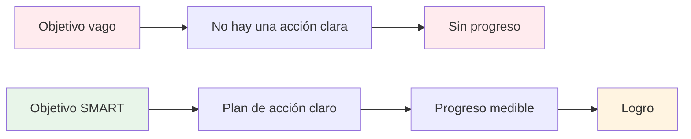

# Objetivos SMART para la petanca

El marco SMART transforma deseos vagos en objetivos viables. Analicemos cada elemento en detalle, con ejemplos específicos para la petanca.

::: tip La gran idea
**Las metas imprecisas conducen a resultados imprecisos.** Las metas SMART generan claridad, acción y progreso medible. Transforma el &quot;Quiero mejorar&quot; en objetivos concretos que realmente puedas alcanzar.
:::

## S - Específico

Un objetivo específico responde a estas preguntas:
- ¿**Qué** exactamente quiero lograr?
- ¿**Dónde** sucederá esto?
- ¿**Qué** aspectos están involucrados?

### Establecer objetivos específicos

| Impreciso | Específico |
|-------|----------|
| &quot;Mejorar mi puntería&quot; | Mejorar mi precisión de puntería en superficies de grava a una distancia de 7 a 9 metros. |
| &quot;Hazte mentalmente más fuerte&quot; | &quot;Desarrollar una rutina consistente antes de cada lanzamiento que utilice para cada lanzamiento&quot; |
| &quot;Gana más partidos&quot; | &quot;Ganar al menos el 60% de mis partidos competitivos esta temporada&quot; |

### Lista de verificación de especificidad
- [ ] ¿Puede alguien más entender exactamente lo que estoy tratando de hacer?
- [ ] ¿He definido las condiciones (distancia, superficie, situación)?
- [ ] ¿Existe una única interpretación de este objetivo?

## M - Medible

Si no puedes medirlo, no puedes gestionarlo. Los objetivos medibles te permiten monitorear tu progreso y saber cuándo has tenido éxito.

### Formas de medir los objetivos de la petanca

**Medidas cuantitativas:**
- Puntos anotados en ejercicios (por ejemplo, 24/30)
- Porcentaje de precisión (por ejemplo, tasa de acierto del 75 %)
- Distancia desde el objetivo (por ejemplo, un promedio de 30 cm desde el gato)
- Consistencia (por ejemplo, 3 sesiones exitosas seguidas)

**Usando ejercicios de entrenamiento como medidas:**

| Perforar | Qué mide | Ejemplo de objetivo |
|-------|-----------------|----------------|
| Escalera de tiro | Precisión de tiro bajo presión | Alcanza los 10 m con 30 bolas |
| Precisión de apuntado | Precisión de apuntamiento a la zona | 24/30 puntos |
| Variación de la distancia | Control de profundidad | 80% dentro de 50 cm |

### Seguimiento de sus medidas
Mantenga un registro sencillo:
- Fecha
- Ejercicio/simulacro
- Puntuación/resultado
- Condiciones (superficie, clima)
- Notas

## A - Alcanzable (pero desafiante)

Las metas deben exigirte sin ser imposibles.

### Encontrar el nivel adecuado

**Demasiado fácil:** &quot;Practica una vez este mes&quot;
- Sin crecimiento, sin motivación

**Demasiado difícil:** &quot;Nunca pierdas un tiro&quot;
- Imposible, conduce a la frustración.

**Perfecto:** &quot;Mejora la precisión de tiro en un 15% en 8 semanas&quot;
- Desafiante pero realista con esfuerzo.

### Preguntas para comprobar la viabilidad
- ¿Otros de mi nivel han conseguido esto?
- ¿Tengo el tiempo y los recursos necesarios?
- ¿Está esto bajo mi control (en su mayor parte)?
- ¿Estoy dispuesto a hacer lo que sea necesario?

### Metas ambiciosas
Está bien tener metas ambiciosas a largo plazo. Solo asegúrate de que tus metas a corto plazo sean pasos alcanzables para alcanzarlas.

## R - Relevante

Tus objetivos deben estar alineados con tu panorama general.

### Preguntas de relevancia
- ¿Este objetivo apoya mi desarrollo general?
- ¿Es esta la prioridad correcta en este momento?
- ¿Esto se ajusta a mi tiempo y recursos disponibles?
- ¿Estoy genuinamente motivado por este objetivo?

### Ejemplo: Comprobación de la relevancia

**Situación:** Quieres competir a nivel nacional

**Objetivos relevantes:**
- Mejorar la precisión de tiro (impacta directamente en los resultados)
- Desarrollar rutinas mentales (ayuda en situaciones de presión)
- Aumentar la frecuencia de entrenamiento (desarrolla habilidades más rápido)

**Objetivos menos relevantes:**
- Aprende tiros con truco (divertido pero no prioritario en la competición)
- Compre bolas nuevas y costosas (el equipamiento no es el factor limitante)

## T - Limitado en el tiempo

Los plazos crean urgencia y permiten la planificación.

### Establecimiento de plazos

| Tipo de objetivo | Marco de tiempo típico |
|-----------|------------------|
| A largo plazo | 1-3 años |
| Anual | 12 meses |
| Trimestral | 3 meses |
| Mensual | 4 semanas |
| Semanalmente | 7 días |
| Sesión | Práctica única |

### Ejemplo de cronología

**Largo plazo (2 años):** Calificar para la selección del equipo nacional

**Anual:** Terminar entre los 10 primeros en el ranking regional

**Trimestral (T1):**
- Establecer una rutina de entrenamiento consistente
- Mejora la precisión de disparo al 70 %

**Mensual (enero):**
- Semana 1: Evaluar el nivel actual, establecer líneas de base
- Semana 2-3: Enfoque en la técnica de tiro
- Semana 4: Probar y medir el progreso

**Semanalmente:**
- Lunes: Sesión técnica de tiro
- Miércoles: Señalamiento y situaciones de juego
- Viernes: Entrenamiento mental y visualización.
- Fin de semana: Competición o práctica de partido

## Poniéndolo todo junto

### Hoja de trabajo para establecer metas

**Mi objetivo (primer borrador):**
_________________________________

**Específico: ¿Qué exactamente?**
_________________________________

**Medible - ¿Cómo lo sabré?**
_________________________________

**Alcanzable - ¿Es realista?**
_________________________________

**Relevante: ¿Por qué es importante esto?**
_________________________________

**Límite de tiempo: ¿para cuándo?**
_________________________________

**Mi objetivo SMART (versión final):**
_________________________________

### Ejemplo completado

**Primer borrador:** &quot;Mejora tus habilidades de tiro&quot;

**Versión SMART:** &quot;Para el 30 de abril, lograré una puntuación de 24/30 o superior en el ejercicio de escalera de tiro (6-10 m con obstáculos) en tres sesiones de entrenamiento consecutivas, medida según mi registro de entrenamiento&quot;.

## Conclusión clave

> Los objetivos SMART convierten los sueños en planes y los planes en resultados.

Tómate el tiempo para definir bien tus objetivos. Un objetivo bien definido es la mitad del camino.

