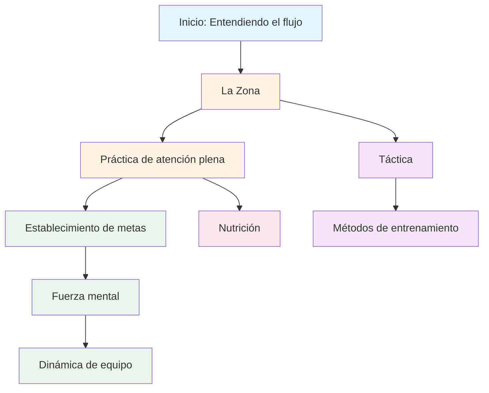

# Educación
<AdBanner />

Bienvenidos al programa educativo de la Academia de Petanca. Aquí, los jugadores de élite aprenden a dominar el juego mental.

::: tip Principio fundamental
En el nivel élite, **el entrenamiento mental cobra mayor importancia que el entrenamiento técnico**. La proporción se invierte a medida que te desarrollas: los principiantes necesitan un 90 % de trabajo técnico, mientras que los expertos necesitan un 80 % de trabajo mental.
:::

## Por qué es importante el entrenamiento mental

En la élite, la habilidad técnica es solo el punto de partida. Las investigaciones demuestran que la actitud mental puede ser tan importante como la habilidad física en deportes de precisión como la petanca. La diferencia entre buenos y grandes jugadores suele estar en sus mentes.

> El deporte es 100% mental. La mente es el motor de todas las capacidades físicas.

## Tu viaje de aprendizaje

Aquí está la ruta recomendada a través de nuestro programa educativo:

**Secuencia recomendada:**
1. **Fundamento:** Comienza con La Zona y Atención Plena
2. **Estructura:** Añadir establecimiento de objetivos y métodos de entrenamiento
3. **Competencia:** Desarrolla la fuerza mental y la táctica
4. **Juego en equipo:** Domina la dinámica de equipo
5. **Optimización:** Ajuste fino con nutrición

## Nuestras rutas de aprendizaje

### 🎯 [La Zona (Estado de Flujo)](/es/educacion/la-zona/)
Descubre qué es realmente &quot;la zona&quot; y cómo acceder a ella. Comprende la ciencia detrás de los estados de fluidez y descubre técnicas prácticas para rendir al máximo cuando más importa.

### 🧘 [Mindfulness](/es/educación/mindfulness/)
Domina el arte de estar presente. Aprende técnicas científicamente probadas para calmar tu mente, mejorar la concentración y recuperarte rápidamente de tus errores.

### 📊 [Establecimiento de metas](/es/educacion/metas/)
Crea una hoja de ruta para tu desarrollo. Aprende el marco SMART adaptado a la petanca y crea un plan de entrenamiento que realmente funcione.

### 💪 [Fuerza mental](/es/educacion/fuerza-mental/)
Desarrolla la fortaleza mental necesaria para la competición. Aprende a manejar la presión, superar la ansiedad y desarrollar rutinas que te permitan alcanzar el máximo rendimiento.

### 🤝 [Dinámica de equipo](/es/educacion/jugador-de-equipo/)
Conviértete en el compañero con el que todos quieren jugar. Aprende sobre comunicación, confianza y cómo contribuir a una cultura de equipo ganadora.

### ♟️ [Tácticas](/es/educación/tácticas/)
Piensa estratégicamente en cada situación. Aprende a tomar decisiones basadas en probabilidades y a saber cuándo asumir riesgos.

### 🏋️ [Métodos de formación](/es/educacion/formacion/)
Entrena de forma más inteligente, no solo más intensa. Aprende a estructurar tu práctica para maximizar tu rendimiento.

### 🥗 [Nutrición](/es/educacion/nutricion/)
Alimenta tu cerebro para un rendimiento preciso. Aprende a mantener la energía y la concentración durante la competición.

## El viaje de la técnica al flujo

A medida que te desarrollas como jugador, tu proporción de entrenamiento se invierte: el entrenamiento mental se vuelve más importante, no menos:

| Nivel | Relación (Tecnología: Mental) | Objetivo principal |
|-------|---------------------|-------------------|
| **Principiante** | 90:10 | Construye la máquina |
| **Intermedio** | 70:30 | Estabilizar la habilidad |
| **Avanzado** | 50:50 | Confía en la máquina |
| **Experto** | 20:80 | Libertad de Ejecución |

No se puede entrenar a un principiante como a un experto (carece de vías neuronales), ni se puede entrenar a un experto como a un principiante (un alto volumen técnico provoca un pensamiento excesivo).

## Referencia rápida: Principios clave de cada sección

| Sección | Principio fundamental | Conclusión clave |
|---------|---------------|--------------|
| **La Zona** | Cambiar del modo analítico al modo automático | *&quot;No hay técnicas que siempre produzcan una bola perfecta. Pero sí existe un estado mental donde las bolas perfectas se vuelven naturales.&quot;* |
| **Consciencia** | Elige dónde poner tu atención | *&quot;La atención plena no se trata de vaciar la mente. Se trata de elegir dónde poner la atención.&quot;* |
| **Establecimiento de metas** | Concéntrese en lo que controla | *&quot;Una meta sin un plan es sólo un deseo.&quot;* |
| **Fuerza mental** | Tener un buen desempeño a pesar de los nervios | *&quot;La fortaleza mental no consiste en eliminar los nervios ni en no cometer nunca errores. Se trata de actuar bien a pesar de ellos.&quot;* |
| **Dinámica de equipo** | La confianza y la comunicación ganan partidos | *&quot;Los mejores equipos no siempre son los más hábiles: son los que juegan mejor juntos.&quot;* |
| **Táctica** | La toma de decisiones supera a la técnica | *&quot;En el nivel de élite, la diferencia rara vez es la técnica: es la toma de decisiones.&quot;* |
| **Capacitación** | Calidad sobre cantidad | *&quot;Entrena de forma más inteligente, no sólo más dura.&quot;* |
| **Nutrición** | Energía estable = rendimiento estable | *&quot;Tu cerebro es un instrumento de precisión. Aliméntalo como corresponde.&quot;* |

## Todas las reglas clave y conclusiones

::: details Haga clic para expandir: Lista completa de principios
Esta es tu guía de referencia rápida. Guarda esta sección en tus favoritos y consúltala con frecuencia.

### Las reglas de la zona
1. **La regla del cambio:** Analizar antes del círculo, ejecutar en el círculo, observar después
2. **La regla de la inversión:** A medida que aumenta la habilidad, el entrenamiento mental se vuelve más importante que el entrenamiento técnico.
3. **La regla de la confianza:** Tu mente consciente planifica, tu subconsciente ejecuta

### Reglas de atención plena
1. **La regla de la conciencia:** Observar sin juzgar
2. **La regla SOAS:** Detenerse, observar, aceptar, soltar
3. **La regla del presente:** Solo puedes controlar este momento, este lanzamiento.

### Reglas para establecer objetivos
1. **La regla de control:** Céntrese en los objetivos del proceso (lo que usted controla) en lugar de en los objetivos de resultados.
2. **La regla SMART:** Los objetivos deben ser específicos, medibles, alcanzables, relevantes y con plazos determinados.
3. **La regla del desglose:** Los objetivos grandes necesitan hitos trimestrales, mensuales y semanales

### Reglas de fortaleza mental
1. **La regla de la rutina:** Las rutinas consistentes previas al disparo desencadenan el máximo rendimiento
2. **La regla del reinicio:** Desarrolla una rutina de reinicio de 10 segundos después de los errores.
3. **El ciclo de la confianza:** Mejor preparación → Más confianza → Mejor rendimiento

### Reglas tácticas
1. **La regla de la probabilidad:** Elige lanzamientos en los que la probabilidad de éxito justifique el riesgo
2. **La regla de control del jack:** El equipo que controla la posición del jack tiene la ventaja
3. **La regla de la distancia:** La distancia corta favorece el disparo, la distancia larga favorece el apuntado.
4. **La regla del estilo:** Fuerza el juego hacia el estilo más fuerte de tu equipo
5. **La regla de la gestión de la bola:** A veces conceder 1 punto es mejor que arriesgar 3

### Reglas de dinámica de equipo
1. **La regla de la comunicación:** La comunicación clara y positiva genera confianza
2. **La regla de apoyo:** La forma en que respondes a los errores de tus compañeros de equipo importa más que tu habilidad.
3. **La regla del rol:** Conozca su rol y ejecútelo plenamente

### Reglas de entrenamiento
1. **La regla de la especificidad:** Entrena lo que quieres mejorar
2. **La regla de variación:** La práctica aleatoria supera a la práctica bloqueada para la transferencia de competencia
3. **La regla de la recuperación:** El descanso es cuando ocurre la adaptación.

### Reglas de nutrición
1. **La regla de la estabilidad:** Evitar picos y caídas de azúcar en sangre
2. **La regla de la hidratación:** Incluso un 2% de deshidratación perjudica el rendimiento
3. **La regla del tiempo:** Comer 2-3 horas antes de la competición
:::

## Comienza tu viaje

::: tip Punto de partida recomendado
Comience con [La Zona](/es/education/the-zone/) para comprender los fundamentos del rendimiento de élite, luego explore [Mindfulness](/es/education/mindfulness/) para obtener técnicas prácticas que puede usar de inmediato.
:::

<AdBanner />
:::

<AdBanner />
