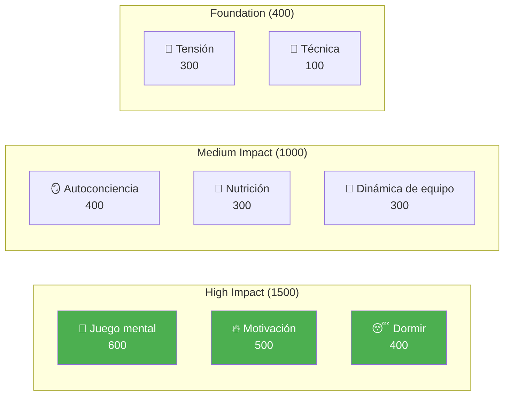

# Desarrollo de jugadores de élite

Bienvenido al programa educativo de la Academia de Petanca: el sistema completo de desarrollo del jugador basado en 8 factores de rendimiento.

::: tip Principio fundamental
En el nivel élite, el **entrenamiento mental cobra mayor importancia que el entrenamiento técnico**. Observa que la Técnica tiene la menor ponderación, no porque no importe, sino porque en el nivel élite todos tienen buena técnica. El factor diferenciador es el mental.
:::

---

## El modelo de rendimiento de 8 factores

Nuestro plan de estudios está estructurado en torno a 8 factores clave, ponderados por su impacto en el rendimiento de élite:

| Factor | Peso | Descripción |
|--------|--------|-------------|
| 🧠 [**Juego Mental**](/es/educacion/juego-mental/) | **600** | Patrones de pensamiento, enfoque, estados de flujo, diálogo interno |
| 🔥 [**Motivación**](/es/educacion/motivacion/) | **500** | Impulso, propósito, orientación a objetivos, persistencia. |
| 😴 [**Sueño y recuperación**](/es/educacion/sueño/) | **400** | Calidad del sueño, recuperación, descanso precompetición |
| 🪞 [**Autoconciencia**](/es/educacion/autoconciencia/) | **400** | Autopercepción precisa, reconocimiento de puntos ciegos |
| 🥗 [**Nutrición**](/es/educacion/nutricion/) | **300** | Estabilidad del azúcar en sangre, hidratación, combustible para la competición. |
| 🤝 [**Dinámica de equipo**](/es/educacion/dinamica-de-equipo/) | **300** | Comunicación, confianza, claridad de roles |
| 💆 [**Gestión de la tensión**](/es/educacion/tension/) | **300** | Tensión física, relajación, control de la respiración. |
| 🎯 [**Técnica**](/es/educación/técnica/) | **100** | Mecánica física, repertorio de lanzamientos |

**Total: 2.900 puntos**

---

## ¿Por qué estos pesos?

Los pesos reflejan el **impacto a nivel élite**:

> En el campeonato regional, la técnica separa al 50% superior. En el campeonato nacional, todos los presentes tienen una técnica de élite. Lo que los distingue es todo lo demás.

---

## Explora cada factor

### 🧠 Juego Mental (600 puntos)

**El factor más influyente para el rendimiento de élite.**

Tu capacidad para gestionar los pensamientos, mantener la concentración y acceder a estados de flujo.

- [La Zona](/es/educacion/juego-mental/la-zona/) — Comprender y acceder a los estados de flujo
- [Fuerza mental](/es/educacion/juego-mental/fuerza-mental/) — Manejo de la presión, rutinas previas al tiro
- [Mindfulness](/es/educacion/juego-mental/mindfulness/) — Enfoque en el momento presente, recuperación de errores

### 🔥 Motivación (500 puntos)

**¿Qué te impulsa a mejorar día tras día, año tras año?**

- [Establecimiento de objetivos](/es/educación/motivación/) — Objetivos SMART, enfoque en el proceso vs. en los resultados
- [Psicología de la motivación](/es/educacion/motivacion/motivacion) — Intrínseca vs. extrínseca, Teoría de la autodeterminación
- [Mantener la motivación](/es/educación/motivación/mantener) — Prevención del agotamiento, navegación hacia la meseta

### 😴 Sueño y recuperación (400 puntos)

**A menudo pasado por alto, pero de enorme impacto.**

La calidad del sueño afecta directamente el tiempo de reacción, la toma de decisiones y la regulación emocional.

- [Ciencia del sueño para deportistas](/es/education/sleep/) — Por qué el sueño es importante para los deportes de precisión
- [Desarrollar hábitos de sueño](/es/educacion/sueño/habitos) — Higiene práctica del sueño
- [Sueño y competición](/es/educación/sueño/competición) — Protocolos previos al evento, gestión de viajes

### 🪞 Autoconciencia (400 puntos)

**No puedes mejorar lo que no puedes ver.**

Una autopercepción precisa permite una mejora específica.

- [La ventaja de la autoconciencia](/es/educacion/autoconciencia/) — Por qué es importante el autoconocimiento
- [Obtener retroalimentación](/es/educación/autoconocimiento/retroalimentación) — Perspectivas externas
- [Análisis de video](/es/educación/autoconocimiento/video) — Uso del video para el autodescubrimiento

### 🥗 Nutrición (300 puntos)

**Energía estable = rendimiento estable.**

Tu cerebro es un instrumento de precisión: aliméntalo adecuadamente.

- [Impulsando el rendimiento](/es/educación/nutrición/) — Azúcar en sangre, hidratación, nutrición para competición

### 🤝 Dinámica de equipo (300 puntos)

**Los mejores equipos no siempre son los más hábiles.**

La comunicación y la confianza a menudo superan el talento individual.

- [Ser un gran compañero de equipo](/es/educacion/dinamica-de-equipo/) — Cultura y apoyo del equipo
- [Comunicación en equipo](/es/educacion/dinamica-de-equipo/comunicacion) — Comunicación clara y positiva

### 💆 Gestión de la tensión (300 puntos)

**La tensión es el enemigo de la precisión.**

No es posible estar tenso y ser preciso al mismo tiempo.

- [Entendiendo la tensión](/es/educacion/tension/) — Tensión física vs. tensión mental
- [Técnicas de liberación](/es/educación/tensión/técnicas) — PMR, respiración, reinicios rápidos
- [Gestión de la competición](/es/educación/tensión/competición) — Protocolos previos y durante el partido

### 🎯 Técnica (100 puntos)

**La base: necesaria pero no suficiente.**

En el nivel de élite, la técnica es un hecho. Los factores diferenciadores están arriba.

- [Descripción general de la técnica](/es/educación/técnica/) — Mecánica física
- [Métodos de entrenamiento](/es/educación/técnica/entrenamiento/) — Práctica deliberada
- [Tácticas](/es/educación/técnica/tácticas/) — Toma de decisiones estratégicas

---

## El viaje del desarrollo

A medida que te desarrollas como jugador, tu ratio de entrenamiento se invierte:

| Nivel | Relación (Tecnología: Mental) | Enfocar |
|-------|---------------------|-------|
| **Principiante** | 90:10 | Construye la máquina |
| **Intermedio** | 70:30 | Estabilizar la habilidad |
| **Avanzado** | 50:50 | Confía en la máquina |
| **Experto** | 20:80 | Libertad de ejecución |

No se puede entrenar a un principiante como a un experto (carece de vías neuronales), ni se puede entrenar a un experto como a un principiante (un alto volumen técnico provoca un pensamiento excesivo).

---

## Referencia rápida: Principios básicos

::: details Haga clic para expandir: Lista completa de principios

### Reglas del juego mental
1. **La regla del cambio:** Analizar antes del círculo, ejecutar en el círculo, observar después
2. **La regla de la confianza:** Tu mente consciente planifica, tu subconsciente ejecuta
3. **La regla del presente:** Solo puedes controlar este momento, este lanzamiento.

### Reglas de motivación
1. **La regla de control:** Centrarse en los objetivos del proceso en lugar de los objetivos de resultados
2. **La regla SMART:** Los objetivos deben ser específicos, medibles, alcanzables, relevantes y con plazos determinados.
3. **La regla intrínseca:** La motivación interna perdura más que las recompensas externas

### Reglas del sueño
1. **La regla de la consistencia:** Despertarse a la misma hora todos los días, incluso los fines de semana
2. **La regla del búfer:** Relajarse 60 minutos o más antes de acostarse
3. **La regla de la competencia:** Dormir más la semana anterior, no solo la noche anterior

### Reglas de autoconciencia
1. **La regla de la retroalimentación:** Busque activamente perspectivas externas
2. **La regla del video:** Lo que sientes ≠ lo que es real: graba y revisa
3. **La regla del punto ciego:** La baja autoconciencia afecta todas las demás evaluaciones

### Reglas de nutrición
1. **La regla de la estabilidad:** Evitar picos y caídas de azúcar en sangre
2. **La regla de la hidratación:** Incluso un 2% de deshidratación perjudica el rendimiento
3. **La regla del tiempo:** Comer 2-3 horas antes de la competición

### Reglas de dinámica de equipo
1. **La regla de la comunicación:** La comunicación clara y positiva genera confianza
2. **La regla del apoyo:** La forma en que respondes a los errores importa más que la habilidad
3. **La regla del rol:** Conozca su rol y ejecútelo plenamente

### Reglas de tensión
1. **La regla de la liberación:** No puedes estar tenso y preciso al mismo tiempo
2. **La regla de Yerkes-Dodson:** Encuentra tu zona de excitación óptima
3. **La regla del reinicio:** Reinicio de 10 segundos antes de cada lanzamiento

### Reglas técnicas
1. **La regla de la especificidad:** Entrena lo que quieres mejorar
2. **La regla de la variación:** La práctica aleatoria supera a la práctica bloqueada
3. **La regla de la recuperación:** El descanso es cuando ocurre la adaptación.
:::

---

## Comienza tu viaje

::: tip Punto de partida recomendado
Comienza con [Juego Mental](/es/education/mental-game/) para comprender los fundamentos del rendimiento de élite. Luego, explora [Sueño](/es/education/sleep/): suele ser la mejora con mayor retorno de la inversión para los jugadores en desarrollo.
:::

