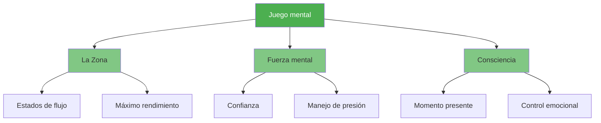

# Juego mental

::: tip El factor más importante
**Peso: 600 puntos** — El juego mental tiene el mayor impacto en tu rendimiento. Domina tu mente y todo lo demás vendrá solo.
:::

El juego mental abarca todo lo que ocurre entre tus oídos: tus pensamientos, tu concentración, tu confianza y tu diálogo interno. Los jugadores de élite no solo tienen mejor técnica, sino que también controlan mejor su estado mental.

## Los tres pilares

### 🎯 [La Zona](/es/educacion/juego-mental/la-zona/)
Accede al estado de fluidez donde el rendimiento se siente sin esfuerzo. Aprende qué desencadena el flujo y cómo alcanzarlo de forma consistente.

- [Introducción a La Zona](/es/educacion/juego-mental/la-zona/)
- [Entrenamiento Técnico vs. Entrenamiento de Fluidez](/es/educacion/juego-mental/la-zona/entrenamiento-tecnico-vs-entrenamiento-de-flujo)
- [Entrando a la zona](/es/educacion/juego-mental/la-zona/entrando-a-la-zona)

### 💪 [Fuerza mental](/es/educacion/juego-mental/fuerza-mental/)
Desarrollar la resiliencia psicológica para actuar bajo presión. Desarrollar la confianza, afrontar los contratiempos y mantener la compostura.

- [Desarrollo de la fuerza mental](/es/educacion/juego-mental/fuerza-mental/)
- [Manejo de la presión](/es/educacion/juego-mental/fuerza-mental/manejo-de-la-presion)
- [Rutina pre-tiro](/es/educacion/juego-mental/fuerza-mental/rutina-pre-tiro)

### 🧘 [Mindfulness](/es/educacion/juego-mental/mindfulness/)
Desarrollar la conciencia del momento presente para mantenerse concentrado y recuperarse rápidamente de los errores.

- [Introducción a la Atención Plena](/es/educacion/juego-mental/atención-plena/)
- [Técnicas de atención plena](/es/educacion/juego-mental/atención-plena/tecnicas)
- [Práctica diaria](/es/educacion/juego-mental/mindfulness/practica-diaria)

## Por qué el juego mental es tan importante

| Aspecto | Capacitación técnica | Entrenamiento mental |
|--------|-------------------|-----------------|
| **En la práctica** | Puedes hacer el disparo | Puedes hacer el disparo |
| **En competición** | La técnica puede fallar bajo presión | Las habilidades mentales mantienen el rendimiento |
| **La diferencia** | La habilidad física es necesaria | La habilidad mental es el multiplicador |

::: warning El error común
La mayoría de los jugadores dedican el 90 % de su tiempo a la técnica y el 10 % a las habilidades mentales. Los jugadores de élite suelen invertir esta proporción una vez que adquieren fundamentos sólidos.
:::

## ¿Por dónde empezar?

**¿Eres nuevo en el entrenamiento mental?** Comienza con [La Zona](/es/educacion/juego-mental/la-zona/) para comprender cómo se siente el máximo rendimiento.

¿Luchas bajo presión? Visita [Fuerza mental](/es/educacion/juego-mental/fuerza-mental/) para obtener técnicas prácticas.

**¿Tu mente divaga durante los partidos?** [Mindfulness](/es/educacion/juego-mental/mindfulness/) te ayudará a mantenerte presente.

## Recursos relacionados

- [Autoconciencia](/es/educacion/autoconciencia/) — Conócete para mejorar más rápido
- [Manejo de la tensión](/es/educacion/tension/) — La relajación física permite claridad mental
- [Herramienta de evaluación](/es/educación/) — Evalúa tu juego mental y obtén recomendaciones personalizadas

