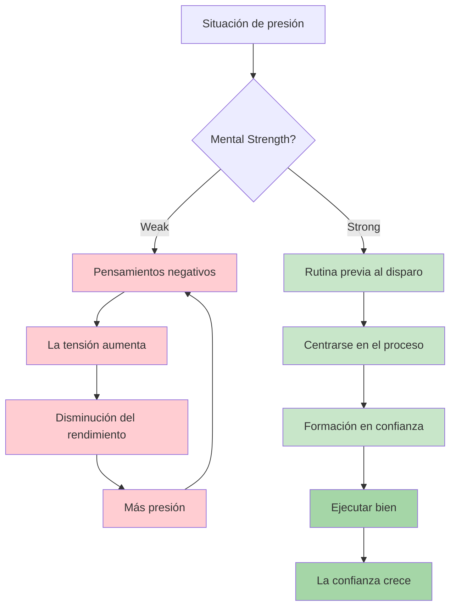

# Fuerza mental

La fortaleza mental es lo que distingue a los jugadores que rinden bien en los entrenamientos de los que lo hacen cuando es crucial. Es la capacidad de manejar la presión, recuperarse de los contratiempos y mantener la concentración durante largas competiciones.

::: tip El principio fundamental
**La fortaleza mental no consiste en eliminar los nervios ni en no cometer nunca errores. Se trata de tener un buen desempeño a pesar de ellos.** No puedes controlar lo que sucede. Puedes controlar cómo respondes.
:::

## ¿Qué es la fuerza mental?

La fuerza mental incluye:
- **Confianza:** Creer en tu capacidad
- **Enfoque:** Mantener la atención en lo que importa
- **Resiliencia:** Recuperarse de los errores
- **Compostura:** Mantener la calma bajo presión
- **Motivación:** Mantener el esfuerzo en el tiempo

Estos no son rasgos fijos: son habilidades que puedes desarrollar.

## Las exigencias mentales de la petanca

La petanca tiene desafíos mentales únicos:

| Desafío | Por qué es difícil |
|-----------|--------------|
| Tiempo entre lanzamientos | Oportunidad para pensamientos negativos |
| Resultados visibles | Todo el mundo ve tus errores |
| Formato de equipo | Presión para no decepcionar a los socios |
| Competiciones largas | Fatiga mental durante muchas horas |
| Juegos cerrados | Hay mucho en juego en los lanzamientos individuales |
| El impulso cambia | montaña rusa emocional |

## Desarrollar la fuerza mental

### 1. Desarrollar la confianza en uno mismo

La confianza proviene de:
- **Preparación:** Saber que has hecho el trabajo
- **Éxitos pasados:** Recordar momentos en los que tuvo un buen desempeño
- **Diálogo interno positivo:** Cómo te hablas a ti mismo
- **Lenguaje corporal:** De pie, moviéndose con propósito.

**Generadores de confianza:**
- Mantén un diario de éxitos
- Visualizar actuaciones exitosas
- Prepárese a fondo para las competiciones
- Utilice un lenguaje corporal seguro (afecta su mente)

### 2. Domina tu diálogo interno

La voz en tu cabeza importa enormemente.

**Diálogo interno destructivo:**
- &quot;Siempre extraño estos&quot;
- &quot;Me voy a ahogar&quot;
- &quot;Mis compañeros cuentan conmigo&quot; (presión)
- &quot;Eso fue terrible&quot;

**Diálogo interno constructivo:**
- &quot;Ya he hecho este lanzamiento antes&quot;
- &quot;Confía en mi entrenamiento&quot;
- &quot;Un lanzamiento a la vez&quot;
- &quot;Próximo lanzamiento, nuevo comienzo&quot;

**Cambiando tu diálogo interno:**
1. Presta atención a lo que te dices a ti mismo
2. Cuestionar las afirmaciones negativas
3. Reemplazar con alternativas realistas y útiles
4. Practica hasta que se vuelva automático

### 3. Desarrollar la resiliencia

La resiliencia es la capacidad de recuperarse de los reveses.

**La mentalidad resiliente:**
- Los errores son información, no fracaso.
- Un mal lanzamiento no te define
- Los reveses son temporales
- Siempre puedes responder bien a lo que sucede.

**Construyendo resiliencia:**
- Practica la recuperación de errores en el entrenamiento
- Utilice el método SOAS (Detenerse, Observar, Aceptar, Deslizar)
- Concéntrese en la respuesta, no en el evento
- Desarrollar una memoria corta para los malos lanzamientos

### 4. Gestiona tu energía

La fortaleza mental requiere gestión de la energía:

**Energía física:**
- Duerme bien antes de las competiciones
- Comer adecuadamente (nivel de azúcar en sangre estable)
- Mantente hidratado
- Moverse entre juegos (no sentarse demasiado tiempo)

**Energía mental:**
- Tome descansos cuando sea posible
- No analices demasiado entre lanzamientos
- Guarda la concentración intensa para cuando la necesites
- Tener rutinas de recuperación

## El ciclo de la confianza y la competencia

::: info El ciclo positivo

**Constrúyelo a través de:**
1. Práctica de calidad (desarrolla competencias)
2. Seguimiento del progreso (genera confianza)
3. Actuaciones exitosas (refuerza ambas)
:::

## En esta sección

- **[Manejo de la presión](/es/educacion/juego-mental/fuerza-mental/manejo-de-la-presion)** - Técnicas para situaciones de alto riesgo
- **[Rutina pre-tiro](/es/educacion/juego-mental/fuerza-mental/rutina-pre-tiro)** - Desarrolla tu disparador de rendimiento

## Resumen: Reglas de fortaleza mental

::: tip Regla n.° 1: La regla de la rutina
**Las rutinas consistentes previas al disparo generan el máximo rendimiento.**
La misma rutina cada vez = disparador confiable para el estado de flujo
:::

::: tip Regla n.° 2: La regla del reinicio
**Desarrolle una rutina de reinicio de 10 segundos después de cometer errores.**
Reinicio físico (respiración profunda, rotación de hombros) + reinicio mental (método SOAS)
:::

::: tip Regla n.° 3: La regla del bucle de confianza
**Mejor preparación → Más confianza → Mejor rendimiento.**
El ciclo funciona en ambos sentidos. Constrúyelo mediante prácticas de calidad y seguimiento del progreso.
:::

::: tip Regla n.° 4: La regla del diálogo interno
**Háblate a ti mismo como hablarías con un compañero de equipo.**
Solidario, constructivo, centrado en lo que hay que hacer (no en lo que salió mal)
:::

::: tip Regla n.° 5: La regla de la gestión energética
**Guarda la concentración intensa para cuando la necesites.**
No analices demasiado entre lanzamientos. Conserva la energía mental para la ejecución.
:::

## Conclusión clave

> La fortaleza mental no consiste en eliminar los nervios ni en no cometer nunca errores. Se trata de tener un buen rendimiento a pesar de ellos.

No puedes controlar lo que sucede. Puedes controlar cómo respondes.

