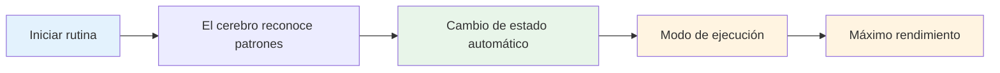

# Construyendo tu rutina previa al disparo

Tu rutina previa al lanzamiento es una de las herramientas más poderosas de tu juego mental. Es una secuencia constante de acciones que te prepara para cada lanzamiento y te permite alcanzar tu mejor rendimiento.

::: tip La gran idea
**Tu rutina es tu puerta de entrada a la zona.** Una rutina constante antes de disparar le indica a tu cerebro: &quot;Es hora de ejecutar&quot;. Con la repetición, se convierte en un detonante automático para alcanzar el máximo rendimiento.
:::

## Por qué funcionan las rutinas

### La consistencia crea confianza
Al hacer siempre lo mismo, se eliminan las variables. El cuerpo sabe lo que viene. Esto crea una sensación de control y familiaridad, incluso en situaciones desconocidas.

### Las rutinas desencadenan estados
Con la repetición, tu rutina se vincula con tu rendimiento. Al comenzar la rutina, se inicia automáticamente el cambio mental al modo de ejecución.

### Las rutinas bloquean las distracciones
Una rutina te da algo en qué concentrarte. No hay lugar para preocuparse por la partitura, el público ni por lo que pueda pasar.

### Las rutinas gestionan la excitación
Una rutina bien diseñada ayuda a regular tu nivel de energía: te tranquiliza si estás demasiado excitado y te concentra si estás desanimado.

## Elementos de una rutina eficaz

### Fase 1: Evaluación (Fuera del Círculo)

Antes de entrar, recopile información:
- Leer el terreno (pendientes, obstáculos, superficie)
- Evaluar la situación (puntuación, posiciones de las bolas)
- Elige tu objetivo y lugar de aterrizaje
- Decide el tipo de lanzamiento (apuntar, disparar, bombear, rodar)

**Aquí es donde ocurre el pensamiento.** Tómate tu tiempo aquí.

### Fase 2: Transición (Entrada al Círculo)

El paso del pensamiento al hacer:
- Acción física (entrar en círculo de manera consistente)
- Señal mental (una palabra o frase que indica &quot;modo de ejecución&quot;)
- Respiración (una respiración consciente para centrarse)

**Este es el cambio.** El análisis termina aquí.

### Fase 3: Configuración (en el círculo)

Prepara tu cuerpo:
- Postura consistente (la misma cada vez)
- Comprobación del agarre (sentir la bola)
- Alineación con el objetivo
- Disparador físico (un pequeño movimiento que es tuyo)

### Fase 4: Visualización (Breve)

Mira el lanzamiento antes de realizarlo:
- Imagina la trayectoria de la pelota (2-3 segundos máximo)
- Siente el lanzamiento exitoso
- Conéctate visualmente con tu objetivo

### Fase 5: Ejecución

Realizar el lanzamiento:
- Enfoque externo (sólo objetivo)
- Confía en tu cuerpo
- Liberación sin dudarlo
- Seguir adelante con naturalidad

## Construyendo tu rutina personal

### Paso 1: Observa lo que ya haces

Probablemente ya tengas alguna rutina. Nota:
- ¿Qué haces antes de un buen lanzamiento?
- ¿Qué te parece natural?
- ¿Qué te ayuda a concentrarte?

### Paso 2: Diseña tu rutina

Crea una secuencia que incluya:
- [ ] Fase de evaluación
- [ ] Momento de transición claro
- [ ] Configuración física consistente
- [ ] Visualización breve
- [ ] Desencadenante de ejecución

### Paso 3: Escríbelo

Sea específico. Ejemplo:

1. **Evaluar:** Leer el terreno, elegir el lugar de aterrizaje
2. **Transición:** Da un paso hacia el círculo con el pie izquierdo primero y di &quot;confía&quot;.
3. **Preparación:** Pies separados al ancho de los hombros, verificar el agarre, alinear los hombros
4. **Visualizar:** Ver el camino, sentir la liberación
5. **Ejecutar:** Ojos en el objetivo, lanzar

### Paso 4: Practica religiosamente

Utilice su rutina en CADA lanzamiento en la práctica:
- Lanzamientos fáciles
- Lanzamientos difíciles
- Cuando estás cansado
- Cuando estas fresco

La rutina debe volverse automática.

### Paso 5: Refinar con el tiempo

Tu rutina evolucionará. Observa qué funciona y ajústala. Pero no la cambies durante la competición, solo entre eventos.

## Tiempo de rutina

Tu rutina debe tomar una cantidad de tiempo constante:
- Demasiado rápido: estás corriendo, no estás preparado adecuadamente
- Demasiado lento: estás pensando demasiado y perdiendo el ritmo.
- Justo: tiempo suficiente para prepararse, pero no tanto como para pensar demasiado

**Tiempo típico:**
- Evaluación: 5-10 segundos
- Transición + Configuración: 3-5 segundos
- Visualización + Ejecución: 3-5 segundos
- **Total: 10-20 segundos**

## Errores rutinarios comunes

| Error | Problema | Solución |
|---------|---------|----------|
| Saltar en la práctica | La rutina no es automática | Úselo en cada lanzamiento |
| Demasiado complicado | Difícil de recordar bajo presión | Simplificar a lo esencial |
| Pensar durante la ejecución | Interrumpe el rendimiento automático | Punto de transición claro |
| Tiempo inconsistente | Crea incertidumbre | Practica con un ritmo constante |
| Cambios a mitad de la competición | Introduce dudas | Quédate con lo que sabes |

## Solución de problemas de rutina

**Si tienes prisa:**
- Añade una respiración en la transición
- Disminuya la velocidad de sus movimientos de configuración
- Pausa antes de la visualización

**Si estás pensando demasiado:**
- Acortar la rutina
- Utilice una señal de transición más fuerte
- Centrarse más en lo externo

**Si eres inconsistente:**
- Grábate en vídeo para comprobarlo
- Practica la rutina sin lanzar
- Obtenga comentarios de un socio

## Rutinas de muestra

### Rutina simple
1. Elija el objetivo
2. Entra, respira
3. Agarrar, alinear
4. Míralo, tíralo

### Rutina detallada
1. Leer el terreno, elegir el lugar de aterrizaje
2. Primero, el pie izquierdo
3. Di &quot;suave&quot; internamente
4. Una respiración, los hombros caen
5. Pies ajustados, comprobación de agarre
6. Alinear los hombros al objetivo
7. Ver el camino (2 segundos)
8. Los ojos se fijan en el objetivo
9. Tirar

## Conclusión clave

> Tu rutina es tu ancla. En el caos, es tu constante.

Constrúyelo con cuidado. Practícalo siempre. Confía plenamente en él.

