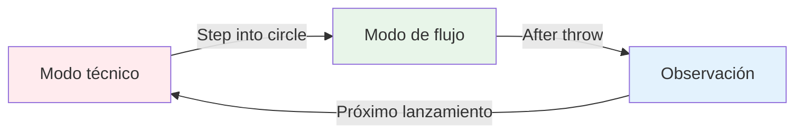
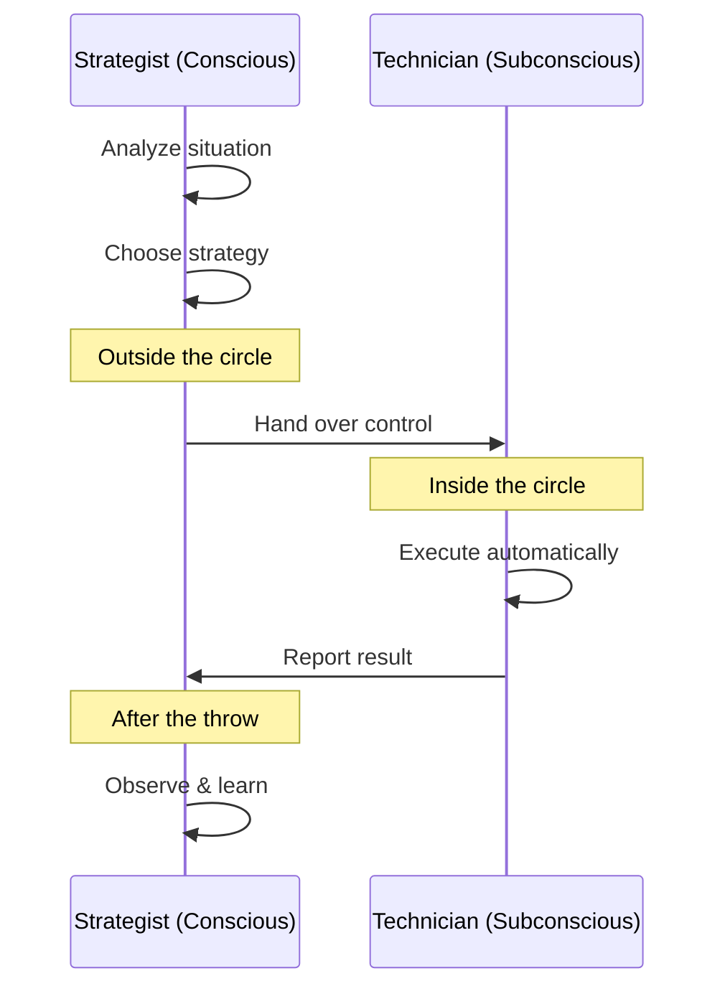

# La Zona: Entendiendo el Estado de Flujo

¿Alguna vez has jugado un partido donde todo encajaba a la perfección? ¿Donde no te fijaste en tu técnica y cada bola cayó justo donde querías? Esa es la zona, y aprender a acceder a ella de forma constante es lo que distingue a los jugadores de élite del resto.

::: tip La gran idea
**El estado de flujo es cuando tu cerebro analítico se calma y tus instintos entrenados toman el control.** No puedes pensar para entrar en la zona: tienes que dejarte ir.
:::

## ¿Qué es La Zona?

La zona, también llamada &quot;estado de fluidez&quot;, es un estado mental en el que te absorbes por completo en lo que haces. El tiempo parece ralentizarse. Tus movimientos se sienten sin esfuerzo. No piensas en la técnica; simplemente estás *haciendo*.

Los científicos llaman a este estado **hipofrontalidad transitoria**. En pocas palabras, la parte analítica del cerebro (la corteza prefrontal) se aquieta, permitiendo que los instintos entrenados tomen el control.

### Los dos modos del cerebro

**Modo Técnico (Planificación):**
- Analizar la situación
- Elige tu estrategia
- Decide qué lanzamiento hacer

**Modo de flujo (ejecución):**
- Confía en tu entrenamiento
- Concéntrese sólo en el objetivo
- Deja que tu cuerpo se ejecute automáticamente

**Observación (Aprendizaje):**
- Observa el resultado sin juzgar
- Aprenda de lo que pasó
- Reiniciar para el siguiente lanzamiento

## La paradoja de la petanca

El reto es el siguiente: la petanca te da mucho tiempo para pensar entre lanzamientos. A diferencia de los deportes rápidos, donde reaccionas al instante, tienes tiempo para caminar hasta el círculo, evaluar la situación y preparar el lanzamiento.

Este “tiempo para pensar” es al mismo tiempo un regalo y una maldición:
- **Regalo:** Podrás planificar estrategias y tomar decisiones inteligentes.
- **Maldición:** Puedes pensar demasiado e interferir con tu habilidad natural.

El jugador de élite aprende a utilizar este tiempo sabiamente: piensa durante la planificación y luego &quot;desconecta&quot; durante la ejecución.

## Dos modos de juego

Tu cerebro funciona en dos modos diferentes:

| Característica | Modo técnico | Modo de flujo |
|---------|---------------|-----------|
| **Cuándo usarlo** | Formación, aprendizaje de nuevas habilidades | Competencia, ejecución |
| **Actividad cerebral** | Alto pensamiento analítico | Silencioso, automático |
| **Enfocar** | Interna (mecánica corporal) | Externo (objetivo) |
| **Sentimiento** | Esforzado, consciente | Sin esfuerzo, natural |

La habilidad clave es aprender a **cambiar** entre estos modos en el momento adecuado.

## El momento del &quot;cambio&quot;

::: warning La regla del cambio
**Antes del círculo:** Analizar, elaborar una estrategia, decidir qué lanzamiento realizar
**En el círculo:** Deja ir el análisis, confía en tu entrenamiento, céntrate solo en el objetivo.
**Después del lanzamiento:** Observa el resultado sin juzgar.
:::

La transición ocurre al entrar en el círculo. Esta es la habilidad más importante en la petanca de élite.

Piénsalo así: tu mente consciente es el **estratega** que elabora el plan, y tu mente subconsciente es el **técnico** que lo ejecuta. El estratega necesita dar un paso atrás y dejar que el técnico trabaje.

## Por qué pensar demasiado afecta el rendimiento

Cuando monitoreas conscientemente tus movimientos durante la ejecución, interrumpes los procesos automáticos que has entrenado. Esto se llama &quot;estrangulamiento&quot; y nos sucede a todos.

::: danger Señales de que estás pensando demasiado
- ❌ Pensando en la posición del brazo a mitad del lanzamiento
- ❌ Preocuparse por el resultado antes de liberar
- ❌ Sentirse tenso o mecánico
- ❌ Dudar de uno mismo en el círculo
:::

::: tip La solución
La solución no es pensar *menos*; es pensar en las **cosas correctas** en el **momento correcto**.

✅ **Pensamiento correcto:** &quot;Veo claramente el objetivo&quot;
❌ **Pensamiento erróneo:** &quot;Mantén el codo recto&quot;
:::

## En esta sección

Aprende a dominar la zona:

- **[Entrenamiento Técnico vs. Flow](/es/educacion/juego-mental/la-zona/entrenamiento-tecnico-vs-flow)** - Entender cuándo enfocarse en la técnica y cuándo dejarse llevar
- **[Entrando a la Zona](/es/educacion/juego-mental/la-zona/entrando-a-la-zona)** - Técnicas prácticas para acceder al estado de flujo

## Resumen: Las reglas de la zona

::: tip Regla n.° 1: La regla del cambio
**Analizar antes del círculo, ejecutar en el círculo, observar después.**
Tu mente consciente planifica, tu subconsciente ejecuta.
:::

::: tip Regla n.° 2: La regla de la inversión
**A medida que aumenta la habilidad, el entrenamiento mental se vuelve más importante que el entrenamiento técnico.**
Principiantes: 90% técnico / 10% mental
Expertos: 20% técnico / 80% mental
:::

::: tip Regla n.° 3: La regla de la confianza
**No puedes pensar hasta lograr una ejecución perfecta.**
Confía en tu entrenamiento. Céntrate en el objetivo, no en tu técnica.
:::

## Conclusión clave

> No hay técnicas que siempre produzcan una bola perfecta. Pero existe un estado mental donde las bolas perfectas se vuelven naturales.

Tu técnica es la base. La zona es donde esa base se convierte en arte.

