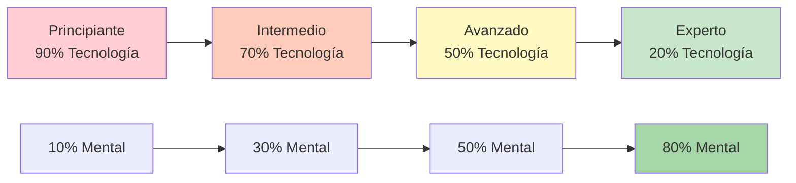

# Capacitación técnica vs. capacitación de flujo

Comprender la diferencia entre el entrenamiento técnico y el entrenamiento de flujo es esencial para el desarrollo de élite. Ambos son necesarios, pero tienen propósitos diferentes y requieren enfoques distintos.

::: tip El principio fundamental
**No se puede entrenar a un principiante como a un experto** (carecen de vías neuronales), y **no se puede entrenar a un experto como a un principiante** (un alto volumen técnico provoca un pensamiento excesivo).
:::

## Dos tipos de entrenamiento

::: info Capacitación técnica (aprendizaje explícito)
**Enfoque:** Mecánica y forma
**Atención:** Movimientos corporales conscientes
**Método:** Desglosar habilidades, práctica repetitiva
**Ideal para:** Aprender nuevas habilidades, corregir malos hábitos, construir bases.

**Ejemplo:** Practicar el punto de lanzamiento 50 veces con análisis de video
:::

::: info Entrenamiento de flujo (aprendizaje implícito)
**Enfoque:** Resultados, no mecánica
**Atención:** Dejar que el subconsciente tome el control
**Método:** Práctica variada, similar a un juego, visualización.
**Ideal para:** Preparación para competiciones, desarrollo de confianza, máximo rendimiento.

**Ejemplo:** Jugar partidos de práctica con presión, concentrándose solo en los objetivos
:::

## El modelo de inversión dinámica

Una proporción correcta de entrenamiento está inversamente relacionada con la competencia técnica. A medida que se domina la técnica, el entrenamiento mental cobra mayor importancia, no menor.

### 1. Principiante (Etapa cognitiva)
- Piensas conscientemente en *qué* hacer
- Los movimientos se sienten incómodos y requieren esfuerzo.
- El cerebro está completamente saturado de mecánica.
- **Relación:** 90% Técnico / 10% Mental
- **Enfoque mental:** Disfrute, enfoque externo (mirar el objetivo), no visualización compleja

### 2. Intermedio (Etapa asociativa)
- Refinas la habilidad con menos pensamiento consciente.
- Los movimientos se vuelven más suaves, los errores disminuyen.
- Empiezas a detectar tus propios errores
- **Ratio:** 70% Técnico / 30% Mental
- **Enfoque mental:** Desarrollar tu rutina previa al rendimiento (PPR)

### 3. Avanzado (Umbral de Autonomía)
- La habilidad está en gran parte automatizada.
- Tu autoimagen a menudo va por detrás de tu capacidad física
- La formación se centra en la simulación de presión.
- **Relación:** 50% Técnico / 50% Mental
- **Enfoque mental:** Visualización, autoimagen, control de la ansiedad.

### 4. Experto (Etapa Autónoma)
- Las habilidades técnicas son totalmente subconscientes
- La atención consciente a la mecánica altera el rendimiento
- El volumen de mantenimiento es todo lo que necesitas técnicamente
- **Ratio:** 20% Técnico / 80% Mental
- **Enfoque mental:** Estado de flujo, estrategia, aquietar la mente.

## La tabla de progresión

| Nivel | Tecnología: Mental | Objetivo principal |
|-------|---------------|-------------------|
| Principiante | 90:10 | Construye la máquina |
| Intermedio | 70:30 | Estabilizar la habilidad |
| Avanzado | 50:50 | Confía en la máquina |
| Experto | 20:80 | Libertad de Ejecución |

## La trampa del experto

Para los jugadores avanzados y expertos, volver a un enfoque técnico elevado es peligroso.

**El problema:** Cuando automatizas una habilidad, pero la monitorizas conscientemente durante la competición, activas la mente consciente y anulas el subconsciente. Esto provoca ansiedad y ahogo.

**La ciencia:** El volumen necesario para mantener una habilidad es significativamente menor (a menudo entre un tercio y un noveno) que el necesario para desarrollarla. Los expertos necesitan un trabajo técnico mínimo para conservar su toque.

**Ejemplo de élite:** Campeones como Philippe Quintais y Dylan Rocher se centran mucho en escenarios tácticos y momentos críticos en lugar de ejercicios mecánicos.

Señales de que estás pensando demasiado en la técnica:
- Parálisis por análisis
- Rendimiento inconsistente a pesar de una buena técnica
- Peores resultados en la competición que en la práctica
- Sentirse &quot;mecánico&quot; en lugar de fluido

## Comparación de métodos de entrenamiento

| Aspecto | Capacitación técnica | Entrenamiento de flujo |
|--------|-------------------|---------------|
| **Tipo de práctica** | Bloqueado (la misma habilidad repetidamente) | Aleatorio (habilidades variadas) |
| **Comentario** | Inmediato, detallado | Retrasado, centrado en los resultados |
| **Ambiente** | Controlado, predecible | Variable, similar a un juego |
| **Estado mental** | Analítico, consciente | Intuitivo, automático |
| **Mejor momento** | Fuera de temporada, desarrollo de habilidades | Precompetición, mantenimiento |

## Práctica bloqueada vs. práctica aleatoria

**Práctica bloqueada:** Repite el mismo lanzamiento 20 veces
- Se siente productivo (se nota una mejora rápida)
- Bueno para el aprendizaje inicial
- Pobre para la retención a largo plazo

**Práctica aleatoria:** Varía la distancia, el objetivo y el tipo de lanzamiento.
- Se siente más difícil (más errores)
- Mejor para la transferencia de la competencia
- Desarrolla la adaptabilidad y la toma de decisiones.

## Directrices prácticas

### Para sesiones técnicas
1. Concéntrese en UN aspecto a la vez
2. Utilice el análisis de vídeo
3. Obtenga comentarios de un entrenador o compañero de entrenamiento
4. Acepta que al principio te sentirás incómodo
5. Mantenga las sesiones más cortas (calidad sobre cantidad)

### Para sesiones de flujo
1. Crear una presión similar a la del juego
2. Concéntrese en el objetivo, no en su cuerpo.
3. Utilice su rutina previa a la inyección de manera constante
4. No analizar durante la sesión
5. Confía en tu entrenamiento

## El desafío de la integración

La verdadera habilidad es saber cuándo utilizar cada modo:

**Durante un partido de competición:**
- Pensamiento técnico: NUNCA durante la ejecución
- Modo de flujo: SIEMPRE al lanzar

**Durante la práctica:**
- Sesiones técnicas: programadas, enfoque específico
- Sesiones de flujo: Simulación de juego, práctica de presión

## Ejemplo de saldo semanal

| Día | Tipo de sesión | Enfocar |
|-----|-------------|-------|
| Lunes | Técnico | Precisión de puntería |
| Martes | Técnico | Precisión de disparo |
| Miércoles | Fluir | Entrenamiento mental, visualización |
| Jueves | Mezclado | Escenarios de juego con enfoque en el flujo |
| Viernes | Técnico | Área de debilidad |
| Sábado | Fluir | Match play, simulación de competición |
| Domingo | Descansar | Recuperación, reflexión |

## Resumen: Reglas de equilibrio en el entrenamiento

::: tip Regla n.° 1: Adaptar el entrenamiento al nivel
**Principiantes (90/10):** Construye la máquina: céntrate en la técnica
**Intermedio (70/30):** Estabilizar la habilidad - agregar trabajo mental
**Avanzado (50/50):** Confía en la máquina: equilibra ambos
**Experto (20/80):** Libertad de ejecución, principalmente mental
:::

::: tip Regla n.° 2: Práctica bloqueada vs. práctica aleatoria
**Práctica bloqueada** (mismo lanzamiento repetidamente): bueno para el aprendizaje inicial, malo para la retención
**Práctica aleatoria** (lanzamientos variados): más difícil en la práctica, mejor en la competición
:::

::: tip Regla n.° 3: La trampa del experto
**Para los expertos:** Un alto volumen técnico provoca pensamientos excesivos y ahogos.
**Solución:** Mínimo mantenimiento técnico, máximo entrenamiento mental
:::

## Conclusión clave

> No se puede entrenar a un principiante como a un experto (carecen de las vías neuronales para el trabajo mental), ni se puede entrenar a un experto como a un principiante (un alto volumen técnico provoca agotamiento y pensamiento excesivo).

El paso de la técnica al flujo requiere una inversión estratégica. Adapta tu entrenamiento a tu etapa de desarrollo.

