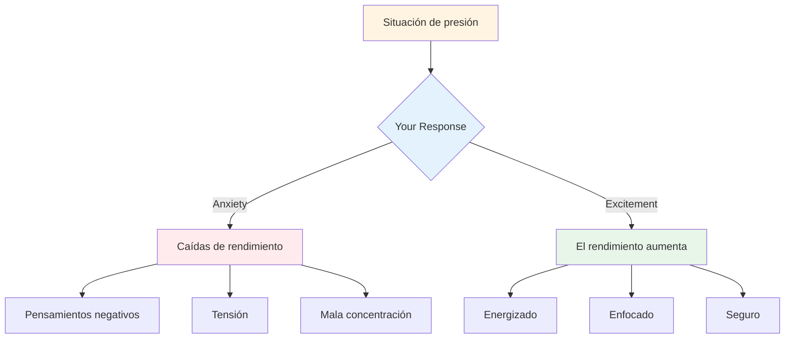

# Manejo de presión
<AdBanner />

La presión es parte de la competencia. El objetivo no es eliminarla; es imposible. El objetivo es tener un buen rendimiento a pesar de ella, e incluso usarla a tu favor.

::: tip La gran idea
**La presión no desaparece con la experiencia: simplemente te hace mejorar tu desempeño con ella.** Los mejores jugadores no son tranquilos; son hábiles en usar su excitación de manera productiva.
:::

## Entendiendo la presión

### ¿Qué crea presión?
- Apuestas altas (partido importante, lanzamiento decisivo)
- Ser observado (público, compañeros de equipo)
- Expectativas (las suyas y las de los demás)
- Incertidumbre (marcador ajustado, oponentes desconocidos)
- El tiempo (se acaba, la espera es demasiado larga)

### ¿Qué efectos produce la presión sobre tu cuerpo?
Cuando sientes presión, tu cuerpo responde:
- La frecuencia cardíaca aumenta
- La respiración se vuelve superficial
- Músculos tensos
- Las manos pueden temblar
- El enfoque se estrecha (a veces demasiado)

Este es tu cuerpo preparándose para la acción. No es malo: es energía que puedes usar.

## Reformulando la presión

### La presión como emoción

Las sensaciones físicas de ansiedad y excitación son casi idénticas. La diferencia radica en cómo las interpretamos.

**Interpretación de la ansiedad:** &quot;Estoy nervioso, algo malo podría pasar&quot;
**Interpretación de la emoción:** &quot;Tengo energía, esto es importante para mí&quot;

**Prueba esto:** Cuando sientas presión, dite a ti mismo: &quot;Estoy emocionado&quot; en lugar de &quot;Estoy nervioso&quot;.

### La presión como privilegio

Solo los momentos importantes generan presión. Si la sientes, estás en una situación importante.

> &quot;La presión es un privilegio; solo la tienen quienes se la ganan.&quot; - Billie Jean King

## Técnicas para momentos de alta presión

### 1. Control de la respiración

Tu respiración es la forma más rápida de cambiar tu estado.

**La técnica 4-7-8:**
1. Inhala durante 4 segundos
2. Mantener durante 7 tiempos
3. Exhala durante 8 segundos
4. Repetir 2-3 veces

**Reinicio rápido (en el círculo):**
- Una respiración lenta y profunda
- Siente tus pies en el suelo
- Deja caer los hombros al exhalar.

<AdInArticle />

### 2. Conexión física a tierra

Conéctate con las sensaciones físicas para salir de tu cabeza:
- Siente el peso de la bola
- Nota tus pies en el suelo
- Aprieta y suelta la mano que no lanza
- Echa los hombros hacia atrás

### 3. Estrechamiento del enfoque

En los momentos de presión, concéntrese sólo en lo que importa:
- No es la puntuación
- No la audiencia
- No es lo que podría pasar
- Sólo este lanzamiento, este objetivo, este momento.

**Palabras clave:** &quot;Aquí. Ahora. Esto.&quot;

### 4. Enfoque en el proceso

Pasar del resultado al proceso:

**Enfoque en el resultado (crea presión):**
- &quot;Necesito hacer esto&quot;
- &quot;Si fallo, perdemos&quot;
- &quot;Todo el mundo está mirando&quot;

**Enfoque en el proceso (reduce la presión):**
- &quot;Sigue mi rutina&quot;
- &quot;Ver el objetivo&quot;
- &quot;Confía en mi entrenamiento&quot;

### 5. El apretón de la mano izquierda

Para jugadores diestros, apretar la mano izquierda durante 10 a 15 segundos:
- Activa el hemisferio derecho del cerebro.
- Calma el pensamiento analítico excesivo
- Ayuda a acceder a la ejecución automática

Utilice esto cuando note que está pensando demasiado.

## Preparándose para la presión

### Simular la presión en la práctica

No puedes manejar la presión de la competencia si nunca la experimentas en el entrenamiento.

**Formas de crear presión en la práctica:**
- Establecer consecuencias (flexiones por errores, comprar café para la pareja)
- Crear escenarios &quot;imprescindibles&quot;
- Practica con una audiencia
- Presión del tiempo (reloj de lanzamiento)
- Fatiga (practica cuando estés cansado)

### Visualización

Ensaye mentalmente situaciones de alta presión:
1. Cierra los ojos
2. Imagine un escenario de presión en detalle
3. Siente las sensaciones de presión
4. Imagínate manejándolo bien
5. Ejecútalo con éxito en tu mente

Haga esto regularmente, no sólo antes de las competiciones.

### Construir un historial de presión

Lleva un registro de las ocasiones en las que has manejado bien la presión:
- ¿Cuál era la situación?
- ¿Cómo te sentiste?
- ¿Qué hiciste?
- ¿Cual fue el resultado?

Revisa esto antes de las competencias para recordarte: &quot;Ya he hecho esto antes&quot;.

## Durante la competición

### Antes del lanzamiento de presión
1. Da un paso atrás y respira
2. Recuerda tu rutina
3. Centrarse en el proceso, no en el resultado
4. Utilice su palabra clave o señal

### En el círculo
1. Complete su rutina exactamente como la practicó.
2. Enfoque en lo externo (objetivo, no cuerpo)
3. Confía en tu entrenamiento
4. Liberación sin dudarlo

### Después del lanzamiento
- Acepta el resultado sin juzgar
- Si es bueno: breve reconocimiento, seguir adelante
- Si es incorrecto: método SOAS, reiniciar para el siguiente lanzamiento

## Errores comunes de presión

| Error | Mejor enfoque |
|---------|----------------|
| Corriendo | Disminuya la velocidad y utilice la rutina completa |
| Cavilaciones | Enfoque externo, formación en confianza |
| Cambio de técnica | Quédate con lo que sabes |
| Centrarse en el resultado | Centrarse en el proceso |
| Luchando contra los nervios | Acepta y utiliza la energía |

## Conclusión clave

> La presión no desaparece con la experiencia. Simplemente, con ella, mejoras tu rendimiento.

Los mejores jugadores no son tranquilos: son expertos en utilizar su excitación de forma productiva.

<AdBanner />
