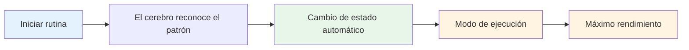

# Construyendo su rutina previa al disparo
<AdBanner />

Tu rutina previa al tiro es una de las herramientas más poderosas de tu juego mental. Es una secuencia constante de acciones que te prepara para cada lanzamiento y desencadena tu mejor estado de rendimiento.

::: Consejo La gran idea
**Tu rutina es tu puerta de entrada a la zona.** Una rutina previa al disparo consistente le indica a tu cerebro: "Es hora de ejecutar". Con la repetición, se convierte en un disparador automático para el máximo rendimiento.
:::

## Por qué funcionan las rutinas

### La coherencia crea confianza
Cuando haces lo mismo cada vez, eliminas variables. Tu cuerpo sabe lo que viene. Esto crea una sensación de control y familiaridad, incluso en situaciones desconocidas.

### Estados de activación de rutinas
Con la repetición, su rutina se vincula con su estado de rendimiento. Al iniciar la rutina se inicia automáticamente el cambio mental al modo de ejecución.

### Las rutinas bloquean las distracciones
Una rutina le da a tu mente algo en qué concentrarse. No hay lugar para preocuparse por la partitura, el público o lo que pueda pasar.

### Las rutinas controlan la excitación
Una rutina bien diseñada ayuda a regular tu nivel de energía, calmándote si estás demasiado activo y concentrándote si estás aburrido.

## Elementos de una rutina eficaz

### Fase 1: Evaluación (fuera del círculo)

Antes de intervenir, recopile información:
- Leer el terreno (pendientes, obstáculos, superficie)
- Evaluar la situación (puntuación, posiciones de bola)
- Elige tu objetivo y lugar de aterrizaje
- Decidir el tipo de lanzamiento (apuntar, disparar, lanzar, rodar)

**Aquí es donde ocurre el pensamiento.** Tómate tu tiempo aquí.

### Fase 2: Transición (Entrando al Círculo)

El paso del pensamiento al hacer:
- Acción física (entrar en el círculo de manera constante)
- Señal mental (una palabra o frase que indica "modo de ejecución")
- Respiración (una respiración consciente para centrarse)

**Este es el cambio.** El análisis termina aquí.

### Fase 3: Configuración (en el círculo)

Prepara tu cuerpo:
- Postura consistente (la misma siempre)
- Comprobación de agarre (sentir la bola)
- Alineación con el objetivo
- Disparador físico (un pequeño movimiento que es tuyo)

### Fase 4: Visualización (Breve)

Mira el lanzamiento antes de realizarlo:
- Imagina la trayectoria de la pelota (2-3 segundos máximo)
- Siente el lanzamiento exitoso
- Conéctate visualmente con tu target

### Fase 5: Ejecución

Realiza el lanzamiento:
- Enfoque externo (solo objetivo)
- Confía en tu cuerpo
- Liberar sin dudarlo
- Siga naturalmente

<AdInArticle />

## Construyendo su rutina personal

### Paso 1: observe lo que ya hace

Probablemente ya tengas alguna rutina. Aviso:
- ¿Qué haces antes de buenos lanzamientos?
- ¿Qué te parece natural?
- ¿Qué te ayuda a concentrarte?

### Paso 2: diseña tu rutina

Crea una secuencia que incluya:
- [ ] Fase de evaluación
- [ ] Momento de transición claro
- [ ] Configuración física consistente
- [ ] Breve visualización
- [ ] Activador de ejecución

### Paso 3: escríbalo

Sea específico. Ejemplo:

1. **Evaluar:** Leer el terreno, elegir el lugar de aterrizaje
2. **Transición:** Entre al círculo con el pie izquierdo primero, diga "confiar"
3. **Configuración:** Pies al ancho de los hombros, comprobar el agarre, alinear los hombros.
4. **Visualizar:** Mira el camino, siente la liberación.
5. **Ejecutar:** Mira al objetivo, lanza

### Paso 4: Practica religiosamente

Utilice su rutina en CADA lanzamiento en la práctica:
- tiros fáciles
- Lanzamientos difíciles
- cuando estés cansado
- cuando estés fresco

La rutina debe volverse automática.

### Paso 5: refinar con el tiempo

Tu rutina evolucionará. Observe lo que funciona y ajústelo. Pero no lo cambies durante la competición, sólo entre eventos.

## Cronometraje de rutina

Tu rutina debe tomar una cantidad constante de tiempo:
- Demasiado rápido: estás apurado y no estás preparado adecuadamente.
- Demasiado lento: estás pensando demasiado y perdiendo el flujo
- Perfecto: suficiente tiempo para prepararse, no tanto como para pensar demasiado

**Tiempo típico:**
- Evaluación: 5-10 segundos
- Transición + Configuración: 3-5 segundos
- Visualización + Ejecución: 3-5 segundos
- **Total: 10-20 segundos**

## Errores rutinarios comunes

|  | Error | Problema | Solución |  |
|---------|---------|----------|
|  | Saltarse en la práctica | La rutina no es automática | Úselo en cada lanzamiento |  |
|  | demasiado complicado | Difícil de recordar bajo presión | Simplifica a lo esencial |  |
|  | Pensando durante la ejecución | Interrumpe el rendimiento automático | Punto de transición claro |  |
|  | Momento inconsistente | Crea incertidumbre | Practica con ritmo constante. |  |
|  | Cambiar a mitad de competición | Introduce dudas | Quédate con lo que sabes |  |

## Solución de problemas de rutina

**Si tienes prisa:**
- Añade un respiro en la transición.
- Ralentiza tus movimientos de preparación
- Pausa antes de la visualización.

**Si estás pensando demasiado:**
- Acortar la rutina
- Utilice una señal de transición más fuerte
- Centrarse más en el exterior

**Si eres inconsistente:**
- Vídeo usted mismo para comprobarlo
- Practica la rutina sin tirar
- Obtener comentarios de un socio

## Rutinas de muestra

### Rutina sencilla
1. Elige el objetivo
2. Entra, respira
3. Agarre, alinee
4. Míralo, tíralo

### Rutina detallada
1. Lea el terreno, elija el lugar de aterrizaje
2. Pise primero el pie izquierdo
3. Di "suave" internamente
4. Un respiro, los hombros caen
5. Pies colocados, control de agarre.
6. Alinee los hombros con el objetivo
7. Ver el camino (2 segundos)
8. Los ojos se fijan en el objetivo.
9. tirar

## Conclusión clave

> Tu rutina es tu ancla. En el caos, es tu constante.

Constrúyalo con cuidado. Practícalo siempre. Confía completamente en ello.

<AdBanner />
