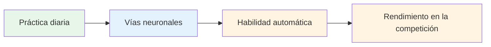
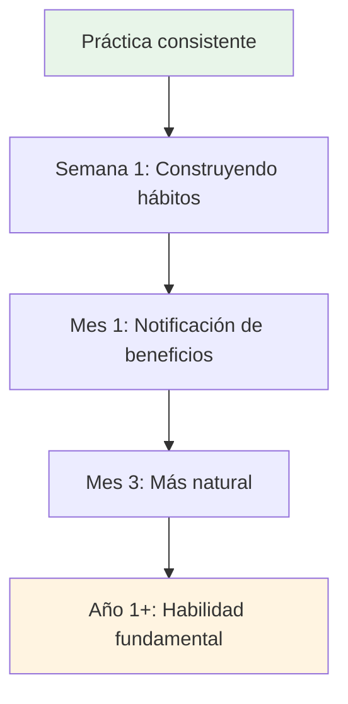

# Desarrollar una práctica diaria de atención plena

Los beneficios de la atención plena se obtienen con la práctica constante. Aquí te explicamos cómo incorporarla a tu vida.

::: tip La gran idea
**La constancia supera a la intensidad.** Cinco minutos al día superan a una hora a la semana. Empieza poco a poco, sé constante y los beneficios se multiplicarán con el tiempo.
:::

## Por qué es importante la práctica diaria

::: info La atención plena es como la aptitud física
- ❌ No puedes ponerte en forma con una sola sesión de gimnasio
- ✅ La práctica regular genera cambios duraderos
- ✅ Los efectos se acumulan con el tiempo.
- ✅Se vuelve más fácil con constancia
:::

::: tip Respaldado por la investigación
Las investigaciones demuestran que incluso **3 minutos diarios** generan beneficios mensurables. Pero es necesario practicarlo con regularidad.
:::

## Creando tu rutina

### Paso 1: Elige tu hora

Elige un horario consistente que funcione para tu vida:

| Tiempo | Ventajas | Consideraciones |
|------|------------|----------------|
| **Mañana** | Establece el tono para el día, menos interrupciones | Necesito despertarme más temprano |
| **Mediodía** | Rompe el día y restablece el enfoque. | Puede olvidar, conflictos de horarios |
| **Noche** | Relájate y reflexiona sobre el día. | Puede estar cansado, menos alerta. |
| **Antes de la práctica** | Conexión directa a la petanca. | Depende del horario de práctica. |

**Mejor enfoque:** Vincularlo a un hábito existente (después del café, antes del almuerzo, etc.)

### Paso 2: Empieza poco a poco

No te propongas dormir 30 minutos el primer día.

**Progresión recomendada:**
- Semana 1-2: 3-5 minutos
- Semana 3-4: 5-10 minutos
- Mes 2: 10-15 minutos
- Mes 3+: 15-20 minutos

Es mejor hacer 5 minutos cada día que 30 minutos una vez a la semana.

### Paso 3: Crea tu espacio

No necesitas una sala de meditación, pero tener un lugar fijo ayuda:
- En algún lugar tranquilo (o usa auriculares)
- Asientos cómodos
- Distracciones mínimas
- El mismo lugar cada vez, si es posible

### Paso 4: Eliminar las barreras

Haz que sea fácil de practicar:
- Pon tu teléfono en silencio
- Dile a tu familia/compañeros de casa que no interrumpan
- Tenga todo listo (cojín, temporizador)
- No esperes las condiciones “perfectas”

## Ejemplos de horarios diarios

### Práctica mínima (5 minutos)
- Mañana: 3 minutos de respiración consciente
- A lo largo del día: 3 momentos de atención plena
- Noche: 2 minutos de consciencia corporal antes de dormir

### Práctica estándar (15 minutos)
- Mañana: 10 minutos de meditación sentada
- Mediodía: 2 minutos de respiración consciente
- Tarde: escaneo corporal de 3 minutos

### Práctica intensiva (30 minutos)
- Mañana: 15 minutos de meditación sentada
- Mediodía: 5 minutos de meditación caminando
- Tarde: 10 minutos de escaneo corporal
- Además: Alimentación consciente en una sola comida

## Integración con el entrenamiento de petanca

### Antes de la práctica
- 5 minutos de meditación sentada
- Establecer una intención para la sesión
- Escaneo corporal para detectar cualquier tensión.

### Durante la práctica
- Utilice la rutina previa a la inyección como práctica de atención plena
- Aplicar SOAS después de los errores
- Mantente presente entre lanzamientos

### Después de la práctica
- 3 minutos de reflexión (sin juzgar)
- Tenga en cuenta cualquier momento de flujo
- Respiración consciente para la transición de salida

## Seguimiento de su práctica

Llevar un registro ayuda a mantener la coherencia:

### Registro simple
| Fecha | Duración | Tipo | Notas |
|------|----------|------|-------|
| Lun | 10 minutos | Sentado | Mente muy ocupada |
| Mar | 10 minutos | Sentado | Hoy más tranquilo |
| Casarse | 5 minutos | Escaneo corporal | Encontré tensión en los hombros |

### Qué seguir
- ¿Practicaste? (Sí/No)
- ¿Cuánto tiempo?
- ¿Que tipo?
- Breve nota sobre la experiencia (opcional)

### Aplicaciones que ayudan
- Espacio mental
- Calma
- Temporizador de información
- Rastreadores de hábitos simples

## Superar obstáculos comunes

### &quot;No tengo tiempo&quot;
- Tienes 3 minutos
- Se trata de prioridad, no de tiempo.
- Intente vincularse con actividades existentes

### &quot;Sigo olvidándolo&quot;
- Establecer una alarma diaria
- Enlace a un hábito existente
- Coloque un recordatorio visual en algún lugar donde pueda verlo.

### &quot;No lo estoy haciendo bien&quot;
- No hay una manera &quot;correcta&quot;
- Si estás prestando atención, lo estás haciendo.
- La mente errante es normal y esperada

### &quot;No veo resultados&quot;
- Los beneficios son sutiles al principio
- Mantenga un diario para observar los cambios a lo largo del tiempo.
- Confíe en la investigación: funciona

### &quot;Es aburrido&quot;
- El aburrimiento es sólo otra experiencia para observar.
- Pruebe diferentes técnicas
- Recuerda por qué lo estás haciendo

## Señales de progreso

Es posible que no notes cambios dramáticos, pero busca:
- Detectar cuándo la mente divaga (más rápido)
- Recuperarse de la frustración más rápidamente
- Detectar la tensión antes de que se acumule
- Sentirse más presente durante los juegos
- Mejor sueño
- Menos reactivo a los malos lanzamientos

## El juego largo

La atención plena es una práctica que dura toda la vida. Los atletas de élite suelen decir que es la habilidad más valiosa que han desarrollado.

**Mes 1:** Construyendo el hábito
**Meses 2-3:** Comienzan a notarse los beneficios
**Meses 4-6:** Volviéndose más natural
**Año 1+:** Parte fundamental de quién eres

## Conclusión clave

> La constancia supera a la intensidad. Cinco minutos al día superan a una hora a la semana.

Empieza hoy. Empieza poco a poco. Sigue adelante.

