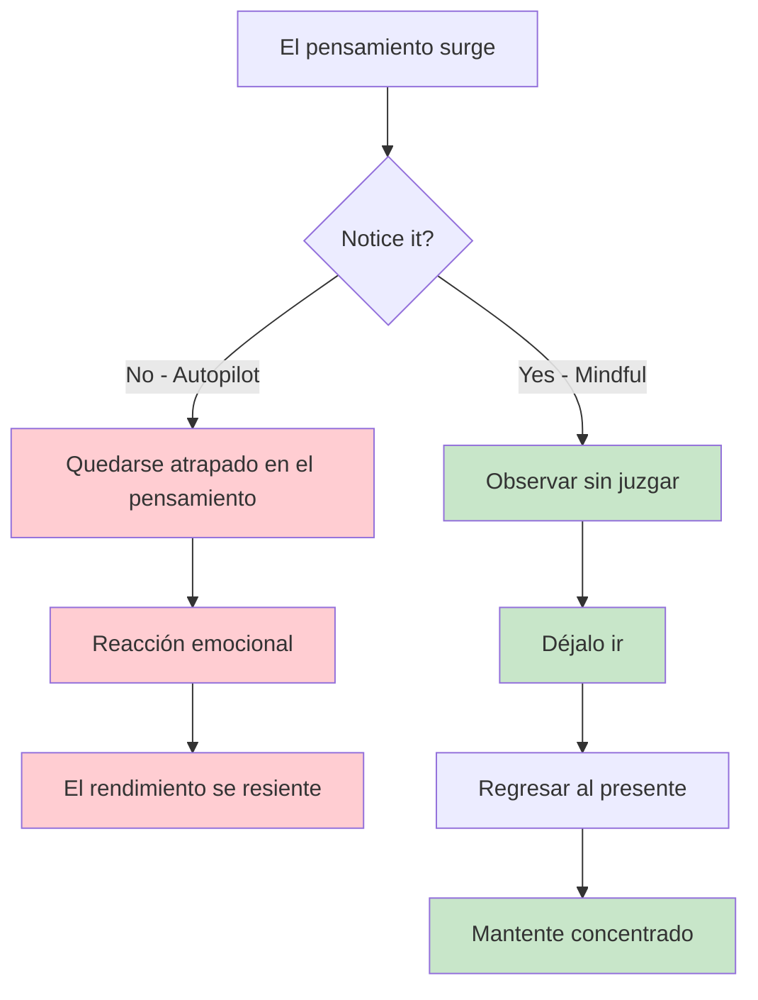
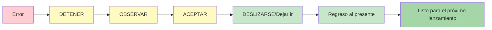

# Atención plena para jugadores de petanca
<AdBanner />

La atención plena es una de las herramientas más poderosas disponibles para los atletas. No es mística ni compleja; es simplemente la práctica de prestar atención al momento presente sin juzgar.

::: tip El principio fundamental
**La atención plena no se trata de vaciar la mente. Se trata de elegir dónde enfocar la atención.** No puedes evitar que surjan pensamientos, pero sí puedes elegir no seguirlos.
:::

## ¿Qué es Mindfulness?

Atención plena significa estar completamente presente y consciente de:
- Dónde estás
- ¿Qué estás haciendo?
- Cómo te sientes

...sin dejarse abrumar por lo que sucede a su alrededor ni reaccionar ante ello.

Para los jugadores de petanca, esto se traduce en:
- Estar completamente presente en cada lanzamiento
- Observar los pensamientos sin dejarse llevar por ellos
- Recuperarse rápidamente de los errores
- Mantener la calma bajo presión

## La ciencia detrás de esto

La atención plena no es solo filosofía: está respaldada por investigaciones sólidas:

### Efectos en tu cerebro
- **Reduce la actividad en la amígdala** (el sistema de alarma del cerebro)
- **Fortalece la corteza prefrontal** (toma de decisiones y concentración): esto le ayuda a pensar con claridad durante la planificación.
- **Mejora tu capacidad para aquietar la mente** cuando sea necesario: esencial para acceder al estado de flujo durante la ejecución
- **Mejora las conexiones** entre las regiones cerebrales
- **Crea cambios estructurales duraderos** con la práctica regular

### Efectos sobre el rendimiento
| Beneficio | Cómo ayuda a tu juego |
|---------|----------------------|
| Reducción del estrés | Menos cortisol, manos más firmes |
| Mejor enfoque | Menos distracciones, decisiones más claras |
| Control emocional | No dejes que los malos lanzamientos se agraven |
| Recuperación más rápida | Recupérate rápidamente de los errores |
| sueño mejorado | Mejor descanso, mejor rendimiento |

## Por qué los jugadores de petanca necesitan atención plena

La petanca tiene desafíos mentales únicos:

1. **Tiempo entre lanzamientos**: muchas oportunidades para pensamientos negativos
2. **Errores visibles** - Todos ven cuando fallas
3. **Presión de equipo**: Tu lanzamiento afecta a tus compañeros.
4. **Competiciones largas** - Fatiga mental durante muchas horas
5. **Partidos cerrados** - Alta presión en los momentos decisivos

La atención plena te ayuda a manejar todos estos problemas.

## La habilidad central: Conciencia sin prejuicios

La palabra clave es &quot;sin prejuicios&quot;.

<AdInArticle />

::: danger Pensamiento crítico (añade peso emocional)
❌ &quot;Ese fue un lanzamiento terrible&quot;
❌ &quot;Siempre extraño estos&quot;
❌ &quot;Mis compañeros deben estar frustrados&quot;

**Resultado:** Espiral de emociones negativas, tensión, peor rendimiento.
:::

::: tip Conciencia sin prejuicios (simplemente observa)
✅ &quot;El lanzamiento se fue a la izquierda del objetivo&quot;
✅ &quot;Noto que me siento tenso&quot;
✅ &quot;Mi mente divaga al ritmo de la partitura&quot;

**Resultado:** Observación clara, recuperación rápida, mantener el enfoque.
:::

**¿La diferencia?** El juicio añade peso emocional y desencadena reacciones. La consciencia simplemente observa y te permite responder con destreza.

## Empezando

No necesitas horas de meditación. Empieza con estas sencillas prácticas:

### 1. Respiración consciente (2 minutos)
- Siéntate cómodamente
- Concéntrese en su respiración
- Cuando tu mente divague (lo hará), regresa suavemente a la respiración.
- No hay juicio sobre el vagabundeo: solo el regreso

### 2. Escaneo corporal (5 minutos)
- Observa las sensaciones en tus pies
- Mueva lentamente la atención hacia arriba a través de su cuerpo.
- Simplemente observa, no intentes cambiar nada.
- Observa las áreas de tensión sin luchar contra ellas

### 3. Momentos de atención plena
- Elige una actividad cotidiana (tomar café, caminar)
- Hazlo con plena atención
- Observa todas las sensaciones involucradas
- Cuando tu mente divague, vuelve a la actividad.

## Atención plena en la competición

### Antes del partido
- Tómate de 2 a 3 minutos para respirar conscientemente.
- Establece una intención sobre cómo quieres jugar (no el resultado, sino el proceso)
- Observa cualquier nerviosismo sin intentar eliminarlo

### Durante el juego
- Utilice su rutina previa a la inyección como un ancla de atención plena
- Entre lanzamientos, vuelve la atención al presente.
- Observa tus pensamientos sobre la puntuación o el resultado y luego déjalos ir.

### Después de los errores

::: warning El método SOAS (tu herramienta de reinicio)
**S**top - Pausa antes de reaccionar
**Observa: ¿Qué pasó? ¿Qué estoy sintiendo?
**A**cepto - Pasó. Está hecho.
**S**slip (Déjalo ir) - Suéltalo, vuelve al ahora

**Tiempo necesario:** 10 segundos
**Úsalo:** Después de cada error, mal rebote o momento frustrante
:::

## En esta sección

- **[Técnicas](/es/educacion/mindfulness/técnicas)** - Ejercicios prácticos que puedes utilizar
- **[Práctica diaria](/es/educacion/mindfulness/practica-diaria)** - Incorpora la atención plena a tu vida

## Resumen: Reglas de atención plena

::: tip Regla n.° 1: La regla de la conciencia
**Observa sin juzgar.**
Observa tus pensamientos y sentimientos sin etiquetarlos como buenos o malos.
:::

::: tip Regla n.° 2: La regla SOAS
**Detenerse, observar, aceptar, soltar.**
Tu reinicio de 10 segundos después de cometer errores. Úsalo siempre.
:::

::: tip Regla n.° 3: La regla del presente
**Sólo puedes controlar este momento, este lanzamiento.**
Los lanzamientos pasados ya están hechos. Los lanzamientos futuros aún no existen. Vive el presente.
:::

::: tip Regla n.° 4: La regla de la práctica
**Empiece poco a poco: 2 a 5 minutos diarios.**
La constancia supera a la duración. La práctica diaria desarrolla la habilidad.
:::

## Conclusión clave

> La atención plena no consiste en vaciar la mente. Se trata de elegir dónde centrar la atención.

No puedes evitar que surjan pensamientos. Pero sí puedes elegir no seguirlos por el camino equivocado.

<AdBanner />
