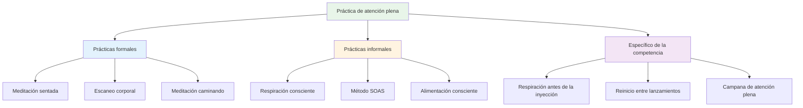

# Técnicas de atención plena
<AdBanner />

Aquí tienes técnicas prácticas que puedes usar para desarrollar la atención plena. Empieza con una o dos y ve progresando a partir de ahí.

::: tip La gran idea
**La atención plena es una habilidad, no un talento.** Al igual que apuntar o disparar, mejora con la práctica. Empieza poco a poco, sé constante y los beneficios se acumulan con el tiempo.
:::

## Prácticas formales

Se trata de sesiones dedicadas a la atención plena: tiempo reservado específicamente para la práctica.

### Meditación sentada

La base de la práctica de la atención plena.

**Cómo hacerlo:**
1. Siéntese cómodamente (silla o suelo)
2. Cierra los ojos o suaviza la mirada.
3. Concéntrese en su respiración: la sensación del aire que entra y sale.
4. Cuando surjan pensamientos, obsérvelos sin juzgarlos.
5. Regrese suavemente la atención a la respiración.
6. Comience con 5 minutos y aumente a 15-20

**Consejos:**
- Los pensamientos vendrán, eso es normal.
- Cada vez que notas que te has desviado y regresas, estás desarrollando la habilidad
- No te juzgues por vagar
- La consistencia importa más que la duración

### Escaneo corporal

Desarrolla la conciencia de las sensaciones físicas.

**Cómo hacerlo:**
1. Acuéstese o siéntese cómodamente
2. Comience por sus pies: observe cualquier sensación.
3. Mueva lentamente la atención hacia arriba: tobillos, pantorrillas, rodillas...
4. Observa sin intentar cambiar nada
5. Si encuentras tensión, respira hacia esa zona.
6. Continúa hasta la parte superior de tu cabeza
7. Tarda entre 10 y 20 minutos

**Para petanca:** Te ayuda a notar la tensión antes de que afecte tu lanzamiento.

### Meditación caminando

Atención plena en movimiento: una excelente preparación para la pista.

**Cómo hacerlo:**
1. Camine lenta y deliberadamente
2. Siente cada parte del paso: levantar, mover, colocar
3. Observa las sensaciones en tus pies y piernas.
4. Cuando tu mente divague, vuelve a las sensaciones físicas.
5. 5-10 minutos son suficientes

## Prácticas informales

<AdInArticle />

Estos integran la atención plena en las actividades diarias.

### Respiración consciente

La técnica más sencilla, disponible en cualquier momento.

**La práctica:**
- Tome 3 respiraciones lentas y deliberadas
- Concéntrese completamente en la sensación.
- Úselo como botón de reinicio durante todo el día.

**Cuándo usarlo:**
- Antes de entrar en el círculo
- Cuando notas que el estrés aumenta
- Entre juegos
- Cualquier momento de transición

### El método SOAS

Tu herramienta para manejar momentos difíciles.

| Paso | Acción | Ejemplo |
|------|--------|---------|
| **Detener | Pausa, no reacciones | No te rindas después de un fallo |
| **Observar | Observa lo que está pasando | &quot;Me siento frustrado. Tengo la mandíbula apretada.&quot; |
| **Aceptar | Reconocer sin luchar | &quot;Así es como me siento ahora mismo.&quot; |
| **Deslizar | Déjalo ir, sigue adelante | Libera la tensión, vuelve al presente |

**Practica esto en la vida diaria** para que sea automático en la competencia.

### Alimentación consciente

Una práctica sorprendentemente poderosa.

**Cómo hacerlo:**
- Coma una comida sin distracciones (sin teléfono, televisión)
- Observa los colores, los olores y las texturas.
- Mastica lentamente y saborea completamente.
- Aviso cuando estés satisfecho

**Por qué es importante:** Desarrolla la habilidad general de prestar atención.

### Conciencia sensorial

Involucrarse plenamente con su entorno.

**La técnica 5-4-3-2-1:**
- Observa 5 cosas que puedes ver
- Observa 4 cosas que puedes oír
- Observa 3 cosas que puedes sentir
- Observa 2 cosas que puedes oler
- Observa una cosa que puedas saborear

**Usa esto:** Cuando tu mente esté acelerada antes de un juego importante.

## Técnicas específicas de la competición

### La respiración antes de la inyección

Integra la respiración en tu rutina:

1. Antes de entrar al círculo, toma una respiración consciente.
2. Siente tus pies en el suelo
3. Deja que tus hombros caigan al exhalar.
4. Entonces comienza tu rutina

### Reinicio entre lanzamientos

Qué hacer mientras espera:

- Observa hacia dónde va tu atención
- Si va a puntuación/resultado, reconocer y volver al presente
- Concéntrese en algo neutral (su respiración, la sensación de una bola)
- Manténgase físicamente relajado

### La &quot;campana de la atención plena&quot;

Utilice activadores que le recuerden que debe estar presente:

- Cada vez que coges una bola
- Cuando escuchas que se lanza el gato
- Cuando entras en el círculo
- Cuando termina un juego

Cada disparador = una respiración consciente.

## Construyendo su práctica

### Semana 1-2: Fundación
- 5 minutos de meditación sentada al día
- 3 respiraciones conscientes antes de cada comida
- Practique SOAS una vez cuando algo menor salga mal

### Semana 3-4: Expansión
- Aumentar la meditación a 10 minutos.
- Añadir escaneo corporal dos veces por semana
- Utilice los disparadores de campana de atención plena en la práctica

### Semana 5+: Integración
- Práctica diaria de 15 a 20 minutos
- Integración completa en la rutina previa al disparo
- SOAS se convierte en una respuesta automática a los errores

## Desafíos comunes

| Desafío | Solución |
|-----------|----------|
| &quot;No puedo dejar de pensar&quot; | No deberías hacerlo. Solo date cuenta y regresa. |
| &quot;No tengo tiempo&quot; | Empieza con 3 minutos. Todos tienen 3 minutos. |
| &quot;Me quedo dormido&quot; | Intente sentarse en lugar de acostarse o practique más temprano durante el día. |
| &quot;Parece que no tiene sentido&quot; | Los beneficios vienen con la constancia. Confía en el proceso. |
| &quot;Me olvido de practicar&quot; | Establece un recordatorio diario. Vincúlalo con un hábito existente. |

## Conclusión clave

> La atención plena es una habilidad. Como cualquier habilidad, mejora con la práctica.

Empieza poco a poco. Sé constante. Los beneficios se acumulan con el tiempo.

<AdBanner />
