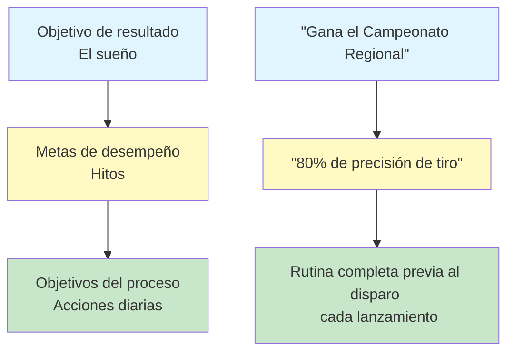

# Establecimiento de objetivos para los jugadores de petanca

Las metas claras son tu brújula. Te guían en tu entrenamiento, te motivan cuando las cosas se ponen difíciles y te permiten medir tu progreso. Sin metas, solo estás jugando. Con metas, avanzas hacia algo.

::: tip El principio fundamental
**Una meta sin un plan es solo un deseo.** Establece metas claras, divídelas en partes, concéntrate en lo que controlas y realiza un seguimiento de tu progreso.
:::

## Por qué son importantes los objetivos

Los objetivos sirven para múltiples propósitos:
- **Dirección:** Saber en qué trabajar
- **Motivación:** Tener algo por lo que luchar
- **Medición:** Sigue tu progreso
- **Enfoque:** Prioriza tu tiempo limitado

Para el jugador autodidacta, las metas son especialmente importantes. Sin un entrenador que te presione, tus metas se convierten en tu guía.

## Los tres tipos de objetivos

No todos los objetivos son iguales. Comprender los diferentes tipos te ayudará a establecer objetivos más acertados.

### 1. Objetivos de resultados
**Qué:** El resultado final que deseas
**Ejemplo:** &quot;Ganar el campeonato regional&quot;
**Nivel de control:** Bajo - depende de los oponentes, las condiciones y la suerte.

### 2. Metas de desempeño
**Qué:** Estándares de desempeño específicos
**Ejemplo:** &quot;Lograr una precisión del 80% en los ejercicios de tiro&quot;
**Nivel de control:** Medio - depende principalmente de usted

### 3. Objetivos del proceso
**Qué:** Acciones y comportamientos que controlas
**Ejemplo:** &quot;Completar mi rutina previa al lanzamiento en cada lanzamiento&quot;
**Nivel de control:** Alto - depende totalmente de usted

### La jerarquía de objetivos

::: warning Visión clave
**Concentre la mayor parte de su atención en los objetivos del proceso.** Son lo que usted controla y conducen a los resultados que desea.

- **Objetivos de resultado:** Bajo control, alta motivación
- **Objetivos de rendimiento:** Control medio, progreso medible
- **Objetivos del proceso:** Alto control, enfoque diario ← **Enfoque aquí**
:::

## El marco SMART

::: info Lista de verificación de objetivos SMART
Todo objetivo debe ser:
- ✅ **E**specífico - Claro y bien definido
- ✅ **M**edible: puedes seguir tu progreso
- ✅ **A**lcanzable - Desafiante pero posible
- ✅ **R**elevante - Alineado con tu panorama general
- ✅ **Límite temporal: tiene una fecha límite
:::

### S - Específico
❌ &quot;Mejora tus tiros&quot;
✅ &quot;Mejora mi precisión de au fer (impacto directo) desde 8 metros&quot;

### M - Medible
❌ &quot;Dispara con más precisión&quot;
✅ &quot;Obtén al menos 24/30 en el ejercicio de escalera de tiro&quot;

### A - Alcanzable
❌ &quot;Nunca pierdas un tiro&quot; (imposible)
✅ &quot;Mejorar la precisión en un 10% en 8 semanas&quot; (desafiante pero realista)

### R - Relevante
❌ &quot;Correr un maratón&quot; (no está directamente relacionado)
✅ &quot;Mejora el equilibrio y la estabilidad para un mejor lanzamiento&quot; (apoya tu juego)

### T - Limitado en el tiempo
❌ &quot;Algún día seré mejor&quot;
✅ &quot;Para el 15 de marzo lograré...&quot;

## Ejemplos de objetivos para la petanca

| Tipo | Gol pobre | Objetivo SMART |
|------|-----------|------------|
| Resultado | &quot;Gana más&quot; | &quot;Llegar a las semifinales en el Torneo de Primavera&quot; |
| Actuación | &quot;Apunta mejor&quot; | Consigue el 70% de los puntos en un radio de 50 cm a una distancia de 8 m. |
| Proceso | &quot;Practica más&quot; | Completar 3 sesiones de entrenamiento enfocadas por semana. |

## Desglosando los grandes objetivos

Las metas grandes pueden resultar abrumadoras. Divídelas en partes más pequeñas:

### Ejemplo: &quot;Ganar el Campeonato de Clubes (dentro de 12 meses)&quot;

**Objetivo anual:** Ganar el campeonato del club

**Objetivos trimestrales:**
- T1: Mejorar la precisión de disparo al 75%
- T2: Desarrollar una rutina consistente antes de disparar
- Q3: Domina las situaciones de presión
- T4: Máximo rendimiento y preparación para la competición

**Objetivos mensuales (T1):**
- Mes 1: Establecer una línea base, identificar debilidades
- Mes 2: Enfoque en la técnica de tiro
- Mes 3: Añade presión a la práctica de tiro

**Objetivos semanales (Mes 2):**
- Semana 1: 3 sesiones de rodaje, análisis de vídeo
- Semana 2: Trabajar en el problema técnico identificado
- Semana 3: Aumenta la distancia gradualmente
- Semana 4: Progreso de la prueba, ajuste el plan

## Conectando tus metas con tu &quot;por qué&quot;

Los objetivos funcionan mejor cuando están conectados a una motivación más profunda.

Pregúntese:
- ¿Por qué quiero lograr esto?
- ¿Qué significará para mí?
- ¿Cómo me sentiré cuando tenga éxito?
- ¿Qué me impulsa a mejorar?

Anota tus respuestas. Revísalas cuando te falte la motivación.

## En esta sección

- **[Psicología de la motivación](/es/educacion/motivacion/motivacion)** — Intrínseca vs. extrínseca, Teoría de la autodeterminación
- **[Objetivos SMART en detalle](/es/educacion/motivacion/objetivos-inteligentes)** — Profundice en la creación de objetivos efectivos
- **[Creando tu plan de entrenamiento](/es/educacion/motivacion/planificacion)** — Convierte tus objetivos en acciones
- **[Mantener la motivación](/es/educacion/motivacion/mantener)** — Sostenibilidad a largo plazo, prevención del agotamiento

## Resumen: Reglas para establecer objetivos

::: tip Regla n.° 1: La regla del control
**Concéntrese en los objetivos del proceso (lo que usted controla) en lugar de en los objetivos de resultados.**
Los objetivos de proceso conducen a objetivos de desempeño, que conducen a objetivos de resultados.
:::

::: tip Regla n.° 2: La regla SMART
**Los objetivos deben ser específicos, medibles, alcanzables, relevantes y con plazos determinados.**
Los objetivos vagos producen resultados vagos. Los objetivos SMART producen progreso.
:::

::: tip Regla n.° 3: La regla de la avería
**Los objetivos grandes necesitan hitos trimestrales, mensuales y semanales.**
Divida los objetivos grandes en pasos pequeños y viables que pueda completar esta semana.
:::

::: tip Regla n.° 4: La regla de la conexión
**Conecta tus objetivos con tu &quot;por qué&quot; más profundo.**
Cuando la motivación se desvanece, tu “por qué” te mantiene en marcha.
:::

## Conclusión clave

> Una meta sin un plan es solo un deseo.

Establece metas claras. Desglósalas. Céntrate en lo que controlas. Monitorea tu progreso.

