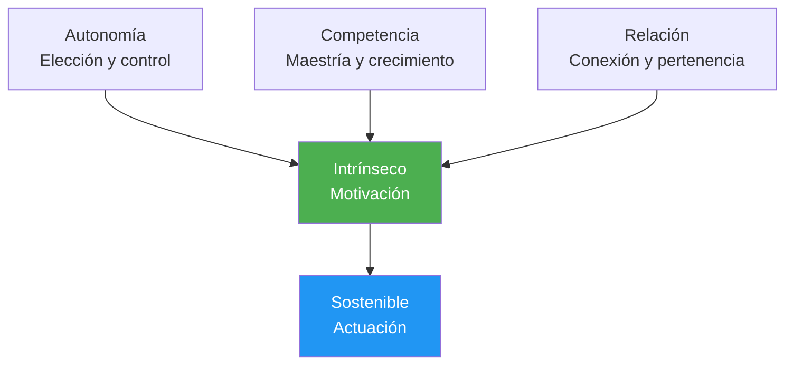

# Psicología de la motivación

Entender POR QUÉ estás motivado (no sólo que lo estás) te ayuda a desarrollar un impulso sustentable que no depende de los resultados.

---

## Motivación intrínseca vs. motivación extrínseca

### Motivación extrínseca

Motivación impulsada por recompensas o presiones externas:

| Fuente | Ejemplo |
|--------|---------|
| **Trofeos/medallas** | &quot;Quiero ganar el campeonato&quot; |
| **Clasificaciones** | &quot;Quiero estar entre los 10 mejores de mi región&quot; |
| **Reconocimiento** | &quot;Quiero que los demás me vean como un buen jugador&quot; |
| **Evitar las críticas** | &quot;No quiero decepcionar a mi equipo&quot; |
| **Financiero** | &quot;Quiero ganar un premio en dinero&quot; |

**Características:**
- Puede proporcionar una fuerte motivación inicial
- A menudo disminuye con el tiempo.
- Depende de factores fuera de su control
- Puede socavar el disfrute

### Motivación intrínseca

Motivación desde la propia actividad:

| Fuente | Ejemplo |
|--------|---------|
| **Maestría** | &quot;Me encanta la sensación de mejorar&quot; |
| **Fluir** | &quot;El tiempo desaparece cuando estoy jugando&quot; |
| **Desafío** | &quot;Disfruto poniéndome a prueba ante los problemas&quot; |
| **Expresión** | &quot;La petanca me permite expresar quién soy&quot; |
| **Alegría** | &quot;Simplemente me encanta jugar a este juego&quot; |

**Características:**
- Más sostenible en el tiempo
- Independiente de los resultados
- Conectado a una satisfacción más profunda
- Mejora el rendimiento de forma natural

::: tip La investigación
Los estudios muestran consistentemente que la **motivación intrínseca conduce a un mejor desempeño, más persistencia y mayor bienestar** que la motivación extrínseca sola.
:::

---

## Teoría de la autodeterminación (SDT)

Desarrollada por Deci y Ryan, la SDT identifica tres necesidades psicológicas fundamentales que impulsan la motivación intrínseca:

### 1. Autonomía

**La necesidad de sentirte en control de tus decisiones**

| Apoya la autonomía | Socava la autonomía |
|-------------------|---------------------|
| Elegir el enfoque de tu entrenamiento | Que te digan exactamente qué hacer |
| Establecer tus propios objetivos | Presión externa para actuar |
| Decidir cómo practicar | Participación forzada |
| Participar en las decisiones del equipo | Controlar a los entrenadores/compañeros de equipo |

**Para la petanca:**
- Elige en qué aspectos trabajar
- Establece tu propio camino de desarrollo
- Tome decisiones tácticas usted mismo
- Sea dueño de su programa de entrenamiento

### 2. Competencia

**La necesidad de sentirse eficaz y capaz**

| Apoya la competencia | Socava la competencia |
|---------------------|----------------------|
| Desafíos apropiados | Tareas demasiado fáciles o demasiado difíciles |
| Comentarios claros sobre el progreso | No hay comentarios o solo negativos |
| Mejora visible | Estancamiento sin explicación |
| Competición apropiada para las habilidades | Sobreajuste constante |

**Para la petanca:**
- Realice un seguimiento de sus métricas de mejora
- Buscar niveles de competencia adecuados
- Celebra los pequeños triunfos
- Obtenga comentarios específicos (no solo resultados)

### 3. Relación

**La necesidad de conexión con los demás**

| Apoya la relación | Socava la relación |
|----------------------|------------------------|
| Relaciones de equipo positivas | Aislamiento |
| Objetivos compartidos con compañeros de equipo | Enfoque puramente individual |
| Pertenencia a la comunidad | Exclusión o conflicto |
| Mentoría (dar/recibir) | Relaciones exclusivamente competitivas |

**Para la petanca:**
- Construir conexiones de equipo genuinas
- Encuentra compañeros de entrenamiento
- Únase a las actividades comunitarias del club
- Compartir conocimientos con otros

---

## La fórmula SDT

```
Autonomy + Competence + Relatedness = Intrinsic Motivation
```

Cuando se satisfacen las tres necesidades, la motivación intrínseca florece naturalmente.



---

## Espectro de tipos de motivación

La SDT describe la motivación en un espectro que va desde lo externo a lo interno:

| Tipo | Descripción | Ejemplo | Calidad |
|------|-------------|---------|---------|
| **Desmotivación** | Sin motivación | &quot;¿Por qué molestarse?&quot; | ❌ |
| **Externo** | Para recompensas/evitar castigos | &quot;Conseguiré un trofeo&quot; | ⭐ |
| **Introyectado** | Presión interna, culpa | &quot;Debería practicar&quot; | ⭐⭐ |
| **Identificado** | Resultado valioso | &quot;Esto me ayuda a mejorar&quot; | ⭐⭐⭐ |
| **Integrado** | Alineado con los valores | &quot;Esto es lo que soy&quot; | ⭐⭐⭐⭐ |
| **Intrínseco** | Puro disfrute | &quot;Me encanta esto&quot; | ⭐⭐⭐⭐⭐ |

**Objetivo:** Mover tu motivación hacia el extremo intrínseco del espectro.

---

## Autoevaluación: Tu perfil de motivación

Califica cada afirmación (1 = En absoluto, 5 = Completamente):

**Indicadores extrínsecos:**
| Declaración | Puntaje |
|-----------|-------|
| Juego principalmente para ganar torneos. | /5 |
| El reconocimiento de los demás me importa mucho. | /5 |
| Perdería el interés sin éxito competitivo. | /5 |
| **Total extrínseco** | /15 |

**Indicadores intrínsecos:**
| Declaración | Puntaje |
|-----------|-------|
| Jugaría incluso si no hubiera competiciones. | /5 |
| La sensación de mejora me emociona. | /5 |
| Pierdo la noción del tiempo cuando juego | /5 |
| **Total intrínseco** | /15 |

**Interpretación:**
- Total intrínseco más alto = motivación más sostenible
- El equilibrio está bien, pero asegúrese de que lo intrínseco ≥ lo extrínseco
- Si lo extrínseco &gt;&gt; intrínseco, reconecta con tu amor por el juego.

---

## Hacia la motivación intrínseca

### Reconectar con la alegría

- **Recuerda por qué empezaste**: ¿Qué te atrajo inicialmente?
- **Juega sin apuestas** — Sesiones ocasionales &quot;solo por diversión&quot;
- **Aprecia los momentos**: observa cuándo estás disfrutando del juego

### Concéntrese en la maestría

- **Establecer objetivos de aprendizaje**, no solo objetivos de resultados
- **Celebre la mejora** independientemente de los resultados
- **Acepte los desafíos** como oportunidades de crecimiento

### Construir autonomía

- **Toma tus propias decisiones** sobre el entrenamiento
- **Sea dueño de su camino de desarrollo**
- **Resistir la presión externa** para entrenar de ciertas maneras

### Cultivar la conexión

- **Invierte en relaciones** más allá de la competencia
- **Compartir conocimientos** con jugadores en desarrollo
- **Encuentra tu comunidad** dentro del deporte

---

## Contenido relacionado

- [Establecimiento de objetivos](/es/educación/motivación/) — Establecer objetivos efectivos
- [Mantener la motivación](/es/educacion/motivacion/mantener) — Sostenibilidad a largo plazo
- [La Zona](/es/educacion/juego-mental/la-zona/) — Motivación intrínseca y fluidez
- Dinámica de equipo: Relación en el contexto del equipo

