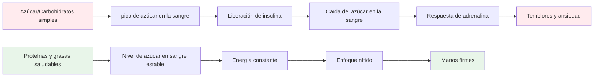
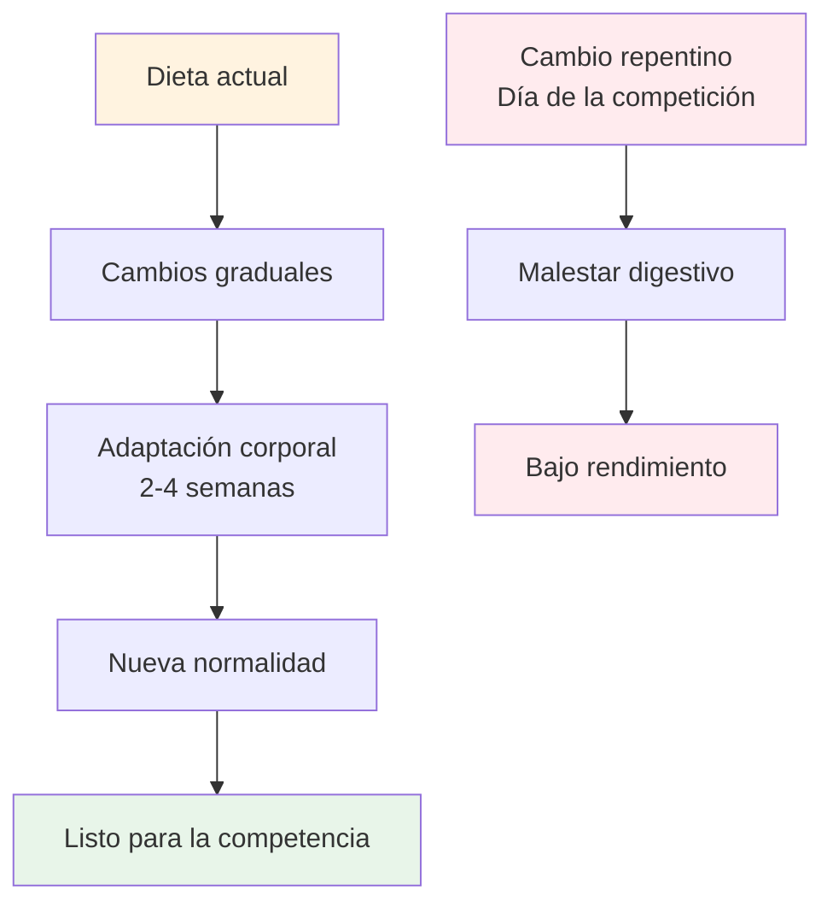

# Nutrición para un rendimiento de precisión

La petanca es un deporte de precisión, no de resistencia. Tus necesidades nutricionales son diferentes a las de un maratonista o un futbolista. Lo más importante es la **estabilidad mental**: mantener la mente ágil y las manos firmes durante un largo día de competición.

::: tip La gran idea
**Your brain is your most important tool in pétanque. Feed it stable fuel, not roller coaster energy.** Focus on protein, healthy fats, and staying hydrated. Avoid sugar spikes.
:::



## El desafío del atleta de precisión

A diferencia de los deportes de alta intensidad, la petanca no requiere grandes reservas de glucógeno ni una rápida reposición de energía. Lo que requiere es:

- **Nivel de azúcar en sangre estable: sin picos ni caídas**
- **Claridad mental constante: concentración que dura todo el día**
- **Manos firmes, sin temblores ni sacudidas**
- **Calma los nervios: baja respuesta a la ansiedad y al estrés**

Su estrategia nutricional debe optimizarse en función de estos factores, no del rendimiento energético bruto.

## El problema con el azúcar y los carbohidratos simples

Muchos atletas adoptan dietas ricas en carbohidratos. Para los jugadores de petanca, esto puede perjudicar su rendimiento.

### La montaña rusa del azúcar en la sangre

Cuando comes azúcar o carbohidratos simples:
1. El azúcar en sangre aumenta rápidamente
2. Se libera insulina para bajarla.
3. Bajadas repentinas de azúcar en sangre (hipoglucemia)
4. Tu cuerpo libera adrenalina para compensar.
5. Experimenta temblores, ansiedad y falta de concentración.

**This is the opposite of what you need for precision.**

### Síntomas de inestabilidad del azúcar en sangre

| Síntoma | Impacto en el rendimiento |
|---------|----------------------|
| Manos temblorosas | Lanzamiento inconsistente |
| Dificultad para concentrarse | Mala toma de decisiones |
| Irritabilidad | Conflicto en equipo, falta de compostura |
| Fatiga después de las comidas | Depresión de la tarde |
| Ansiedad | Sensibilidad a la presión |
| Niebla mental | Pensamiento táctico lento |

## Un mejor enfoque: energía estable

El objetivo es proporcionar a tu cerebro combustible constante sin que se produzcan altibajos.

### Principios clave

1. **Prioriza las proteínas y las grasas saludables**: proporcionan energía lenta y constante.
2. **Elige carbohidratos complejos en lugar de simples** - Si comes carbohidratos, elige los que se digieran lentamente.
3. **Evita los picos de azúcar** - Especialmente antes y durante la competición.
4. **Mantente hidratado** - La deshidratación afecta significativamente la concentración.
5. **Come regularmente** - No te dejes llevar por el hambre.

### Alimentos que ayudan

| Tipo de comida | Ejemplos | Por qué funciona |
|-----------|----------|--------------|
| Proteína | Huevos, nueces, queso, carne. | Digestión lenta, energía estable. |
| Grasas saludables | Aguacate, aceite de oliva, frutos secos | Combustible de larga duración |
| carbohidratos complejos | Verduras, legumbres | La fibra retarda la absorción |
| Frutas bajas en azúcar | Bayas, manzanas | Nutrientes sin pico |

### Alimentos que se deben limitar

| Tipo de comida | Ejemplos | Por qué es problemático |
|-----------|----------|---------------------|
| Azúcar | Dulces, refrescos, pasteles | Pico rápido y caída |
| Pan blanco/pasta | Sándwiches, platos de pasta | Conversión rápida en azúcar |
| Zumo de frutas | Zumo de naranja, batidos | Azúcar concentrado |
| bebidas energéticas | La mayoría de las marcas comerciales | Caída de azúcar y cafeína |

## Nutrición el día de la competición

### Antes de la competición

**2-3 hours before:**
- Comida equilibrada con proteínas, grasas y verduras.
- Evite los carbohidratos pesados que pueden causar somnolencia.
- Ejemplo: Huevos con verduras, o ensalada con pollo.

**1 hour before:**
- Refrigerio ligero si es necesario
- Frutos secos, queso o una pequeña porción de proteína.
- Evite cualquier cosa azucarada

### Durante la competición

**Between games:**
- Agua (lo más importante)
- Pequeños snacks proteicos (frutos secos, queso, carne)
- Evite los snacks y bebidas azucaradas.

**Signs you need to eat:**
- Dificultad para concentrarse
- Irritabilidad
- Sentirse tembloroso
- Dolor de cabeza

### Después de la competición

- Repóngase con una comida equilibrada
- Rehidratarse completamente
- No te &quot;premies&quot; con azúcar: afectará tu recuperación.

## Hidratación

La deshidratación afecta la función cognitiva antes de sentir sed.

### Pautas

- **Comience hidratado: beba agua durante todo el día antes de la competición.**
- **Durante el juego: beba agua regularmente, no espere a tener sed.**
- **Evite el exceso de cafeína: es diurético.**
- **Esté atento a las señales: dolor de cabeza, orina oscura, fatiga**

### ¿Cuánto cuesta?

Como regla general, busque orina de color amarillo pálido. Si es oscura, necesita más agua.

## La opción baja en carbohidratos

Algunos atletas de precisión adoptan dietas bajas en carbohidratos o cetogénicas. La teoría:

**Potential benefits:**
- Nivel de azúcar en sangre muy estable (sin picos posibles)
- Claridad mental constante
- Reducción de la ansiedad y los temblores.
- Sin bajones de energía por la tarde

**Considerations:**
- Requiere período de adaptación (1-2 semanas)
- No apto para todos
- Requiere planificación y compromiso
- Consulte primero con un proveedor de atención médica

Esta es una estrategia avanzada, no necesaria para todos, pero que vale la pena considerar si la estabilidad del nivel de azúcar en sangre es un problema importante para usted.

## La alimentación como práctica: entrenando tu cuerpo

::: warning Concepto crítico
**Mat är inte bara bränsle - det är något du övar med.** Just like you practice your throw, you must practice your nutrition to get your body comfortable with competition-day eating.
:::

### Por qué son importantes las prácticas alimentarias

Tu sistema digestivo se puede entrenar. Lo que comes regularmente se convierte en lo que tu cuerpo espera y procesa mejor. Si solo comes proteínas y verduras los días de competición, tu cuerpo no se adaptará.

**The problem:**
- Comer alimentos desconocidos el día de la competición puede provocar molestias digestivas.
- Tu cuerpo necesita tiempo para adaptarse a nuevos patrones de alimentación.
- Estrés + comida desconocida = posibles problemas estomacales
- La ansiedad por el rendimiento ya es bastante mala sin añadirle ansiedad digestiva.

**The solution:**
- Practica tu nutrición de competición durante el entrenamiento
- Haga que las comidas del día de la competencia formen parte de su rutina habitual
- Entrena tu cuerpo para que se sienta cómodo con alimentos de energía estable

### El proceso de adaptación



Cuando cambias tu dieta:
1. **Semana 1-2:** Tu cuerpo se adapta a nuevos alimentos, puede sentirse diferente
2. **Semana 3-4:** Se produce la adaptación, los nuevos alimentos se sienten normales.
3. **Semana 5+:** Tu cuerpo se siente cómodo y eficiente con estos alimentos

**This is why you can't just "eat healthy" on competition day and expect optimal results.**

### Cómo practicar tu nutrición

#### 1. Comienza durante el entrenamiento

**Practice your competition-day eating during training sessions:**
- Come la misma comida previa al entrenamiento que comerías antes de la competición.
- Lleva los mismos bocadillos que llevarías a un torneo.
- Observa cómo responde tu cuerpo
- Ajuste según lo que funcione

**Example training day:**
```
2-3 hours before: Eggs with vegetables (same as competition)
During training: Water + nuts (same as competition)
After training: Balanced meal with protein
```

#### 2. Hazlo tu normalidad

**Don't have a "competition diet" and a "regular diet"** - this creates two problems:
- Tu cuerpo nunca se adapta completamente a ninguno de los dos.
- La comida de competición resulta desconocida y estresante.

**Instead:**
- Haga de los alimentos de energía estable su norma diaria
- Tu cuerpo se vuelve eficiente en el uso de proteínas y grasas.
- El día de competición se siente normal, no diferente.
- Sin sorpresas digestivas

#### 3. Probar y refinar

**Use training to experiment:**

| Prueba | Qué tener en cuenta | Ajustar |
|------|----------------|--------|
| Horario de comidas antes del entrenamiento | Niveles de energía, concentración | Encuentra tu ventana óptima |
| Diferentes fuentes de proteínas | Digestión, comodidad | Identificar lo que funciona mejor |
| Tipos de snacks | Energía sostenida | Encuentra tus snacks favoritos |
| Cantidades de hidratación | Concentración, pausas para ir al baño | Ingesta de equilibrio |

**Keep a simple log:**
- Qué comiste y cuándo
- ¿Cómo te sentiste durante el entrenamiento?
- Niveles de energía y concentración
- ¿Algún problema digestivo?

#### 4. Genere comodidad y confianza

**The psychological benefit:**

Cuando has practicado tu nutrición cientos de veces en el entrenamiento:
- Sabes exactamente cómo responderá tu cuerpo
- Sin ansiedad por la elección de alimentos
- Una cosa menos de la que preocuparse el día de la competición
- Confianza en tu preparación

**This is the same principle as practicing your throw** - repetition builds comfort and reliability.

### Desafíos comunes de adaptación

::: details Transición de una dieta alta en carbohidratos a una dieta de energía estable

**Challenge:** You're used to bread, pasta, and sugary snacks

**Adaptation period:** 2-4 weeks

**What to expect:**
- Semana 1: Puede sentirse diferente, antojos de alimentos viejos.
- Semana 2: La energía se estabiliza, los antojos se reducen.
- Semana 3-4: Nueva normalidad, cuerpo eficiente con grasas/proteínas

**How to practice:**
- Comience con una comida a la vez
- Reemplace primero los carbohidratos simples con carbohidratos complejos
- Aumente gradualmente las proteínas y las grasas saludables.
- Practique primero durante el entrenamiento de bajo riesgo
:::

::: details Cómo encontrar alimentos que funcionen para usted

**Challenge:** Not everyone digests the same foods well

**What to test:**
- Diferentes fuentes de proteínas (huevos, carne y frutos secos)
- Horario de las comidas (2 horas vs. 3 horas antes)
- Tamaño de las porciones (demasiado = lento, muy poco = hambriento)
- Alimentos específicos que causan malestar

**Practice approach:**
- Pruebe una variable a la vez
- Dar a cada prueba 2-3 sesiones de entrenamiento
- Toma nota de lo que te hace sentir mejor
- Crea tu &quot;menú de competición&quot; personal
:::

::: details Cómo lidiar con los entornos alimentarios de los torneos

**Challenge:** Tournaments often have limited food options

**Practice solution:**
- Lleva siempre tus propios snacks (practica esto)
- Explorar los lugares con antelación cuando sea posible
- Tiene opciones de respaldo que sabe que funcionan
- Practica comer en diferentes entornos

**Mental preparation:**
- No confíes en la comida del local
- Trate los alimentos como parte de su equipo
- Empáquelo como empaqueta sus petancas
:::

### El plan de práctica nutricional de 30 días

**Goal:** Make stable-energy eating your comfortable normal

**Week 1-2: Foundation**
- Reemplace una comida al día con una alimentación de estilo competitivo.
- Practica la nutrición pre-entrenamiento
- Empieza a llevar snacks a los entrenamientos
- Observa cómo responde tu cuerpo

**Week 3-4: Expansion**
- Realice dos comidas al día centradas en energía estable.
- Practique la alimentación completa del día de competición en los días de entrenamiento
- Refina tus elecciones de refrigerios
- Crea tu lista de alimentos favoritos

**Week 5+: Mastery**
- Comer con energía estable es tu nueva normalidad
- El cuerpo está completamente adaptado.
- El día de competición se siente rutinario
- Confianza en tu nutrición

### Tu kit de comida para la competición

**Practice packing this for every training session:**

**Pre-competition (2-3 hours before):**
- [ ] Fuente de proteínas (huevos, carne o frutos secos)
- [ ] Verduras o ensalada
- [ ] Grasas saludables (aguacate, aceite de oliva, queso)

**During competition:**
- [ ] Botella de agua (rellenable)
- [ ] Frutos secos mixtos (pequeñas porciones)
- [ ] Huevos duros (si puedes mantenerlos frescos)
- [ ] Cubitos de queso o queso en tiras
- [ ] Carne seca o cecina
- [ ] Snacks de respaldo

**The more you practice with this kit, the more automatic it becomes.**

## Consejos prácticos

### Snacks fáciles para la competición
- Frutos secos mixtos (sin sal)
- huevos duros
- Cubitos de queso
- Cecina de res o pavo
- Verduras con hummus
- Aceitunas

### Qué evitar
- Snacks de máquinas expendedoras
- bebidas deportivas azucaradas
- Pasteles y productos horneados
- Barras de caramelo y chocolate
- La mayoría de las barritas &quot;energéticas&quot; (verificar el contenido de azúcar)

## Conclusión clave

> Tu cerebro es tu herramienta más importante en la petanca. Aliméntalo con energía estable, no con la energía de una montaña rusa. Y practica tu nutrición como practicas tu lanzamiento: la repetición genera comodidad y fiabilidad.

Concéntrate en las proteínas, las grasas saludables y en mantenerte hidratado. Evita los picos de azúcar. **Lo más importante: integra tu alimentación diaria con la del día de la competición.** Tu cuerpo necesita práctica para rendir al máximo.

**Remember:** You wouldn't show up to a tournament with a throwing technique you've never practiced. Don't show up with a nutrition strategy you've never practiced either.

