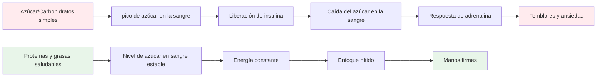

# Nutrición para un rendimiento de precisión

La petanca es un deporte de precisión, no de resistencia. Tus necesidades nutricionales son diferentes a las de un maratonista o un futbolista. Lo más importante es la **estabilidad mental**: mantener la mente ágil y las manos firmes durante un largo día de competición.

::: tip La gran idea
**Tu cerebro es tu herramienta más importante en la petanca. Aliméntalo con energía estable, no con energías volátiles.** Concéntrate en las proteínas, las grasas saludables y en mantenerte hidratado. Evita los picos de azúcar.
:::

## El desafío del atleta de precisión

A diferencia de los deportes de alta intensidad, la petanca no requiere grandes reservas de glucógeno ni una rápida reposición de energía. Lo que requiere es:

- **Azúcar en sangre estable**: sin picos ni caídas
- **Claridad mental constante**: concentración que dura todo el día
- **Manos firmes** - sin temblores ni sacudidas
- **Calma los nervios** - baja respuesta a la ansiedad y al estrés

Su estrategia nutricional debe optimizarse en función de estos factores, no del rendimiento energético bruto.

## El problema con el azúcar y los carbohidratos simples

Muchos atletas adoptan dietas ricas en carbohidratos. Para los jugadores de petanca, esto puede perjudicar su rendimiento.

### La montaña rusa del azúcar en la sangre

Cuando comes azúcar o carbohidratos simples:
1. El azúcar en la sangre aumenta rápidamente
2. Se libera insulina para reducirla.
3. Bajadas repentinas de azúcar en sangre (hipoglucemia)
4. Tu cuerpo libera adrenalina para compensar.
5. Experimenta temblores, ansiedad y falta de concentración.

**Esto es lo opuesto de lo que necesitas para lograr precisión.**

### Síntomas de inestabilidad del azúcar en sangre

| Síntoma | Impacto en el rendimiento |
|---------|----------------------|
| Manos temblorosas | Lanzamiento inconsistente |
| Dificultad para concentrarse | Mala toma de decisiones |
| Irritabilidad | Conflicto en equipo, falta de compostura |
| Fatiga después de las comidas | Depresión de la tarde |
| Ansiedad | Sensibilidad a la presión |
| Niebla mental | Pensamiento táctico lento |

## Un mejor enfoque: energía estable

El objetivo es proporcionar a tu cerebro combustible constante sin que sufras altibajos.

### Principios clave

1. **Prioriza las proteínas y las grasas saludables**: proporcionan energía lenta y constante.
2. **Elige carbohidratos complejos en lugar de simples** - Si comes carbohidratos, elige los que se digieran lentamente.
3. **Evite los picos de azúcar** - Especialmente antes y durante la competición
4. **Mantente hidratado** - La deshidratación afecta significativamente la concentración.
5. **Come regularmente** - No permitas que te entre demasiada hambre

### Alimentos que ayudan

| Tipo de comida | Ejemplos | Por qué funciona |
|-----------|----------|--------------|
| Proteína | Huevos, nueces, queso, carne. | Digestión lenta, energía estable. |
| Grasas saludables | Aguacate, aceite de oliva, frutos secos | Combustible de larga duración |
| carbohidratos complejos | Verduras, legumbres | La fibra retarda la absorción |
| Frutas bajas en azúcar | Bayas, manzanas | Nutrientes sin pico |

### Alimentos que se deben limitar

| Tipo de comida | Ejemplos | Por qué es problemático |
|-----------|----------|---------------------|
| Azúcar | Dulces, refrescos, pasteles | Pico rápido y caída |
| Pan blanco/pasta | Sándwiches, platos de pasta | Conversión rápida en azúcar |
| Zumo de frutas | Zumo de naranja, batidos | Azúcar concentrado |
| bebidas energéticas | La mayoría de las marcas comerciales | Caída de azúcar y cafeína |

## Nutrición el día de la competición

### Antes de la competición

**2-3 horas antes:**
- Comida equilibrada con proteínas, grasas y verduras.
- Evite los carbohidratos pesados que pueden causar somnolencia.
- Ejemplo: Huevos con verduras, o ensalada con pollo.

**1 hora antes:**
- Refrigerio ligero si es necesario
- Frutos secos, queso o una pequeña porción de proteína.
- Evite cualquier cosa azucarada

### Durante la competición

**Entre juegos:**
- Agua (lo más importante)
- Pequeños snacks proteicos (frutos secos, queso, carne)
- Evite los snacks y bebidas azucaradas.

**Señales de que necesitas comer:**
- Dificultad para concentrarse
- Irritabilidad
- Sentirse tembloroso
- Dolor de cabeza

### Después de la competición

- Repóngase con una comida equilibrada
- Rehidratarse completamente
- No te &quot;premies&quot; con azúcar: afectará tu recuperación.

## Hidratación

La deshidratación afecta la función cognitiva antes de sentir sed.

### Pautas

- **Empieza hidratado** - Bebe agua durante todo el día antes de la competición.
- **Durante el juego** - Beba agua regularmente, no espere a tener sed.
- **Evite el exceso de cafeína** - Es diurético.
- **Esté atento a las señales**: dolor de cabeza, orina oscura, fatiga

### ¿Cuánto cuesta?

Como regla general, busque orina de color amarillo pálido. Si es oscura, necesita más agua.

## La opción baja en carbohidratos

Algunos atletas de precisión adoptan dietas bajas en carbohidratos o cetogénicas. La teoría:

**Beneficios potenciales:**
- Nivel de azúcar en sangre muy estable (sin picos posibles)
- Claridad mental constante
- Reducción de la ansiedad y los temblores.
- Sin bajones de energía por la tarde

**Consideraciones:**
- Requiere período de adaptación (1-2 semanas)
- No apto para todos
- Requiere planificación y compromiso
- Consulte primero con un proveedor de atención médica

Esta es una estrategia avanzada, no necesaria para todos, pero que vale la pena considerar si la estabilidad del nivel de azúcar en sangre es un problema importante para usted.

## Consejos prácticos

### Snacks fáciles para la competición
- Frutos secos mixtos (sin sal)
- huevos duros
- Cubitos de queso
- Cecina de res o pavo
- Verduras con hummus
- Aceitunas

### Qué evitar
- Snacks de máquinas expendedoras
- bebidas deportivas azucaradas
- Pasteles y productos horneados
- Barras de caramelo y chocolate
- La mayoría de las barritas &quot;energéticas&quot; (verificar el contenido de azúcar)

## Conclusión clave

> Tu cerebro es tu herramienta más importante en la petanca. Aliméntalo con combustible estable, no con energía de montaña rusa.

Concéntrate en las proteínas, las grasas saludables y en mantenerte hidratado. Evita los picos de azúcar. Tu concentración, compostura y pulso firme te lo agradecerán.

