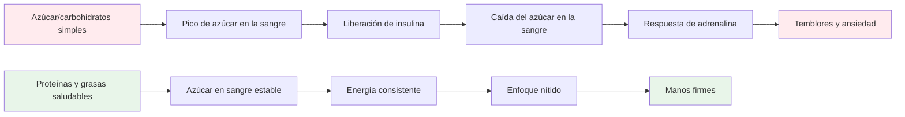

# Nutrición para un rendimiento de precisión

La petanca es un deporte de precisión, no un deporte de resistencia. Sus necesidades nutricionales son diferentes a las de un corredor de maratón o un jugador de fútbol. Lo que más importa es **la estabilidad del combustible cerebral**: mantener la mente alerta y las manos firmes durante un largo día de competición.

::: Consejo La gran idea
**Tu cerebro es tu herramienta más importante en la petanca. Aliméntelo con combustible estable, no con energía de montaña rusa.** Concéntrese en las proteínas, las grasas saludables y en mantenerse hidratado. Evite los picos de azúcar.
:::

## El desafío del atleta de precisión

A diferencia de los deportes de alta intensidad, la petanca no requiere reservas masivas de glucógeno ni una rápida reposición de energía. Lo que requiere es:

- **Azúcar en sangre estable**: sin picos ni caídas
- **Claridad mental constante**: concentración que dura todo el día
- **Manos firmes**: sin temblores ni sacudidas
- **Calmar los nervios** - baja respuesta de ansiedad y estrés

Su estrategia nutricional debe optimizarse teniendo en cuenta estos factores, no la producción de energía bruta.

## El problema del azúcar y los carbohidratos simples

Muchos atletas optan por seguir dietas altas en carbohidratos. Para los jugadores de petanca, esto puede perjudicar su rendimiento.

### La montaña rusa del azúcar en sangre

Cuando comes azúcar o carbohidratos simples:
1. El nivel de azúcar en sangre aumenta rápidamente
2. Se libera insulina para reducirlo.
3. Caídas del nivel de azúcar en sangre (hipoglucemia)
4. Tu cuerpo libera adrenalina para compensar
5. Experimentas temblores, ansiedad y falta de concentración.

**Esto es lo opuesto a lo que necesitas para obtener precisión.**

### Síntomas de inestabilidad del azúcar en sangre

|  | Síntoma | Impacto en el rendimiento |  |
|---------|----------------------|
|  | Manos temblorosas | Lanzamiento inconsistente |  |
|  | dificultad para concentrarse | Mala toma de decisiones |  |
|  | Irritabilidad | Conflicto de equipo, mala compostura. |  |
|  | Fatiga después de las comidas | Caída de la tarde |  |
|  | Ansiedad | Sensibilidad a la presión |  |
|  | Niebla mental | Pensamiento táctico lento |  |

## Un mejor enfoque: energía estable

El objetivo es proporcionarle a su cerebro combustible constante sin la montaña rusa.

### Principios clave

1. **Prioriza las proteínas y las grasas saludables**: proporcionan energía de forma lenta y constante.
2. **Elija carbohidratos complejos en lugar de simples** - Si come carbohidratos, elija aquellos que se digieran lentamente
3. **Evita los picos de azúcar** - Especialmente antes y durante la competición
4. **Manténgase hidratado** - La deshidratación afecta significativamente la concentración
5. **Come regularmente** - No te dejes tener demasiada hambre

### Alimentos que ayudan

|  | Tipo de comida | Ejemplos | Por qué funciona |  |
|-----------|----------|--------------|
|  | Proteína | Huevos, nueces, queso, carne. | Digestión lenta, energía estable. |  |
|  | Grasas saludables | Aguacate, aceite de oliva, nueces | Combustible de larga duración |  |
|  | carbohidratos complejos | Verduras, legumbres | La fibra retarda la absorción |  |
|  | Frutas bajas en azúcar | bayas, manzanas | Nutrientes sin pico |  |

### Alimentos para limitar

|  | Tipo de comida | Ejemplos | Por qué es problemático |  |
|-----------|----------|---------------------|
|  | Azúcar | Dulces, refrescos, pasteles. | Pico rápido y caída |  |
|  | pan blanco/pasta | Sándwiches, platos de pasta. | Conversión rápida a azúcar |  |
|  | Zumo de frutas | Jugo de naranja, batidos | Azúcar concentrado |  |
|  | Bebidas energéticas | La mayoría de las marcas comerciales. | Choque de azúcar + cafeína |  |

## Nutrición del día de la competición

### Antes de la competencia

**2-3 horas antes:**
- Comida equilibrada con proteínas, grasas y verduras.
- Evite los carbohidratos pesados ​​que pueden causar somnolencia.
- Ejemplo: huevos con verduras o ensalada con pollo.

**1 hora antes:**
- Merienda ligera si es necesario
- Nueces, queso o una pequeña porción de proteína.
- Evite cualquier cosa azucarada

### Durante la competición

**Entre juegos:**
- Agua (más importante)
- Pequeños snacks proteicos (nueces, queso, carne)
- Evite los bocadillos y bebidas azucarados.

**Señales de que necesitas comer:**
- dificultad para concentrarse
- Irritabilidad
- sentirse tembloroso
- Dolor de cabeza

### Después de la competencia

- Reponer con una comida equilibrada
- Rehidratar completamente
- No se "recompense" con azúcar: afectará su recuperación

## Hidratación

La deshidratación afecta la función cognitiva antes de que sienta sed.

### Pautas

- **Empieza hidratado** - Bebe agua durante todo el día antes de la competición.
- **Durante el juego** - Beba agua con regularidad, no espere hasta tener sed.
- **Evita el exceso de cafeína** - Es un diurético
- **Esté atento a los signos**: dolor de cabeza, orina oscura, fatiga.

### ¿Cuánto cuesta?

Una pauta general: busque orina de color amarillo pálido. Si está oscuro, necesitas más agua.

## La opción baja en carbohidratos

Algunos atletas de precisión adoptan dietas bajas en carbohidratos o cetogénicas. La teoría:

**Beneficios potenciales:**
- Azúcar en sangre muy estable (no es posible que se produzcan picos)
- Claridad mental constante
- Reducción de la ansiedad y los temblores.
- No hay caídas de energía por la tarde.

**Consideraciones:**
- Requiere periodo de adaptación (1-2 semanas)
- No apto para todos
- Requiere planificación y compromiso.
- Consulte primero a un proveedor de atención médica

Esta es una estrategia avanzada; no es necesaria para todos, pero vale la pena considerarla si la estabilidad del azúcar en sangre es un problema importante para usted.

## Consejos prácticos

### Bocadillos fáciles de competencia
- Nueces mixtas (sin sal)
- huevos duros
- Cubitos de queso
- Cecina de ternera o pavo
- Verduras con hummus
- aceitunas

### Qué evitar
- Aperitivos en máquinas expendedoras
- Bebidas deportivas azucaradas
- Pasteles y productos horneados
- Barras de caramelo y chocolate
- La mayoría de barritas "energéticas" (consulte el contenido de azúcar)

## Conclusión clave

> Tu cerebro es tu herramienta más importante en la petanca. Aliméntelo con combustible estable, no con energía de montaña rusa.

Concéntrese en las proteínas, las grasas saludables y en mantenerse hidratado. Evite los picos de azúcar. Tu concentración, compostura y manos firmes te lo agradecerán.

