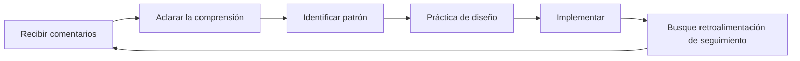

# Obtener y utilizar retroalimentación

La retroalimentación es una de las herramientas más poderosas para el desarrollo, y una de las menos utilizadas. Esta página te enseña a buscar retroalimentación activamente, recibirla de forma constructiva y convertirla en mejoras prácticas.

---

## Por qué nos resistimos a la retroalimentación

Antes de aprender a buscar retroalimentación, comprenda por qué es difícil:

### Protección del ego

Tu cerebro interpreta las críticas a tu desempeño como una amenaza a tu identidad. Esto desencadena respuestas defensivas:
- Descartando la retroalimentación
- Encontrar razones por las cuales la persona está equivocada
- Evitar situaciones similares en el futuro

### Sesgo de confirmación

Naturalmente, buscamos información que confirme lo que ya creemos. Si crees que eres un buen asesor, notarás tus aciertos y justificarás tus errores.

### El cambio de mentalidad de crecimiento

::: tip Reformular la retroalimentación
**Mentalidad fija:** &quot;La crítica significa que tengo defectos&quot;
Mentalidad de crecimiento: «La retroalimentación es información que me ayuda a mejorar».

La diferencia no es la positividad, sino la precisión. La retroalimentación se basa en datos, no en juicios.
:::

---

## Fuentes de retroalimentación objetiva

### 1. Datos cuantitativos

Los números no mienten ni suavizan la verdad:

| Métrico | Lo que revela |
|--------|-----------------|
| **Precisión de apuntado %** | Línea base técnica y tendencias |
| **Precisión en el primer y último juego** | Efectos de la fatiga/presión |
| **Tasa de éxito de disparo** | Por distancia, tipo de objetivo, situación del partido |
| **Porcentaje de Carreau** | Eficacia en la toma de riesgos |

### 2. Compañeros de equipo

Tus compañeros de equipo te ven en competencia, cuando tu autopercepción es menos precisa:

**Qué preguntar:**
- &quot;¿Cómo me ves cuando vamos perdiendo?&quot;
- &quot;¿Qué observas sobre mi enfoque en los juegos cerrados?&quot;
- &quot;¿Qué cosa podría hacer para ser un mejor compañero de equipo?&quot;

### 3. Oponentes

Las conversaciones posteriores al partido con oponentes de confianza pueden ser reveladoras:

**Qué preguntar:**
- &quot;¿Qué intentabas explotar en mi juego?&quot;
- &quot;¿Hubo algo que te sorprendió sobre cómo jugué?&quot;

### 4. Entrenadores/Jugadores experimentados

La experiencia externa proporciona una perspectiva que usted no puede generar por sí mismo:

**Qué preguntar:**
- &quot;¿Cuál es la mayor brecha entre mi potencial y mi rendimiento actual?&quot;
- &quot;¿Qué patrón ves en mis errores?&quot;
- &quot;¿Qué priorizarías si me estuvieras entrenando?&quot;

### 5. Análisis de vídeo

El espejo más objetivo disponible. Consulte [Análisis de video](/es/educación/autoconciencia/video) para obtener protocolos detallados.

---

## Cómo pedir retroalimentación de manera eficaz

### El marco SEEK

**S - Específico**
No preguntes: &quot;¿Cómo jugué?&quot;
Pregunte: &quot;¿Cómo se vio mi precisión al apuntar en el tercer final cuando estábamos atrás?&quot;

**E - Ejemplos**
Pregunte: &quot;¿Puede darme un ejemplo específico?&quot;
Esto obliga a proporcionar una retroalimentación concreta en lugar de generalizaciones.

**E - Exploratorio**
Acérquese con curiosidad, no con defensa.
Estoy intentando comprender mis puntos ciegos. ¿Qué podría estar pasando por alto?

**K - Amable (contigo mismo)**
Recuerda: pedir retroalimentación es un acto de valentía. Estás trabajando duro.

### El tiempo importa

| Cuando | Mejor para | Evitar |
|------|----------|-------|
| **Inmediatamente después** | Observaciones técnicas específicas | Procesamiento emocional |
| **Al día siguiente** | Perspectiva equilibrada, patrones | Si los detalles se han desvanecido |
| **Reseña en vídeo** | Análisis objetivo | Si retrasa demasiado la acción |

---

## Recibir retroalimentación sin ponerse a la defensiva

Cuando recibas retroalimentación, tu cerebro querrá defenderse. Aquí te explicamos cómo contrarrestarla:

### La regla de los 3 segundos

Cuando recibas retroalimentación, **espera 3 segundos antes de responder**. Esto le da tiempo a tu cerebro racional para reaccionar antes de que tu cerebro emocional reaccione.

### La técnica &quot;Cuéntame más&quot;

En lugar de defenderte, di: &quot;Cuéntame más sobre eso&quot;.

Este:
- Compra tiempo de procesamiento
- Demuestra que valoras la entrada
- A menudo revela la visión fundamental

### Recepción separada de la evaluación

**Paso 1:** Recibir (sólo escuchar)
**Paso 2:** Aclarar (asegurarse de entender)
**Paso 3:** Agradecer (reconocer el regalo)
**Paso 4:** Evaluar (luego, decidir en privado qué hacer)

No tienes que aceptar la retroalimentación de inmediato. Simplemente recíbela con apertura.

---

## El Protocolo de Respuesta a la Retroalimentación

Utilice esto cuando reciba comentarios:

1. &quot;Gracias por decirme eso.&quot;
   - Aprecio genuino, incluso si la retroalimentación duele

2. **¿Puedes darme un ejemplo específico?**
   - Pasa de lo general a lo procesable

3. &quot;¿Qué me sugieres probar?&quot;
   - Invita a la colaboración para mejorar

4. &quot;Voy a pensar en eso.&quot;
   - Compromiso honesto sin acuerdo inmediato

---

## Convertir la retroalimentación en acción

La retroalimentación sin acción es sólo una conversación incómoda.

### El proceso de retroalimentación a la acción

### Plantilla de acción

Para cada pieza de retroalimentación procesable:

| Elemento | Su respuesta |
|---------|---------------|
| **La retroalimentación** | (Lo que se dijo) |
| **El Patrón** | (¿Qué problema recurrente revela esto?) |
| **La acción** | (¿Qué cosa específica practicarás?) |
| **La medida** | ¿Cómo sabrás si has mejorado? |
| **La línea de tiempo** | ¿Cuando volverás a evaluar? |

---

## Creando una cultura de retroalimentación

### Con tu equipo

- **Normalízalo:** La retroalimentación regular se vuelve esperada, no excepcional.
- **Calle de doble sentido:** Dar feedback para recibirlo cómodamente
- **Acuerdos de horarios:** &quot;Hagamos un informe después de los partidos&quot; vs. críticas no solicitadas
- **Concéntrese en los detalles:** &quot;Noté X&quot; es mejor que &quot;Siempre Y&quot;

### Contigo mismo

- **Autoevaluación semanal:** Tiempo dedicado a evaluar tu semana
- **Reflexión escrita:** Escribir crea claridad
- **Seguimiento de patrones:** Busque temas recurrentes en múltiples fuentes

---

## El jugador resistente a la retroalimentación

Si te reconoces en alguno de estos, prioriza este trabajo:

::: warning Señales de resistencia a la retroalimentación
- Siempre puedes explicar por qué la retroalimentación no se aplica.
- Buscas retroalimentación sólo de personas que están de acuerdo contigo.
- Te sientes atacado cuando recibes aportaciones constructivas
- Evitas a las personas que desafían tu autopercepción.
- Racionalizas los malos resultados como factores externos
:::

Romper estos patrones requiere un esfuerzo consciente, pero el resultado es una mejora acelerada.

---

## Contenido relacionado

- [La ventaja de la autoconciencia](/es/educacion/autoconciencia/) — Por qué es importante el autoconocimiento
- [Análisis de vídeo](/es/educación/autoconciencia/vídeo) — Autoobservación objetiva
- [Dinámica de equipo](/es/educacion/dinamica-de-equipo/) — Comunicación con los compañeros de equipo
- [Fuerza mental](/es/educacion/juego-mental/fuerza-mental/) — Cómo afrontar las verdades difíciles

