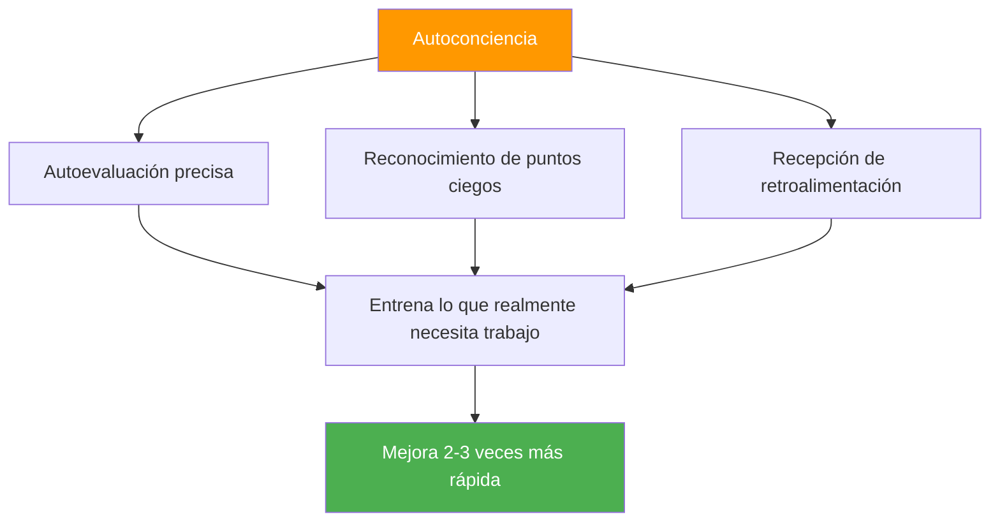

# La ventaja de la autoconciencia

::: tip La meta-habilidad que lo multiplica todo
**Peso: 400 puntos** — Los jugadores con una autopercepción precisa mejoran 2 o 3 veces más rápido porque entrenan lo que realmente necesita trabajo.
:::

## Por qué este es tu multiplicador oculto

> &quot;No puedes mejorar lo que no puedes ver&quot;.

La mayoría de los jugadores pasan horas practicando, pero ¿están practicando las cosas correctas? La autoconciencia es la meta-habilidad que garantiza que su tiempo de entrenamiento sea realmente efectivo.

### El efecto multiplicador de la mejora



Sin autoconciencia, usted podría:
- Practica lo que ya sabes hacer (se siente bien, crecimiento limitado)
- Echa un vistazo a los fallos técnicos que no puedes ver
- Atribuir erróneamente las pérdidas a factores externos
- Resiste los comentarios que podrían ayudarte

Con autoconciencia, usted:
- Identificar con precisión las debilidades reales
- Aceptar e integrar comentarios útiles
- Entiende cómo la presión afecta tu juego específico
- Conozca sus patrones en diferentes condiciones

---

## La paradoja de la autoconciencia

::: danger La incómoda verdad
Las investigaciones demuestran consistentemente que quienes necesitan mayor autoconciencia suelen creer que poseen un excelente autoconocimiento. Quienes poseen un alto nivel de autoconciencia se cuestionan constantemente y buscan información externa.

**¿Cuál eres tú?**
:::

Esto se llama el **efecto Dunning-Kruger** aplicado a la autopercepción. La misma falta de conciencia que te frena también te impide ver que careces de ella.

### La solución: espejos externos

Como no podemos confiar plenamente en nuestra percepción interna, necesitamos espejos externos:

| Espejo | Lo que revela |
|--------|-----------------|
| **Análisis de vídeo** | La realidad técnica vs. lo que crees que estás haciendo |
| **Datos de rendimiento** | Patrones que quizás no notes |
| **Comentarios de los compañeros de equipo** | Cómo te perciben bajo presión |
| **Observación del entrenador** | Un ojo experto en tu juego |

---

## La ventana de Johari para jugadores de petanca

La ventana de Johari es un modelo psicológico que mapea lo que usted y los demás saben sobre su juego:

```
                    Known to Self    Unknown to Self
                   ┌────────────────┬────────────────┐
 Known to Others   │     OPEN       │     BLIND      │
                   │  Arena         │  Spot          │
                   │                │                │
                   │ Your conscious │ What others    │
                   │ skills and     │ see but you    │
                   │ tendencies     │ don't          │
                   ├────────────────┼────────────────┤
 Unknown to Others │    HIDDEN      │   UNKNOWN      │
                   │    Facade      │   Potential    │
                   │                │                │
                   │ What you know  │ Undiscovered   │
                   │ but don't      │ capabilities   │
                   │ share          │                │
                   └────────────────┴────────────────┘
```

### Tu objetivo: ampliar el área &quot;abierta&quot;

**1. Reduce tus puntos ciegos**
- Buscar análisis de vídeo
- Solicitar comentarios específicos
- Esté atento a los patrones en los resultados

**2. Comparte más (reduce lo oculto)**
- Dile a tus compañeros de equipo cuando estás teniendo dificultades
- Discuta su enfoque abiertamente
- Pide ayuda cuando la necesites

**3. Descubre tu potencial desconocido**
- Pruebe nuevos enfoques
- Experimento en entrenamiento
- Salir de la zona de confort

---

## Autoconciencia vs. Autocrítica

::: warning Distinción crítica
La autoconciencia es la **observación neutral** de la realidad.
La autocrítica es un **juicio negativo** sobre ti mismo.

NO son la misma cosa
:::

| Autoconciencia | Autocrítica |
|----------------|----------------|
| &quot;Me perdí tres carreaux hoy&quot; | &quot;Soy terrible con los carreaux&quot; |
| &quot;Me pongo tenso en los partidos cerrados&quot; | &quot;Siempre me ahogo bajo presión&quot; |
| &quot;Mi puntería es menos precisa cuando estoy cansado&quot; | &quot;No soporto torneos largos&quot; |
| &quot;Me comunico menos cuando pierdo&quot; | &quot;Soy un mal compañero de equipo cuando estoy estresado&quot; |

**La diferencia importa porque:**
- La autoconciencia conduce a una mejora específica
- La autocrítica conduce a la vergüenza y a la evasión.
- La autoconciencia es objetiva y específica
- La autocrítica es emocional y generalizada.

---

## Los tres niveles de autoconciencia

### Nivel 1: Autoconciencia técnica
*&quot;¿Cómo me estoy desempeñando realmente?&quot;*

- Precisión en diferentes condiciones
- Patrones de ejecución técnica
- Efectos del estado físico en el rendimiento

### Nivel 2: Autoconciencia psicológica
“¿Cómo respondo mental y emocionalmente?”

- Respuestas al estrés y desencadenantes
- Fluctuaciones de confianza
- Patrones de enfoque y distractores

### Nivel 3: Autoconciencia social
*&quot;¿Cómo influyo en los demás y cómo me ven?&quot;*

- Patrones de comunicación en equipo
- Momentos (o lagunas) de liderazgo
- Cómo afectan tus emociones a tus compañeros de equipo

---

## Autoevaluación: Tu autoconciencia actual

Califícate honestamente (1 = Nunca, 5 = Siempre):

| Pregunta | Puntaje |
|----------|-------|
| Puedo predecir con precisión mi desempeño en diferentes situaciones. | /5 |
| Sé qué condiciones hacen que mi rendimiento sea inferior al esperado | /5 |
| Entiendo cómo me perciben mis compañeros de equipo bajo presión. | /5 |
| Acepto e integro comentarios críticos. | /5 |
| Mi autoevaluación coincide con la evaluación de mi entrenador/compañeros de equipo | /5 |
| Puedo analizar objetivamente mi desempeño sin reacción emocional. | /5 |
| Observo cambios en mi propio estado mental durante la competición. | /5 |

**Tanteo:**
- **28-35:** Gran autoconciencia (pero manténgase humilde y siga buscando aportes)
- **21-27:** Autoconciencia moderada (buena base sobre la cual construir)
- **14-20:** Brecha de autoconciencia (este módulo es fundamental para ti)
- **Por debajo de 14:** Puntos ciegos significativos (priorizar este trabajo)

---

## En este módulo

### [Obtener y utilizar la retroalimentación](/es/educación/autoconciencia/retroalimentación)
- Fuentes de retroalimentación objetiva
- Cómo solicitar retroalimentación de manera efectiva
- Recibir retroalimentación sin ponerse a la defensiva
- Convertir la retroalimentación en acción

### Análisis de vídeo para el autodescubrimiento
- Qué grabar y cuándo
- Qué buscar en tu metraje
- Comparando la autopercepción con la realidad del vídeo
- Protocolos de análisis de vídeo

---

## Victoria rápida: Las tres preguntas

Después de tu próximo entrenamiento o partido, pregúntate:

1. **¿Qué creo que hice bien?** (Sea específico)
2. **¿Qué diría un observador objetivo?** (Separar la percepción de la realidad)
3. **¿Qué es lo que evito mirar?** (Encuentra el punto ciego)

Escribe tus respuestas. Compáralas con el tiempo. Surgirán patrones.

---

## Factores relacionados

- [Juego Mental](/es/educacion/juego-mental/) — La autoconciencia apoya el entrenamiento mental
- [Dinámica de equipo](/es/educacion/dinamica-de-equipo/) — Entiende cómo te perciben los demás
- [Motivación](/es/educacion/motivacion/) — Conoce tus verdaderos impulsos
- [Técnica](/es/educación/técnica/) — El análisis de video revela la verdad técnica

