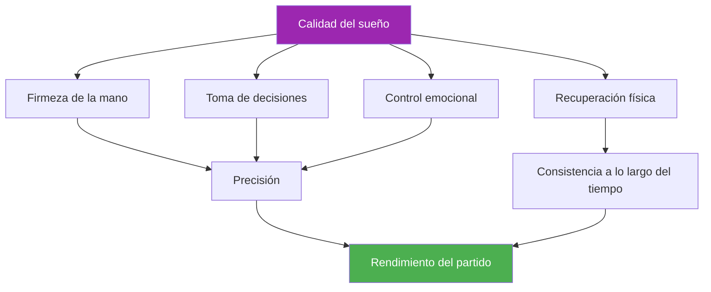

# Sueño y recuperación

::: tip Un factor crítico de rendimiento
**Peso: 400 puntos** — El sueño es el factor más subestimado en los deportes de precisión. Tus manos, decisiones y emociones dependen de un descanso de calidad.
:::

## La ventaja oculta del rendimiento

> &quot;El jugador que duerme mejor suele ganar.&quot;

En la petanca, a diferencia de los deportes de resistencia, donde los atletas a veces pueden superar la fatiga, la precisión es innegociable. Tu capacidad para colocar una bola a centímetros del cochonnet depende de sistemas extremadamente sensibles a la falta de sueño:

- Control motor fino
- Toma de decisiones bajo presión
- Regulación emocional
- Consolidación de la memoria

Este módulo revela por qué el sueño puede ser su mayor ventaja competitiva sin explotar.

---

## Cómo el sueño afecta tu juego

### Firmeza de la mano y control motor

Las investigaciones demuestran que la motricidad fina reduce entre un 10 % y un 15 % la deuda de sueño acumulada por hora. Para los jugadores de petanca, esto se manifiesta como:

- **Aumento de microtemblores**: imperceptibles para usted, pero que afectan la consistencia de la liberación.
- **Propiocepción reducida**: menor conciencia de la presión de agarre y la posición del brazo
- **Corrección de errores más lenta**: Su cuerpo no puede realizar los microajustes que producen precisión

::: warning Por qué señalar sufre primero
Apuntar requiere el control motor más fino de cualquier tiro. A menudo, es la primera habilidad que se deteriora cuando se duerme poco, incluso cuando uno se siente bien.
:::

### Toma de decisiones y tácticas

Su corteza prefrontal, responsable de la planificación, la evaluación de riesgos y el pensamiento estratégico, es muy sensible a la pérdida de sueño:

- **La evaluación de riesgos se ve afectada** — Puede intentar tiros con un porcentaje más bajo
- **La flexibilidad táctica disminuye** — Es más difícil adaptarse a mitad del juego
- **El fenómeno de la &quot;decisión a las 2 a. m.&quot;**: Las decisiones que parecen razonables cuando uno está cansado parecen cuestionables en retrospectiva.

### Regulación emocional

La falta de sueño provoca **hiperactividad en la amígdala**, el centro emocional del cerebro:

- La presión se siente más intensa
- La frustración tras los fallos se amplifica
- La recuperación de los reveses lleva más tiempo
- La dinámica del equipo puede verse afectada por el mal humor.

### Consolidación de la memoria

La memoria motora se consolida durante el sueño, especialmente durante las fases de sueño profundo:

- **Práctica sin dormir = retención limitada**
- **&quot;Dormir sobre ello&quot; realmente funciona** para los cambios de técnica
- La fórmula: **Práctica de calidad + Sueño de calidad = Habilidad permanente**

---

## La conexión entre el sueño y el rendimiento

---

## La realidad de la deuda de sueño

### ¿Qué es la deuda de sueño?

La deuda de sueño es **acumulativa**. Perder una hora de sueño no solo afecta ese día, sino que se acumula:

| Días | Horas cortas | Deuda total | Impacto en el rendimiento |
|------|-------------|------------|-------------------|
| 1 | -1 hora | 1 hora | Mínimo |
| 3 | -1 hora/día | 3 horas | Notable |
| 7 | -1 hora/día | 7 horas | Significativo |
| 14 | -1 hora/día | 14 horas | Severo |

::: danger El mito del fin de semana
**No puedes recuperarte del todo** los fines de semana. Aunque dormir más ayuda, no elimina la deuda acumulada. La constancia es más importante que dormir mucho de vez en cuando.
:::

### ¿Cuánto necesitas?

El mito de &quot;8 horas para todos&quot; es un mito. Las necesidades individuales varían:

- **La mayoría de los adultos:** 7-9 horas
- **Algunos funcionan bien en:** 6-7 horas
- **Algunos requieren:** 9+ horas

**Cómo encontrar SU necesidad óptima de sueño:**
1. Durante las vacaciones (sin alarma), permítete dormir naturalmente durante 5 a 7 días.
2. Después de la fase inicial de &quot;recuperación&quot;, observe cuánto tiempo duerme.
3. Es probable que esto se acerque a su necesidad biológica.

---

## La ciencia en breve

### Etapas del sueño que importan

| Escenario | Función | Relevancia de la petanca |
|-------|----------|-------------------|
| **Sueño profundo (N3)** | Recuperación física, hormona del crecimiento. | Recuperación muscular, restauración de energía. |
| **Sueño REM** | Procesamiento emocional, consolidación de la memoria | Retención de habilidades motoras, resiliencia emocional |
| **Sueño ligero (N1-N2)** | Transición, mantenimiento | Admite la arquitectura general |

### Hallazgos clave de la investigación

1. **Estudio de baloncesto de Stanford**: Los jugadores que prolongaron el sueño a 10 horas mejoraron la precisión de los tiros libres en un 9 % (Mah et al., 2011)
2. **Precisión del servicio de tenis**: la restricción del sueño redujo la precisión del servicio en un 53 % (Reyner y Horne, 2013)
3. **Metaanálisis del tiempo de reacción**: Incluso una sola noche de mal sueño reduce el tiempo de reacción en un 300 % (Lim y Dinges, 2010)

---

## Autoevaluación: Tu realidad del sueño

Califícate honestamente (1-5):

| Pregunta | Puntaje |
|----------|-------|
| Duermo la misma cantidad la mayoría de las noches. | /5 |
| Me duermo en 15-20 minutos | /5 |
| Rara vez me despierto durante la noche. | /5 |
| Me despierto sintiéndome renovado | /5 |
| Mantengo la energía durante todo el día. | /5 |

**Tanteo:**
- **20-25:** Excelentes hábitos de sueño
- **15-19:** Bueno, pero con margen de mejora
- **10-14:** Es probable que el sueño esté afectando tu rendimiento
- **Por debajo de 10:** La mejora del sueño debe ser una prioridad

---

## En este módulo

### [Protocolos de sueño para competición](/es/educacion/sueño/competición)
- La semana antes de la competición
- Gestión de viajes y zonas horarias
- Protocolos para la siesta energética
- Estrategias de emergencia para casos de &quot;no pude dormir&quot;

### Higiene del sueño para deportistas
- Los 10 fundamentos del sueño
- Plantillas de rutinas nocturnas
- El reto del sueño de 30 días
- Solución de problemas comunes

---

## Victoria rápida: esta noche

Si no hace nada más, implemente estos dos cambios esta noche:

1. **Establezca una hora de despertarse constante**: la misma hora mañana que hoy, dentro de 30 minutos
2. **No uses pantallas 30 minutos antes de acostarte** — Lee, estírate o prepárate para el día siguiente.

Estos dos cambios por sí solos pueden mejorar la calidad del sueño en cuestión de días.

---

## Factores relacionados

El sueño se conecta con todo lo demás en tu desempeño:

- [Manejo de la tensión](/es/educación/tension/) — La PMR y las técnicas de relajación ayudan a conciliar el sueño
- [Nutrición](/es/educacion/nutricion/) — El horario de las comidas y el nivel de azúcar en sangre afectan la calidad del sueño
- [Juego Mental](/es/educacion/juego-mental/) — El sueño favorece la función cognitiva y el control emocional
- [Autoconciencia](/es/educacion/autoconciencia/) — Reconocer cuándo la fatiga está afectando tu juego

