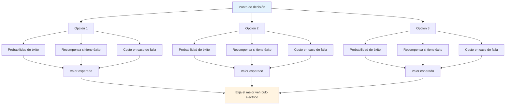

# Toma de decisiones basada en la probabilidad

El pensamiento táctico de élite utiliza la probabilidad para tomar mejores decisiones. En lugar de adivinar o dejarse llevar por la intuición, se piensa sistemáticamente en las opciones.

::: tip La gran idea
**Piense en probabilidades, no en certezas.** La mejor decisión no siempre es la más agresiva ni la más segura: es la que le ofrece el mejor valor esperado en muchas situaciones similares.
:::

## El marco básico

Cada lanzamiento tiene tres componentes:

| Componente | Pregunta | Ejemplo |
|-----------|----------|---------|
| **Probabilidad de éxito** | ¿Qué probabilidad hay de que ejecute esto? | 70% de tasa de éxito a esta distancia |
| **Recompensa si tiene éxito** | ¿Qué gano? | Gana el punto, gana posición |
| **Costo en caso de fracaso** | ¿Qué pierdo? | Darle un punto fácil al oponente |

::: info La fórmula
**Valor esperado = (Probabilidad × Recompensa) - ((1 - Probabilidad) × Costo)**

Las buenas decisiones maximizan el valor esperado a lo largo del tiempo.
:::

## Pensando en probabilidades

Al decidir entre las opciones, considere:
- ¿Cuál es mi tasa de éxito realista para cada opción?
- ¿Qué gano si funciona?
- ¿Cuál es el costo si falla?
- ¿Cómo afecta la situación del juego a mi elección?

La mejor opción no siempre es la más agresiva ni la más segura: es la que ofrece el mejor resultado en muchas situaciones similares.

## Conozca sus números

Para utilizar el pensamiento probabilístico, necesita conocer sus tasas de éxito reales:

| Tipo de lanzamiento | Distancia | Su tasa de éxito |
|------------|----------|-------------------|
| Punto (cerrar) | 6-7 meses | ___% |
| Punto (medio) | 8-9 meses | ___% |
| Punto (largo) | 10 m+ | ___% |
| Disparar (cerrar) | 6-7 meses | ___% |
| Disparar (medio) | 8-9 meses | ___% |
| Disparar (largo) | 10 m+ | ___% |

Monitorea esto en la práctica. Sé honesto: la mayoría de los jugadores sobreestiman sus probabilidades de éxito.

## Ajuste a las condiciones

Sus tarifas base cambian en función de:

| Factor | Efecto en la tasa de éxito |
|--------|----------------------|
| Terreno desconocido | -10 a -20% |
| Situación de presión | -5 a -15% |
| Fatiga | -5 a -10% |
| Confianza (alta) | +5 a +10% |
| Éxito reciente | +5% |
| Fallo reciente | -5 a -10% |

Sea realista acerca de estos ajustes.

## El principio de la ventaja de Boule

Cuando te quedan más bolas que a tu oponente:

**Prioridad 1: Asegurar el punto**
- Primero, asegúrate de tener al menos un punto
- No seas codicioso antes de haber asegurado lo básico

**Prioridad 2: Maximizar puntos con riesgo calculado**
- Una vez que tengas la posesión, evalúa si puedes sumar más puntos.
- Cada lanzamiento adicional es una decisión de riesgo/recompensa.
- No conviertas una victoria segura de 2 puntos en una derrota por excederte

**Menos bolas restantes:** Debes aprovechar cada lanzamiento. Las jugadas seguras podrían no ser suficientes; considera opciones con mayor recompensa para recuperar la apuesta al final.

## El principio &quot;Une Boule Devant&quot;

Una bola delante del boliche (entre el boliche y el oponente) es extremadamente valiosa:
- Bloquea líneas de señalización directa.
- Obliga a los oponentes a rodearlos o pasarlos por encima.
- Puede desviar las bolas entrantes
- Es una &quot;bola de dinero&quot; que vale la pena proteger.

**Implicación táctica:** A veces, colocar una bola de bloqueo es mejor que intentar acercarse más.

## Tolerancia al riesgo según el estado del juego

### Con límite de tiempo

Al jugar con un límite de tiempo, la diferencia de puntuación importa:

| Situación de puntuación | Enfoque de riesgo |
|-----------------|---------------|
| Liderando por 4+ | Muy conservador: proteger el liderazgo y hacer correr el reloj. |
| Liderando por 1-3 | Conservador: no regalas puntos |
| Atado | Riesgos equilibrados y calculados |
| Por detrás por 1-3 | Agresivo: necesidad de ganar terreno |
| Detrás por 4+ | Muy agresivo: hay que arriesgarse, el tiempo se acaba. |

### Sin límite de tiempo

Cuando no hay presión de tiempo:
- Mantén tu plan de juego: no cambies la estrategia solo por el marcador.
- La puntuación fluctuará: confíe en su enfoque
- Solo considere cambiar su plan de juego si claramente no está funcionando contra este oponente.
- Los cambios de pánico cuando uno se queda atrás a menudo empeoran las cosas

### Ajustes del final del juego

**Si al ganar este final se gana el juego:**
- Sea más conservador
- No te arriesgues a ceder varios puntos
- Un solo punto podría ser suficiente

**Si pierdes este final pierdes el juego:**
- Tomar riesgos mayores
- Necesitas sumar varios puntos
- El juego seguro no te salvará

## Errores comunes de probabilidad

### 1. Exceso de confianza
&quot;Puedo encestar ese tiro&quot;, pero ¿lo harás 7 de cada 10 veces? Sé honesto.

### 2. Ignorar las tasas base
Tu porcentaje de tiro no cambia porque el momento sea importante.

### 3. Falacia del costo hundido
&quot;Ya fallé dos veces, debería seguir disparando&quot; - cada lanzamiento es independiente.

### 4. Sesgo de resultado
Un tiro arriesgado que funcionó seguía siendo arriesgado. Una jugada segura que falló seguía siendo correcta.

### 5. Ignorar las opciones del oponente
Piensa en lo que harán después de tu lanzamiento, tenga éxito o no.

## Aplicación práctica

### Antes de cada lanzamiento

1. **Identificar opciones** (apuntar, disparar, bloquear, etc.)
2. **Estimar la probabilidad de éxito** para cada uno
3. **Considere los resultados** (éxito y fracaso)
4. **Tenga en cuenta el estado del juego** (puntuación, bolas restantes)
5. **Elija** la opción con el mejor valor esperado
6. **Comprometerse plenamente** - sin dudas durante la ejecución

### Desarrollando la intuición

Con el tiempo, el pensamiento probabilístico se vuelve intuitivo:
- Realice un seguimiento honesto de sus resultados
- Revisar las decisiones después de los partidos
- Observe patrones en sus tasas de éxito
- Ajusta tu modelo mental

## Conclusión clave

> Las buenas decisiones no siempre conducen a buenos resultados. Pero las buenas decisiones, con el tiempo, conducen a mejores resultados.

Piensa en probabilidades. Conoce tus números. Haz la jugada inteligente, no la optimista.

