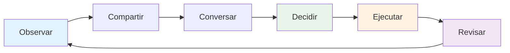

# Comunicación en equipo
<AdBanner />

La comunicación eficaz es lo que transforma a un grupo de personas en un equipo. En la petanca, donde la estrategia cambia constantemente y la presión es alta, la forma de comunicarse puede determinar el resultado.

::: tip La gran idea
**La comunicación es lo que transforma a los individuos en un equipo.** Una comunicación clara, específica y de apoyo bajo presión separa a los buenos equipos de los excelentes.
:::

## El ciclo de la comunicación

La buena comunicación en equipo sigue un ciclo:

| Paso | Acción | Ejemplo |
|------|--------|---------|
| **Observar** | Observa lo que está pasando | Terreno, posiciones, oponentes |
| **Compartir** | Cuéntales a tus compañeros lo que ves | &quot;El terreno se inclina hacia la izquierda allí&quot; |
| **Conversar** | Intercambio de perspectivas | &quot;¿Debería bloquear o ir por el punto?&quot; |
| **Decidir** | Acordar el enfoque | &quot;Vamos a probar el globo alto&quot; |
| **Ejecutar** | Hazlo con compromiso | Concentración total en el lanzamiento |
| **Revisar** | Aprender de los resultados | &quot;Eso funcionó bien&quot; o &quot;La próxima vez...&quot; |

## Cuándo comunicarse

### Antes de cada fin
- Evaluar el terreno juntos
- Discutir el enfoque general
- Aclarar quién lanza y cuándo
- Establezca el tono (tranquilo, centrado)

### Durante el final
- Compartir observaciones (&quot;El terreno se inclina hacia la izquierda&quot;)
- Coordinar la estrategia (&quot;¿Debería intentar bloquear o ir por el punto?&quot;)
- Ofrecer apoyo (&quot;Tómate tu tiempo, tú puedes&quot;)
- Ajustar los planes a medida que cambia la situación

### Entre extremos
- Breve informe (qué funcionó y qué no)
- Reiniciar mentalmente
- Prepárate para el próximo final
- Manténgase conectado como equipo

### Después del juego
- Informe completo (cuando corresponda)
- Reconocer contribuciones
- Identificar aprendizajes
- Mantener la relación

## Cómo comunicarse

### Sea claro y específico

**Vago:** &quot;Intenta acercarte&quot;
**Despejado:** &quot;Apunta al lado izquierdo del gato, a unos 20 cm hacia afuera&quot;

**Vago:** &quot;Buen intento&quot;
**Claro:** &quot;Buen peso, un poco a la izquierda de la línea&quot;

### Sea constructivo

Centrarse en las soluciones, no en los problemas:

**Enfocado en el problema:** &quot;Sigues fallando hacia la derecha&quot;
**Enfocado en la solución:** &quot;¿Quizás podrías intentar apuntar un poco más hacia la izquierda para compensar?&quot;

### Sea solidario

Tu tono importa tanto como tus palabras:
- Mantén la calma, incluso cuando te sientas frustrado
- Utilice un lenguaje corporal alentador
- Reconozca el esfuerzo, no sólo los resultados
- Construye, no destruyas

### Escuchar activamente

La comunicación es bidireccional:
- Preste toda su atención cuando sus compañeros de equipo hablen.
- Haga preguntas aclaratorias
- Reconoce lo que has escuchado
- No interrumpir ni despedir

<AdInArticle />

## Desafíos de la comunicación

### Desacuerdo sobre la estrategia

**Mal enfoque:**
- Insiste en tu camino
- Ponerse a la defensiva
- Ceder con resentimiento
- Discutir durante el juego

**Mejor enfoque:**
1. Comparte tu perspectiva claramente
2. Escuchenlos completamente
3. Discuta brevemente los pros y los contras
4. Decidir juntos (o dejar la decisión en manos del líder designado)
5. Comprometerse plenamente con la decisión
6. Reseña después del partido

### Después del error de un compañero de equipo

**Lo que necesitan:**
- Reconocimiento rápido
- Permiso para seguir adelante
- Confianza en que todavía confías en ellos
- Concéntrese en el siguiente lanzamiento

**Qué decir:**
- &quot;No hay problema, el siguiente&quot;
- &quot;Buena suerte, te toca el siguiente&quot;
- &quot;Seguimos en esto&quot;
- *A veces basta con un gesto o una palmadita*

**Qué NO decir:**
- Nada (el silencio parece un juicio)
- &quot;Está bien&quot; (puede sonar despectivo)
- ¿Algo sobre lo que salió mal? (no ahora)
- Frustración visible (el lenguaje corporal cuenta)

### Cuando cometes un error

**Qué hacer:**
- Breve reconocimiento (&quot;Mi error&quot;)
- No te disculpes demasiado
- No pongas excusas
- Reiniciar y concentrarse en el siguiente lanzamiento
- Confía en que tus compañeros de equipo te apoyarán

### Tensión en el equipo

Si aumenta la tensión durante un juego:
1. Reconoce que está sucediendo
2. Respira antes de responder
3. Concéntrese en el juego, no en el conflicto.
4. Abordarlo adecuadamente después del juego
5. No dejes que afecte tu juego

## Comunicación no verbal

Gran parte de la comunicación en equipo es no verbal:

### Señales positivas
- Contacto visual
- Cabeceo
- Pulgares hacia arriba
- Postura relajada
- Moviéndose hacia los compañeros de equipo
- Sonriendo (cuando sea apropiado)

### Señales negativas (evítelas)
- Poniendo los ojos en blanco
- Dándose la vuelta
- Brazos cruzados
- Suspirando
- Sacudiendo la cabeza
- Lenguaje corporal tenso

**Recuerda:** Tus compañeros lo ven todo. Tu lenguaje corporal influye en su confianza y rendimiento.

## Desarrollando hábitos de comunicación

### Comunicación práctica

No esperes a que la competencia se comunique:
- Practicar debates estratégicos en la formación
- Darnos retroalimentación regularmente
- Desarrolla el lenguaje de tu equipo
- Genere comodidad con una conversación honesta

### Desarrollar señales de equipo

Algunos equipos desarrollan taquigrafía:
- Señales manuales para la estrategia
- Palabras clave para situaciones
- Frases rápidas con significado compartido

### Registros regulares

Fuera de los juegos:
- ¿Cómo estamos trabajando juntos?
- ¿Qué va bien?
- ¿Qué podría ser mejor?
- ¿Hay algún problema que abordar?

## El papel del capitán

Si su equipo tiene un líder designado:

**Responsabilidades del capitán:**
- Decisión final cuando el equipo no está de acuerdo
- Estableciendo el tono y la energía
- Gestión de la dinámica del equipo
- Mantener la concentración bajo presión

**Todos los demás:**
- Comparte tu perspectiva
- Apoyar la decisión una vez tomada
- Ayuda a mantener la energía del equipo
- Asume la responsabilidad de tu rol

## Conclusión clave

> Los grandes equipos hablan entre sí, no sobre los demás. Se comunican con honestidad, respeto y un compromiso compartido con el éxito.

Practica la comunicación como si lanzaras. Es una habilidad que mejora con la atención.

<AdBanner />
