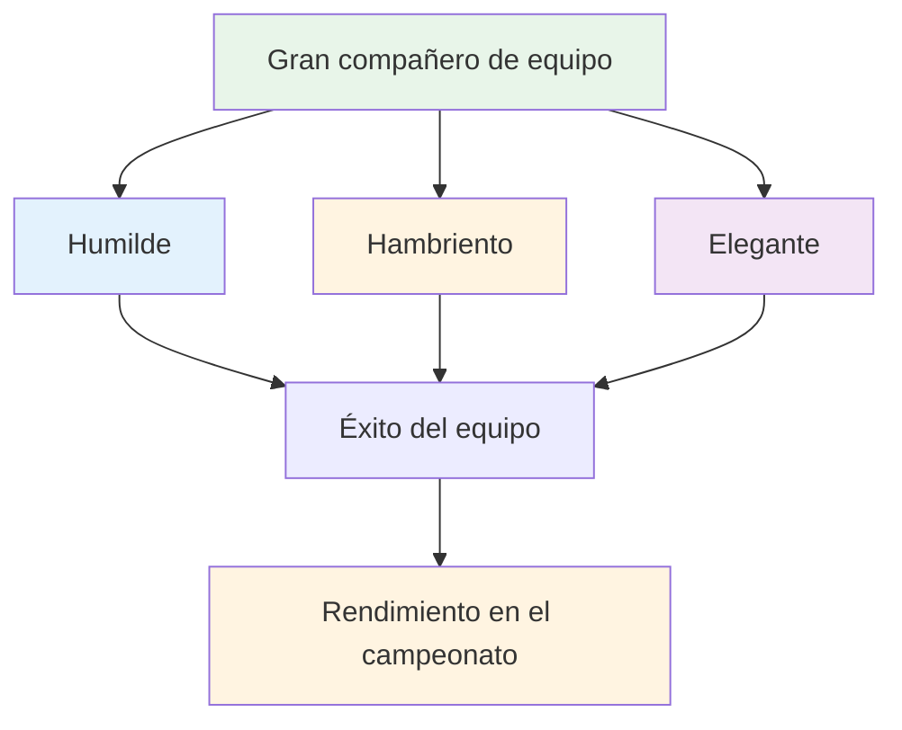

# Ser un gran jugador de equipo
<AdBanner />

La petanca se juega a menudo en equipos: dobles (dobles) o triples (tripletes). La habilidad individual importa, pero la dinámica del equipo puede determinar el resultado. Los mejores equipos no siempre son los más hábiles, sino los que mejor trabajan juntos.

::: tip La gran idea
**Los mejores equipos no siempre son los más hábiles: son los que trabajan mejor juntos.** Ser humilde, tener hambre y ser emocionalmente inteligente te convierte en un gran compañero de equipo.
:::

## ¿Qué hace a un gran compañero de equipo?

La investigación y la experiencia apuntan a tres cualidades clave:

### 1. Humilde
- Prioriza el éxito del equipo sobre la gloria personal
- Reconoce las contribuciones de los demás
- Admite errores sin excusas
- Abierto a la retroalimentación y al aprendizaje.
- No necesita ser la estrella

### 2. Hambriento
- Automotivado y motivado
- Hace el trabajo sin que se lo pidan
- Siempre buscando mejorar
- Aporta energía al equipo.
- No se basa en el talento

### 3. Inteligente (emocionalmente)
- Lee bien las situaciones y las personas.
- Sabe cuándo hablar y cuándo escuchar.
- Gestiona sus propias emociones
- Apoya a sus compañeros de equipo de manera adecuada
- Maneja los conflictos de manera constructiva

## Los fundamentos del éxito del equipo

### Metas y visión compartidas

Los equipos fuertes tienen:
- Objetivos claros y acordados
- Objetivos individuales alineados con los objetivos del equipo
- Comprensión compartida de lo que significa el éxito
- Compromiso con la misión colectiva

**Preguntas para discutir con tu equipo:**
- ¿Qué estamos tratando de lograr juntos?
- ¿Cómo se ve el éxito para nosotros?
- ¿Cómo nuestros objetivos individuales apoyan al equipo?

### Comunicación eficaz

La comunicación es el elemento vital del rendimiento del equipo.

**Buena comunicación en equipo:**
- Abierto y honesto
- Respetuoso, incluso en el desacuerdo
- Claro y específico
- Bidireccional (hablar y escuchar)
- Oportuno (información correcta en el momento correcto)

<AdInArticle />

**Durante los juegos:**
- Discuta la estrategia antes de cada final
- Compartir observaciones sobre el terreno y los oponentes.
- Coordinar quién lanza cuándo
- Apoyémonos mutuamente después de los lanzamientos (buenos o malos)

### Confianza y respeto

Sin confianza, los equipos se desmoronan bajo presión.

**Generando confianza:**
- Sé confiable (haz lo que dices)
- Ser competente (hacer bien su trabajo)
- Sé honesto (incluso cuando sea difícil)
- Mostrar vulnerabilidad (admitir dificultades)
- Apoyar a los demás de manera constante

**Mostrando respeto:**
- Valorar la contribución de cada persona
- Escucha diferentes perspectivas
- Reconozca el esfuerzo, no sólo los resultados
- Tratar el rol de cada uno como importante

### Roles claros

Todo el mundo debería entender:
- Sus principales responsabilidades
- Cómo contribuyen al equipo
- Lo que otros esperan de ellos
- Cuándo dar un paso adelante y cuándo dar un paso atrás

**En triples:**
| Role | Enfoque principal | Cualidades clave |
|------|--------------|---------------|
| Puntero | Coloque las bolas cerca del jack | Precisión, consistencia |
| Medio | Adaptarse a la situación | Versatilidad, juego de lectura. |
| Tirador | Retirar las bolas del oponente | Precisión bajo presión |

Los roles pueden ser flexibles, pero la claridad ayuda.

## Dinámica del equipo durante la competición

### Antes del partido
- Llegar juntos, calentar juntos
- Discutir la estrategia general
- Establezca el tono (positivo, centrado)
- Comprueba cómo se siente cada uno.

### Durante el juego
- Comunicarse entre extremos
- Manténgase positivo independientemente del resultado
- Apoyarnos mutuamente después de los errores
- Celebremos juntos los éxitos (brevemente)
- Manténgase enfocado en el proceso, no en el resultado

### Después de los errores
Qué NO hacer:
- Mostrar frustración visiblemente
- Criticar o culpar
- Retirarse o guardar silencio
- Reflexiona sobre lo que pasó

Qué hacer:
- Reconocimiento rápido (&quot;no hay problema&quot;)
- Mover el foco al siguiente lanzamiento
- Mantener un lenguaje corporal positivo
- Confía en que tu compañero de equipo se recuperará

### Después del juego
- Informe conjunto (qué funcionó, qué no)
- Reconocer las contribuciones individuales
- Discutir mejoras para la próxima vez
- Mantener relaciones sin importar el resultado

## Patrones de comunicación

### Retroalimentación constructiva
**Pobre:** &quot;Sigues fallando esos tiros&quot;
**Mejor:** &quot;Noté que los tiros van hacia la izquierda. ¿Quieres intentar ajustar tu postura?&quot;

### Respuesta de apoyo a los errores
**Pobre:** *Silencio o frustración visible*
**Mejor:** &quot;Dificil. Te toca el siguiente.&quot;

### Discusión estratégica
**Pobre:** &quot;Sólo dispárale&quot;
**Mejor:** &quot;¿Qué opinas: apuntar para bloquear o intentar disparar? Veo pros y contras en ambos casos&quot;.

## Construyendo cultura de equipo

Los grandes equipos desarrollan compartido:
- **Valores:** Lo que representamos
- **Normas:** Cómo nos comportamos
- **Idioma:** Cómo nos comunicamos
- **Rituales:** Lo que hacemos juntos

**Ejemplos:**
- Siempre estrechar la mano antes y después
- Frases de aliento específicas
- Rutina previa al juego juntos
- Comida o bebida después del partido

## En esta sección

- **[Comunicación en equipo](/es/education/team-player/comunicacion)** - Guía detallada para comunicarse eficazmente

## Conclusión clave

> Tu equipo es tan fuerte como su relación más débil, no su jugador más débil.

Invierte en tus compañeros. Genera confianza. Comunícate bien. Triunfen juntos.

<AdBanner />
